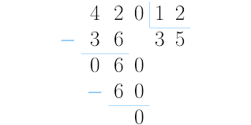

# Class 01
In this readme, the important concepts of the class will be provided, the homework to be carried out and finally the explanation of how each point of the homework was carried out.

## Main concepts
* Heap vs Binary Search Tree
* Binary search tree
* Interpreters and compilers
* Hidden classes
* Sparse array
* Map vs array
* Sparse matrix and algorithms
*Catching

[Summary of the class.](https://docs.google.com/document/d/1pHbHcZFxaiceiqwmq3UQTkFnHX94ACPrJdoJp2QkU5A/edit?usp=sharing)


## Homework
Perform arithmetic operations on strings without relying on bigint or arithmetic libraries. The operations should function as string functions, considering only positive integers (you can avoid negative numbers, all numbers will be positive and integer).
```js
String.plus(string) => string
String.minus(string) => string
String.divide(string) => string
String.multiply(string) => string
```

## Homework development

Each task have its hown test file and script. Each script is stored in the ```./scripts``` folder and each test is store in the ```./tests``` folder.

__Tests are performed in jest and using random numbers. The maximun amount of digits of the random numbers and number of tests to perform can be edited.__

### String.plus(string) => string 

This task is made using a classic algorithm learned in school. For making the script por readable, all string are transformed to arrays, even if it's not necessary.

For performing the operations, it is checked which addend have more digits, the one with more digits will be the first addend, the other one will be filled with zeros in the most significant digits in order to have tha same length, so we can use the same script with out having to use conditionals for the cases in which numbers have different lengths.

Then we transverse both numbers from back to front, partial operations are performed for each columnd and the carry numbers are stored to add to the next most significant digit.

|    |   | *1* | *1* | *1* |   | 
| -- | --| - | --| --| - |
|    | 1 | 4 | 1 | 3 | 9 |
| +  | 0 | 3 | 8 | 7 | 6 |
|    | 1 | 8 | 0 | 1 | 5 |

Finally, it is checkef if there are zeros in the most significant digits of the result, in case the user used the prototype with numbers like "02342" for example. If there are zeros we romove them.

### String.minus(string) => string 

This task is made using a classic algorithm learned in school. For making the script por readable, all string are transformed to arrays, even if it's not necessary.

First we check which number is bigger in abosulte module, if the minuend is bigger than substraend we proceed in this order, if substraned is bigger than minuend, we have to invert the order of the operators and check a flag that indicates the rest  will be negative, then the algorithm proceed with the rest as normal.

Zeros are filled to the most significant digits of the shorter operand, so we can use the same script with out having to use conditionals for the cases in which numbers have different lengths.

Finally we transverse both numbers from back to front, partial operations are performed, being aware the if the partial minuend is smaller than the partial substraend, we must borrow a ten from a neighbour.

|    |   | *1*3  | *10*   | *1*3 |   | 
| -- | --| -     | --    | --    | - |
|    | 1 | ~~4~~ | ~~1~~ | ~~3~~ | 9 |
| -  | 0 | 3     | 8     | 7     | 6 |
|    | 1 | 8     | 0     | 1     | 5 |

Finally we check if the result have a zero at the most signficant digit, if so, we remove it. It might the case the most significant number of both operands are the same, so a reamainding zero will appear.

## String.multiply(string) => string
This task is made using a classic algorithm learned in school with a small variation. For making the script por readable, all string are transformed to arrays, even if it's not necessary.

First, we create and empty array that will store the result. This array have the necessary length for storing the maximun possible result.

Then we proceed to iterate over two fors, transversing both numbers from back to front in order to perform the partial operations.
There is a carry variable that stores if a partial sum operation have more than two digits, so we add it in the next run. 

|    |   | |  |  |   | 
| -- | --| - | --| --| - |
|    |  |  | 2 | 3 | 5 |
| *  |  |  | 0 | 2 | 3 |
| first partial operation   |  | | 7 | 0 | 5 |
| second partial operation| + | 4| 7 | 0 |  |
|  result  |  | __5__| __4__ | __0__| __5__ |

The variation from school algorithm begins here, instead of having one new array for each partial operation, we perform the partial operations over the result array, so the partial results are being stored there and are modificated every run of the fors cycles.

Finnaly we remove the unnecesary zeros, as we start with an array filled with zeros, if most signficant digit are not overloaded, we have to remove them.

## String.multiply(string) => string

This task is made using a classic algorithm learned in school. We only divide integers numbers and return integer results. If there is a reminder, we ignore it. We cannot divide by zero.




The algorithm works using a subDividend, which will always try to takes digits from dividiend in order to be equal or bigger than divisor, so it can perform the operation, lets explain with an example. 

In the first run the subDividend will be 42, as it is bigger than 12, it will go into a while cycle, where it calculates the partial result (3) an the reminder (36).

As the reminder (36) is bigger than the divisor (12), we can perform the operation as explained before.

Now, we have a reminder of 6, that is not bigger than the divisor (12), so the reminder is stored in the subDividend, and we push the 0 from the dividend, so now we can perform the last operation.