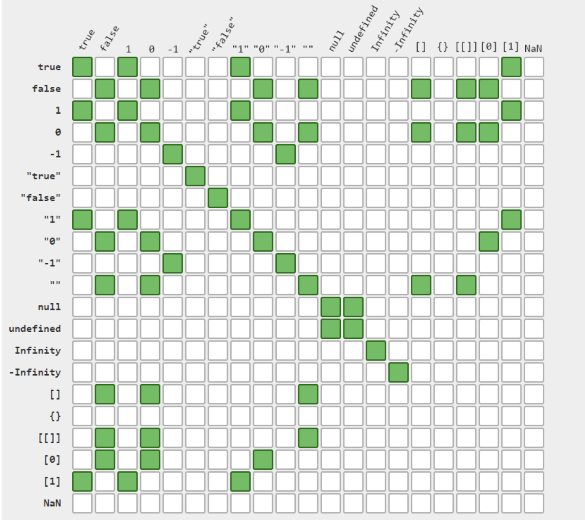
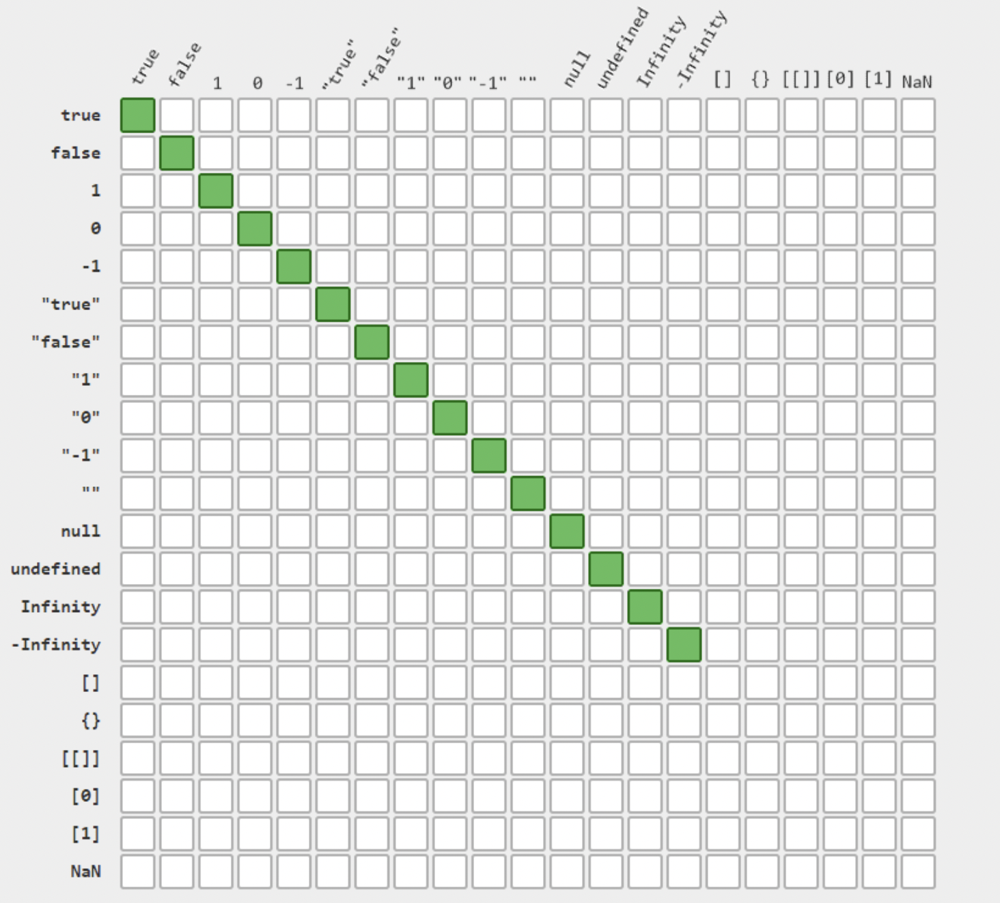

# Class 03

In this readme, the important concepts of the class will be provided, and the homework to be carried out.

__The homework development is in the folder ```./homework/```__

__Main concepts:__
* Variable types
* Hoisting
* Data types
* Type conversion
* Why string is unmutable
* Observation of arrays
* Operators
* Cheat sheet for ==
* Cheat sheet for ===
* Homework


## Variable types
Have script have to ways for declaring variables, __both of them are block scopded__.
* let
* const

__Let is mutable__ while __const is unmutable__.
It is __important__ to note that objects and arrrays declared with __"const"__ can have the their propertires or elements modified, but the binding to the variable cannot.

## Hoisting

Hoisting in JavaScript is a behavior that allows variable and function declarations to be moved to the top of their containing scope during the compilation phase, before the code is executed. This can lead to some unexpected results if not understood properly.

Here's how hoisting works for variables and functions:

Variable Hoisting:
In JavaScript, when you declare a variable using var, let, or const, the declaration is hoisted to the top of its scope but not the initialization (assigning a value to the variable). Let's see an example:

```js
console.log(myVar); // Output: undefined
var myVar = 42;
```

Even though myVar is accessed before its actual declaration, it doesn't throw an error. The variable is hoisted, so the declaration is moved to the top, but the initialization is not. The output is undefined.

__Function Hoisting:__
Function declarations are also hoisted to the top of their scope, and they can be called before their actual declarations in the code. For example:

```js
foo(); // Output: "Hello, I am foo!"

function foo() {
  console.log("Hello, I am foo!");
}
```

The function foo can be called before its declaration, thanks to hoisting.

However, it's important to note that function expressions (functions assigned to variables) are not hoisted.

```js
// This will throw an error
bar(); // Uncaught TypeError: bar is not a function

var bar = function() {
  console.log("Hello, I am bar!");
};
```

In this case, the variable bar is hoisted, but its value (the function) is not assigned yet, hence the error.

To avoid confusion and potential bugs caused by hoisting, it's a good practice to declare and initialize variables at the beginning of their scope and define functions before calling them. Also, consider using let and const instead of var, as they have block scope and are less prone to hoisting-related issues.

## Data types
All types except Object define immutable values represented directly at the lowest level of the language. We refer to values of these types as primitive values.

JavaScript have 8 data types. These are all primitives (except, see object):

* __Number:__ Represents both integer and 
floating-point numbers.
    * Positive values greater than Number.MAX_VALUE are converted to +Infinity.
    * Positive values smaller than Number.MIN_VALUE are converted to +0.
    * Negative values smaller than -Number.MAX_VALUE are converted to -Infinity.
    * Negative values greater than -Number.MIN_VALUE are converted to -0.

* __String:__ Represents a sequence of characters (text).

* __Boolean:__ Represents a logical value, either true or false.
* __Null:__ Represents the intentional absence of any value.
* __Undefined:__ Represents a variable that has been declared but has not been assigned any value.
* __Symbol:__ used as property keys for objects to avoid naming collisions in properties and to create private members in classes.
* __BigInt:__ Represents integers with arbitrary precision (ES2020 and later).
* __Object:__ some people says it is primitive, other says it is non-primitive.
    * __Object:__ Represents a collection of key-value pairs. Objects are used to store complex data and can contain functions, arrays, and other objects
    * __Array:__ Arrays are a type of object that represent ordered collections of elements. They can hold multiple values of any data type, and each element in the array is accessible using its index.
    * __Date__

__Some examples:__
```js
// Numbers
typeof 37 === "number";
typeof 3.14 === "number";
typeof 42 === "number";
typeof Math.LN2 === "number";
typeof Infinity === "number";
typeof NaN === "number"; // Despite being "Not-A-Number"
typeof Number("1") === "number"; // Number tries to parse things into numbers
typeof Number("shoe") === "number"; // including values that cannot be type coerced to a number

typeof 42n === "bigint";

// Strings
typeof "" === "string";
typeof "bla" === "string";
typeof `template literal` === "string";
typeof "1" === "string"; // note that a number within a string is still typeof string
typeof typeof 1 === "string"; // typeof always returns a string
typeof String(1) === "string"; // String converts anything into a string, safer than toString

// Booleans
typeof true === "boolean";
typeof false === "boolean";
typeof Boolean(1) === "boolean"; // Boolean() will convert values based on if they're truthy or falsy
typeof !!1 === "boolean"; // two calls of the ! (logical NOT) operator are equivalent to Boolean()

// Symbols
typeof Symbol() === "symbol";
typeof Symbol("foo") === "symbol";
typeof Symbol.iterator === "symbol";

// Undefined
typeof undefined === "undefined";
typeof declaredButUndefinedVariable === "undefined";
typeof undeclaredVariable === "undefined";

// Objects
typeof { a: 1 } === "object";

// use Array.isArray or Object.prototype.toString.call
// to differentiate regular objects from arrays
typeof [1, 2, 4] === "object";

typeof new Date() === "object";
typeof /regex/ === "object";

// The following are confusing, dangerous, and wasteful. Avoid them.
typeof new Boolean(true) === "object";
typeof new Number(1) === "object";
typeof new String("abc") === "object";

// Functions
typeof function () {} === "function";
typeof class C {} === "function";
typeof Math.sin === "function";
```

__Other important examples:__
```js
typeof NaN === "number"; // Despite being "Not-A-Number"
Nan == Nan // => false
Nan === Nan // => false

let val = NaN;
Number.isNan(val) // => true
if(val === val) // => false, only happens with NaN

// This stands since the beginning of JavaScript
typeof null === "object";
```

## Type conversion

JavaScript have two types of type convertions:
* __Implict / non-explicit__ 
* __Non-implicit / explicit__

### Implicit type convertion
 Happens automatically by JavaScript when an operation involves operands of different types.

```js
// Example
let num1 = 5;          // num1 is a number
let num2 = "10";       // num2 is a string

let result = num1 + num2; // JavaScript will convert num1 to a string and perform string concatenation.
console.log(result);   // Output: "510" (a string)
```

### Non-implicit / explicit type convertion
Developers can explicitly convert data from one type to another using various built-in functions or methods. 
```js
// Example
let strNumber = "42";
let num = Number(strNumber); // Converts the string "42" to a number 42
console.log(num); // Output: 42
```

__Some explicit__ type convertions are:
* __Number():__ Converts a value to a number.
* __parseInt() and parseFloat():__ Converts a string to an integer or floating-point number.
* __String():__ Converts a value to a string.
* __Boolean():__ Converts a value to a boolean.
* __BigInt():__ Converts a number into a big int.

__Explicit type convertions__ can also be:
* __Simple:__ Simple type conversion refers to converting primitive data types directly into other primitive data types, like the examples shown above.
* __Complex:__ Complex type conversion involves converting objects into primitive data types or other objects (arrays, objects, functions). This conversiones are done with:
  * toString()
  * valueOf()
  
  ### Unary "+" operator
  
__The unary plus operator (+)__ is a built-in operator in JavaScript that is used to convert its operand into a number explicitly. It is a form of explicit type conversion similar to using the Number() function but in a more concise form.

__Example:__
```js
let numString = "42";
let numericString = "3.14";
let negativeString = "-10";
let booleanValue = true;
let notANumber = "Hello";

console.log(+numString); // Output: 42 (converted to a number)
console.log(+numericString); // Output: 3.14 (converted to a number)
console.log(+negativeString); // Output: -10 (converted to a number)
console.log(+booleanValue); // Output: 1 (true is converted to 1)
console.log(+notANumber); // Output: NaN (cannot be converted to a number)
```

### Falsy values of Boolean type convertion
__This values will give a false:__
```js
if (false) {
  console.log("This won't be executed");
}
if (0) { //also +0 and -0
  console.log("This won't be executed");
}
if (NaN) {
  console.log("This won't be executed");
}
if (null) {
  console.log("This won't be executed");
}
if (undefined) {
  console.log("This won't be executed");
}
if ("") { // also "0"
  console.log("This won't be executed");
}

//All of other values will return true
```

### Object to primitive convertions
[For detailed information see this.](https://javascript.info/object-toprimitive).

__Function toString__

First it will check for the method toString and return the value, if no method is available, it will check for valueOf and it will try to return this, if no method is there, it will return error.

_function.toString()

	if isPrimitive(input.toString) => input.toString
	if isPrimitive(input.valueOf) => input.valueOf
	thrwow new TypeError_

  __Function toNumber__

  First it will check for the method valueOf and return the value, if no method is available, it will check for toString and it will try to return this, if no method is there, it will return error.

_function.toNumber()

	if isPrimitive(input.valueOf) => input.valueOf
	if isPrimitive(input.toString) => input.toString
	thrwow new TypeError_

  __There is also a Symbol.toPrimitive method, check the link at the begining of this section.__

  ```js
let user = {
  name: "John",
  money: 1000,

  // for hint="string"
  toString() {
    return `Hi: "${this.name}"`;
  },

  // for hint="number" or "default"
  valueOf() {
    return this.money;
  }

};

console.log(user); // {name: "John"}
console.log(String(user)); // => Hi: "John"
console.log(user + 500); // => 1500 (here convert user to Number, return 1000 and add 500)
  ```

## Why string is unmutable
```Info from chatGPT, it seems okay```

In JavaScript, strings are immutable, which means that once a string is created, its content cannot be changed. Any operation that seems to modify a string actually creates a new string with the modified content, leaving the original string unchanged. This immutability is a fundamental characteristic of strings in JavaScript and is shared by most programming languages.

__There are several reasons why strings are designed to be immutable:__

* __Predictability:__ Immutability ensures that strings behave predictably in various scenarios. Once you have a string value, you can rely on it not changing unexpectedly, which can lead to more reliable and bug-free code.

* __Performance:__ Immutable strings make certain operations more efficient. For example, when concatenating two strings, instead of modifying the existing string, JavaScript can create a new string by combining the contents of the original strings. This approach is more efficient in terms of memory usage and execution speed.

* __Sharing:__ In some cases, JavaScript can optimize memory usage by sharing references to the same string among different variables. If strings were mutable, modifying one variable could inadvertently affect other variables sharing the same string reference.

* __Security:__ Immutability can improve security by preventing certain types of attacks, such as data tampering or injection vulnerabilities. Immutable strings help ensure data integrity in security-critical applications.

__Example:__
```js
let originalString = "Hello";
let modifiedString = originalString.toUpperCase();

console.log(originalString); // Output: "Hello" (unchanged)
console.log(modifiedString); // Output: "HELLO" (new string with modified content)

```

## Observation of arrays
```Copied from internet, it is okay.```

In JavaScript, __arrays are objects__, and like all objects, they are __stored in memory as references__. When you declare an array in JavaScript, what you actually create is a reference to the memory location where the array data is stored.

__When you assign an array variable to other variable, you copy the memory reference, so when you change any of the variables, the other will also be modified.__

Here's a simplified explanation of how arrays work in memory:

__Declaration:__ When you declare an array, JavaScript allocates memory for the array's contents and stores the elements sequentially in memory. It also creates a reference (a memory address) that points to the location where the array data is stored.

__Reference:__ The array variable you declare doesn't contain the actual array data directly. Instead, it holds the memory address (reference) to where the array data is stored in memory.

__Accessing Elements:__ When you access elements in the array using their index, JavaScript uses the reference to locate the memory address of the desired element and fetches its value from that location.

__Modifying Elements:__ If you modify an element in the array, JavaScript uses the reference to find the memory address of the element and updates the value at that location.

This reference-based approach is why arrays can have dynamic lengths and why operations like adding or removing elements from an array are relatively efficient. When you modify an array, you don't need to copy the entire array's contents; you only need to update the specific elements being changed.

## Operators
JavaScript have many kind of operators, these operators are:

* __Arithmetic Operators__
* __Assignment Operators__
* __Comparison Operators__
* __String Operators__
* __Logical Operators__
* __Bitwise Operators__
* __Ternary Operators__
* __Type Operators__

[See explanation of each operator here.](https://www.w3schools.com/js/js_operators.asp)


## Cheat sheet for ```==```



## Cheat sheet for ```===```




# Homework
```
Your task is to create a JavaScript library that provides advanced data transformation functions. The library should include the following features:

addValues: Accepts two arguments of any type and performs the appropriate addition operation based on the types of the arguments. The function should return the result of the addition. If the addition is not possible, it should throw an error.

stringifyValue: Accepts a single argument of any type and converts it to a string representation. For objects and arrays, use JSON.stringify() for serialization. For other types, use the appropriate built-in methods or operations to convert them to strings.

invertBoolean: Accepts a single boolean argument and returns its inverted value. If the argument is not a boolean, it should throw an error.

convertToNumber: Accepts a single argument of any type and attempts to convert it to a number. For strings, use parseFloat() or parseInt() for conversion. For other types, use appropriate operations or functions to perform the conversion. If the conversion is not possible, it should throw an error.

coerceToType: Accepts two arguments: value and type. It attempts to convert the value to the specified type using type coercion. The function should return the coerced value if successful. If the coercion is not possible, it should throw an error.

Implement additional functions of your choice that demonstrate advanced type conversion scenarios or cater to specific use cases related to primitive types. You are encouraged to explore complex scenarios and push the limits of type conversion.
```