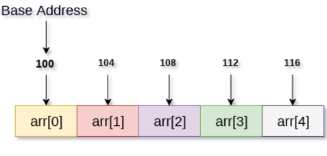

# Class 7 - Arrays

## What are arrays

In JavaScript, an array is a type of object that stores a collection of values in a specific order and provides methods for accessing, manipulating, and iterating over the elements in the collection.

Arrays are dynamic data structures, which means that they can grow or shrink in size as elements are added or removed. They can also store values of different data types, including numbers, strings, objects, and even other arrays, making them a versatile and powerful tool for managing data in your programs.



Arrays acces is vey memory reference. So the variable will be memory reference to the first array value.

The memory used by the array is
`Memory = ITEM_SIZE x count`.
If we want to acces the "n" element of the array, in terms of memory, this element will be located at `array.ponter + ITEM_SIZE * "n-1" `.

### Array pros

- Easy to loop through the elements
- Have many methods for findind elements
- Easy to modify it self
- It finds elements very fast

### Arrays cons

- We have to guess the memory space that is going to use, as must of the times is dinamically created.
- If we push elements, if memory space is not big enough, the engine will create another memory space and copy all the elements, this operations costs performance.
- We can boost performance by reserving the memory space and creating and empty element, but it costs memory space.

## Degining an array

### Array literal

The simplest way to define an array is by using an array literal, which is a comma-separated list of values enclosed in square brackets []:

```js
const fruits = ["Apple", "Banana"];

console.log(fruits.length); // 2
console.log(fruits[0]); // "Apple"
```

### Array.of()

The Array.of() static method creates a new Array instance from a variable number of arguments, regardless of number or type of the arguments.

```js
console.log(Array.of("foo", 2, "bar", true));
// Expected output: Array ["foo", 2, "bar", true]

console.log(Array.of());
// Expected output: Array []
```

### Array.fill()

The fill() method changes all elements in an array to a static value, from a start index (default 0) to an end index (default array.length). It returns the modified array.

```js
const a = Array(6).fill(1); => [1,1,1,1,1,1]


const array1 = [1, 2, 3, 4];

// Fill with 0 from position 2 until position 4
console.log(array1.fill(0, 2, 4));
// Expected output: Array [1, 2, 0, 0]

// Fill with 5 from position 1
console.log(array1.fill(5, 1));
// Expected output: Array [1, 5, 5, 5]

console.log(array1.fill(6));
// Expected output: Array [6, 6, 6, 6]
```

### Array constructor _NOT RECOMENDED_

```js
const fruits = new Array("Apple", "Banana");

console.log(fruits.length); // 2
console.log(fruits[0]); // "Apple"
```

## A property and some methods

### Array: length

The length data property of an Array instance represents the number of elements in that array.

```js
const numbers = [1, 2, 3, 4, 5];

if (numbers.length > 3) {
  numbers.length = 3;
}

console.log(numbers); // [1, 2, 3]
console.log(numbers.length); // 3
console.log(numbers[3]); // undefined; the extra elements are deleted
```

**The array object observes the length property, and automatically syncs the length value with the array's content. This means:**

- Setting length to a value smaller than the current length truncates the array — elements beyond the new length are deleted.
- Setting any array index (a nonnegative integer smaller than 232) beyond the current length extends the array — the length property is increased to reflect the new highest index.
- Setting length to an invalid value (e.g. a negative number or a non-integer) throws a RangeError exception.

### Array.prototype.every()

The every() method tests whether all elements in the array pass the test implemented by the provided function. It returns a Boolean value.

```js
//Syntax
every(callbackFn);
every(callbackFn, thisArg);

const isBelowThreshold = (currentValue) => currentValue < 40;

const array1 = [1, 30, 39, 29, 10, 13];

console.log(array1.every(isBelowThreshold));
// Expected output: true
```

The callbackFn must return a true or false.

### Array.prototype.some()

The some() method tests whether at least one element in the array passes the test implemented by the provided function. It returns true if, in the array, it finds an element for which the provided function returns true; otherwise it returns false. It doesn't modify the array.

```js
// Syntax
some(callbackFn);
some(callbackFn, thisArg);

const array = [1, 2, 3, 4, 5];

// Checks whether an element is even
const even = (element) => element % 2 === 0;

console.log(array.some(even));
// Expected output: true
```

### Array.prototype.map()

The map() method creates a new array populated with the results of calling a provided function on every element in the calling array.

```js
//Syntax
map(callbackFn);
map(callbackFn, thisArg);

const array1 = [1, 4, 9, 16];

// Pass a function to map
const map1 = array1.map((x) => x * 2);

console.log(map1);
// Expected output: Array [2, 8, 18, 32]
```

### Filter

The filter() method creates a shallow copy of a portion of a given array, filtered down to just the elements from the given array that pass the test implemented by the provided function.

```js
// Syntax
filter(callbackFn);
filter(callbackFn, thisArg);

const words = [
  "spray",
  "limit",
  "elite",
  "exuberant",
  "destruction",
  "present",
];

const result = words.filter((word) => word.length > 6);

console.log(result);
// Expected output: Array ["exuberant", "destruction", "present"]
```

### Array.prototype.reduce()

**BE AWARE WITH THE USE OF ACCUMULATOR DEFAULT THAT IS AN EMPTY OBJECT**

Acumulate array to just one value. It returns the new accumulated value.

The reduce() method executes a user-supplied "reducer" callback function on each element of the array, in order, passing in the return value from the calculation on the preceding element. The final result of running the reducer across all elements of the array is a single value.

```js
// Syntax

reduce(callbackFn);
reduce(callbackFn, initialValue);

const array1 = [1, 2, 3, 4];

// 0 + 1 + 2 + 3 + 4
const initialValue = 0;
const sumWithInitial = array1.reduce(
  (accumulator, currentValue) => accumulator + currentValue,
  initialValue
);

console.log(sumWithInitial);
// Expected output: 10
```

### Array.prototype.forEach()

The forEach() method executes a provided function once for each array element.

Just for loop through array and get some result. It doesnt return o modify anything

```js
// Syntax
forEach(callbackFn);
forEach(callbackFn, thisArg);

const array1 = ["a", "b", "c"];

array1.forEach((element) => console.log(element));

// Expected output: "a"
// Expected output: "b"
// Expected output: "c"
```

## Ways to iterate over an array

### Array.prototype.forEach()

Explained above.

### for...of

The for...of statement executes a loop that operates on a sequence of values sourced from an iterable object. Iterable objects include instances of built-ins such as Array, String, TypedArray, Map, Set, NodeList (and other DOM collections), as well as the arguments object, generators produced by generator functions, and user-defined iterables.

```js
// Syntax
for (variable of iterable) statement;

const array1 = ["a", "b", "c"];

for (const element of array1) {
  console.log(element);
}

// Expected output: "a"
// Expected output: "b"
// Expected output: "c"
```
