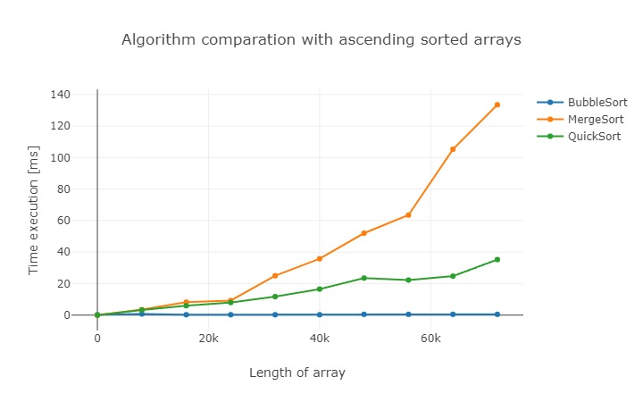

# Performance Analysis of Sorting Algorithms

## Summary

In this short report, an analysis of the next three sorting algorithms will be presented:

- Bubble Sort
- Merge Sort
- Quick Sort

The final objective is to achieve the following results:

- Execution time of each sorting algorithm for different array types and different array lengths.
- Array length at which Quick Sort becomes the slowest method
- Array length at which Quick Sort and Merge Sort start to outperform Bubble Sort consistently
- Why quick sort is faster than merge sort

## Methodology

In this section, the methodology for achieving the objectives will be explained.

### Getting results

To achieve the objective a main code with different utils in JavaScript has been made, please check out [this file](./main.js).

The summary flow chart is the next.

<p align="center">

<div align="center"><b>Minimalistic flow diagram of main code.</b></div>
</p>

Depending on the sort method it is desired to analyze, some user configuration might be required.

```js
// To be modified by user
const maxArrayLength;
const iterationsForAverage
const iterationsForRandom
const multiplier
const sortObjects
```

- **maxArrayLength:** Defines the maximum length of the array to be analyzed. Arrays from length = 2 to length < maxArrayLength will be created. Bigger array lengths reflect longer execution times.

- **iterationsForAverage:** Each sort time is stored as an average of the time that takes to sort it X times. The X is defined by iterationsForAverage. If plots and reports of code have noise, increase this variable. Bigger values give more accuracy but reflect longer execution times.

- **iterationsForRandom:** To have a uniform sort time for random arrays, the sort time is stored as the average time for sorting X different random arrays of the same length. The X is defined by iterationsForRandom. If plots and reports of code have noise, increase this variable. Bigger values reflect longer execution times.

- **multiplier:** Sorting times do not have a noticeable variation time when the array length is increased by one. In order the save execution time, the array length increases by an X value in each sort iteration. The X is defined by the multiplier. Smaller values reflect longer execution times and add noise for array lengths minor to 100.

- **sortObjects**: Stores the sort methods to be analyzed. When analyzing merge sort and quick sort, it would be desirable to remove the bubble sort method as it will slow down the execution time.

### Finding the optimal array length for each sort method

As the [main code](./main.js) execution time might take several minutes to execute, some user configurations might be necessary for being able to analyze the different desired methods faster.

The next methodology was taken.

#### General behavior of the sort methods

Configure the user input in the following way:

```js
// To be modified by user
const maxArrayLength; > 2000
const iterationsForAverage; > 100
const iterationsForRandom; > 100
const multiplier;  100
const sortObjects = [bubble, merge, quick];
```

This configuration will have a fast execution time and will show how each method behaves.

#### Bubble sort behavior

To know at which point Bubble Sort becomes the slowest method for each type of array, start decreasing the maxArrayLength (this will give you less execution time) and start increasing iterationsForAverage and iterationsForRandom (this will give you more accuracy).

Once the hot spot is reached **(thanks to observation of plot and console reports it will be shown where the bubble sort starts becoming slower)**, the multiplier can start to be decreased, this will give more accuracy until a certain point. When results start to become noise, increase iterationsForAverage and iiterationsForRandom for extra accuracy.

Then, it can be analyzed the best-use scenario for the bubble sort method for each array type.

#### Merge and quick sort behavior

To compare both sort methods, set the next configuration.

```js
// To be modified by user
const maxArrayLength; > 80000
const iterationsForAverage; > 4
const iterationsForRandom; > 4
const multiplier;  8000
const sortObjects = [merge, quick]; // IMPORTANT NOTE: bubble sort method is removed, as it slow down the execution time of the algorithm
```

This configuration will give a good approach to the general behavior of both methods.

Repeat steps as the bubble sort behavior for each array type scenario to know at which array length quick sort starts to be faster.

## Results

In this section, the results for different user configuration scenarios will be shown.

### General behavior of bubble, merge and quick sort methods

```js
// User configuration
const maxArrayLength = 80000;
const iterationsForAverage = 4;
const iterationsForRandom = 4;
const multiplier = 8000;
const sortObjects = [bubble, merge, quick];
```

#### Ascending sorted arrays

<p align="center">

</p>

- **Best performance:** Bubble sort method
- **Middle performance:** Quick sort method
- **Worst performance:** Merge sort method

#### Descending sorted arrays

<p align="center">

</p>

- **Best performance:** Quick sort method
- **Middle performance:** Merge sort method
- **Worst performance:** Bubble sort method

#### Random sorted arrays

<p align="center">

</p>

- **Best performance:** Quick sort method
- **Middle performance:** Merge sort method
- **Worst performance:** Bubble sort method

### Behavior of bubble sort method

In this section results focusing on the bubble sort method against merge and quick sort method will be presented.

```js
// User configuration
const maxArrayLength = 300;
const iterationsForAverage = 10000;
const iterationsForRandom = 10000;
const multiplier = 5;
const sortObjects = [bubble, merge, quick];
```

#### Ascending sorted arrays

<p align="center">

</p>

The Bubble sort method is the fastest. A tendency is presented that this method is the fastest no matter the array length.

#### Descending sorted arrays

<p align="center">

</p>

<p align="center">

</p>

- The Bubble sort algorithm becomes slower than the merge sort method when the array length is 142 +-5.

- The Bubble sort algorithm becomes slower than the quick sort method when the array length is 202 +-5.

#### Random sorted arrays

<p align="center">

</p>

<p align="center">

</p>

- The Bubble sort algorithm becomes slower than the quick sort method when the array length is in the range of 177 to 187.

- The Bubble sort algorithm becomes slower than the merge sort method when the array length is in the range of 212 to 227.

### Merge sort method versus Quick sort method

#### Ascending sorted arrays

```js
// User configuration
const maxArrayLength = 3500;
const iterationsForAverage = 600;
const iterationsForRandom = 1;
const multiplier = 200;
const sortObjects = [merge, quick];
```

<p align="center">

</p>

<p align="center">

</p>

- The Merge sort algorithm is faster for array length minor than 2402 +- 200.
- The Quick sort algorithm is faster for array lengths equal to and bigger than 2402 +- 200.

#### Descending sorted arrays

```js
// User configuration
const maxArrayLength = 3500;
const iterationsForAverage = 600;
const iterationsForRandom = 1;
const multiplier = 200;
const sortObjects = [merge, quick];
```

<p align="center">

</p>

<p align="center">

</p>

- The Merge sort algorithm is faster for array length minor than 2202 +- 200.
- The Quick sort algorithm is faster for array lengths equal to and bigger than 2002 +- 200.

#### Random sorted array

```js
// User configuration
const maxArrayLength = 300;
const iterationsForAverage = 1;
const iterationsForRandom = 50000;
const multiplier = 5;
const sortObjects = [merge, quick];
```

<p align="center">

</p>

<p align="center">

</p>

- The Merge sort algorithm is faster for array length minor than 97 +-5.
- The Quick sort algorithm is faster for array lengths equal to and bigger than 97 +-5.

## Conclusions

Further statistical analyses with more complex tools should be done having concrete conclusions.

In terms of subjective conclusions we can make the following affirmations:

- **When to use the bubble sort method**;
1. If we expect the majority of arrays will be sorted.
2. If we expect the majority of arrays will be in the worst scenario and the array lengths are less than 142 +- 5.
3. If we expect the majority of arrays will be random and the array lengths are less than 177.

- **When to use the merge sort method**;
1. If we are sure the majority of arrays will be in the worst scenario and the array lengths are less than 2202 +- 200.
2. If we expect the majority of arrays will be random and the array lengths are less than 97 +- 5.

- **When to use the quick sort method**;
1. If we are sure the majority of arrays will be in the worst scenario and the array lengths are more than 2202 +- 200.
2. If we expect the majority of arrays will be random and the array lengths are more than 97 +- 5.
