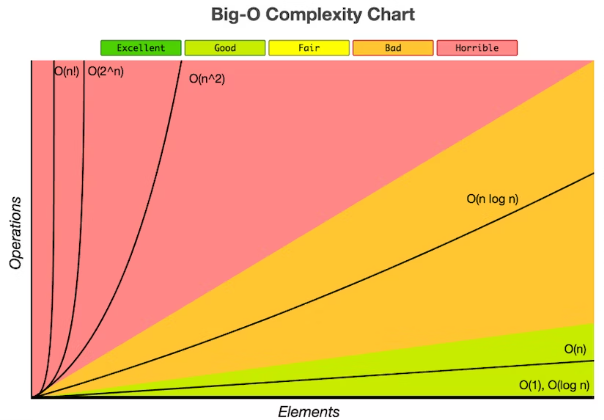
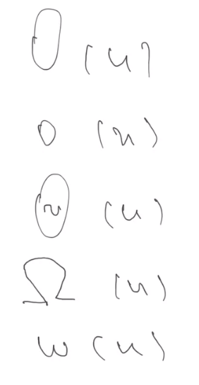

# Class 9 - Big O notation & Sort Algorithms

# Big O Notation

**Big O notation** is the language we use for talking about how long an algorithm takes to run (time complexity) or how much memory is used by an algorithm (space complexity). Big O notation can express the best, worst, and average-case running time of an algorithm. For our purposes, we’re going to focus primarily on Big-O as it relates to time complexity.

- It is very important to know this so you can compare algorithm effiencies
- There are softs like special profilers thah helps you to know the algorithm complexity



### Trying to find a complexity for a max elemenet find

```js
let m = a[0]; // 2 operations here (search element and assign)

for (let i = 0; i < a.length; i++) {
  // 2 + 2n
  // two operations, i = assigment and the comparisson if we must start the cicle. Afte it start, we have another two operation (the comparisson and i++ that happens every iteration).
  if (a[i] > m) {
    // 2n
    m = a[i]; // we do not reach here all the times. So we calculate with the worst scenario. 2n operations
  }
}

// f(n) = 4 + 2*n + 2*n + 2*n
// f(n) = 6n + 4

// we take n as the iterarions of the algorithm. So the for cycle is included there

// f(100) = 604, the +4 is insignificant, so we say the complexity will be f(n) = 6n
```

- first we assing value to a variable
- find concrete value in array
- compare two values
- increment value
- math operation

**Som examplese, n is always mor important than the costants and n value sthat grows slower**

```js
f(n) = 5n + 12 => f(n) = n;
f(n) = 109 => f(n) = 1;
f(n) = n ^ 2 + 33n + 22 => f(n) = n^2;
f(n) = 2n^3 + n ^ 2 + 33n + 22 => f(n) = 2n^2 ;
```

### Example if we have a duplicate in two arrays

```js
bool duplicate = false;
for(i ... n){
    for(j ... n) {
        if(i != j $$ [i] == a[j]) {
            duplicate = true;
            break;
            }
    }
}

// the complexity is f(n) = n^2;
```

```js
fir(i...n){
    fun(i);
}

// if function have some complexity, we must multiply the complexity of the function with the complexity of the algorithm
```

[See more here.](https://betterprogramming.pub/big-o-notation-a-simple-explanation-with-examples-a56347d1daca)

**~(n) counts the exact complexity, search this in internet**

# Selection sort

```js
a = [3, 1, 4, 2]
for(i ... n) {
    let m = a[0];
    let mi = 0;
    a.forEach((el, idx) => {
        if(el < m) {
            m = el;
            mi = idx;
        }
    });
    a.splice(mi,1);
    b.push(m);
}

// example 3, 1 , 3, 2
// 4 iterarions
// 3 iterarions
// 2 iterarions
// 1

// every time the iterations get lower becouse we remove elements from array, it is difficult to calculate complexity.

// we give the wors scenario, example for an infinite array, our complexity will be n^2


// So our big o nation is O(n)~= n^2 "~" is approximately
```

### We have 5 notations



- **Big Oh**, the first one indicate the complexity is equal or less
- The second one, indicates the complexity is less
- **Big Theta**, the third one, indicates the time complexity is equal
- **Big Omega** the fourth one, indicates the time complexity is equal or bigger
- the fourth one, indicantes time complexity is bigger

# Sorting methods

## Bubble sort

Bubble sort algorithm is an algorithm that sorts an array by comparing two adjacent elements and swapping them if they are not in the intended order. Here order can be anything like increasing or decreasing.

Works well when n is not very high.

- O(n^2) in worst case
- O(n) in best case

[See more here.](https://www.geeksforgeeks.org/bubble-sort/)

## Shaker sort (also called cocktail sort)

Some times is better than bubble sort, but in very rary cases.
When you expect that the bigger elements are in the start and/or the end of the array and the smaller elements are in the middle, this algorithm is better than bubble sort

O(n^2) in worst case
O(n) in best case

[See more here.](https://www.geeksforgeeks.org/cocktail-sort/)
[See visualization here.](https://www.geeksforgeeks.org/cocktail-sort-visualizer-using-javascript/)

## Insertion sort

It is very important for interviews but is not normal to use it.

O(n^2) in worst case
O(n) in best case

How to implemente easy. https://youtu.be/JU767SDMDvA

[See more here.](https://www.geeksforgeeks.org/insertion-sort/)
[Visualization here.](https://en.wikipedia.org/wiki/Insertion_sort)

## Stooge sort

Stooge Sort is a recursive sorting algorithm. __It is not much efficient__ but interesting sorting algorithm. It generally divides the array into two overlapping parts (2/3 each). After that it performs sorting in first 2/3 part and then it performs sorting in last 2/3 part. And then, sorting is done on first 2/3 part to ensure that the array is sorted.

- O(n(log3/log1.5)) = O(n2.709), hence it is slower than even bubble sort(n^2)

[See more here.](https://www.geeksforgeeks.org/stooge-sort/)

## Pancake sort

Sometimes we have different sources of data, some are ascendly, other descendly, here this method is the better choice.

[See more here.](https://iq.opengenus.org/pancake-sort/)

- Time Complexity: O(n2),

## Merge sort

__It is very fast and popular and asked in interviews__

Merge sort is a recursive algorithm that continuously splits the array in half until it cannot be further divided i.e., the array has only one element left (an array with one element is always sorted). Then the sorted subarrays are merged into one sorted array.

- O(n log (n))

[See more here.](https://en.wikipedia.org/wiki/Merge_sort)

## Quick sort

Quicksort is a sorting algorithm based on the divide and conquer approach where

1. An array is divided into subarrays by selecting a pivot element (element selected from the array).

While dividing the array, the pivot element should be positioned in such a way that elements less than pivot are kept on the left side and elements greater than pivot are on the right side of the pivot.

2. The left and right subarrays are also divided using the same approach. This process continues until each subarray contains a single element.

3. At this point, elements are already sorted. Finally, elements are combined to form a sorted array.


[See more.](https://www.programiz.com/dsa/quick-sort#google_vignette)

- Best Case:  Ω (N log (N))
- Average Case:  θ ( N log (N))
- Worst Case: O(N2)

## Counting sort

if we know all elements are less than certain number, and max element number is not much bigger than the sort array length.

- Time Complexity: O(N + K) where N is the number of elements in the input array and K is the range of input. 

[See more here.](https://www.simplilearn.com/tutorials/data-structure-tutorial/counting-sort-algorithm)

## Monte Carlo Sort

Worst case O(n ^ 4);
Best case (1)
Average O(n)

Check if this is okey.

## Shell sort

## Gnome sort

## Heap sort

## Exchange Sort

## Radix

# Homework 

# Analyzing Sorting Algorithm Performance

### Task

Your task is to analyze the performance of three sorting algorithms: QuickSort, BubbleSort, and Merge Sort. You will determine the array length at which QuickSort and Merge Sort start to outperform BubbleSort consistently. You are required to implement the sorting algorithms on your own.

### Instructions

1. Implement the QuickSort, BubbleSort, and Merge Sort algorithms from scratch.
2. Create three types of arrays for testing the sorting algorithms:
    - **Sorted Array:** An array with elements in ascending order.
    - **Sorted Backward Array:** An array with elements in descending order.
    - **Random Array:** An array with elements placed randomly.
3. Start with arrays containing 2 elements and gradually increase the number of elements.
4. Measure the execution time of each sorting algorithm for each type of array and different array lengths.
5. Determine the length of the array at which QuickSort and Merge Sort start to consistently outperform BubbleSort. Record these lengths.
6. Run the sorting tests multiple times using different random placements of elements to ensure consistent results.
7. Once you've found the results, run the tests for a few more array lengths to observe how the time complexity of BubbleSort compares to QuickSort and Merge Sort.

### Submission

Prepare a report that includes:

- Your implementations of QuickSort, BubbleSort, and Merge Sort.
- The process you followed to determine the lengths at which QuickSort and Merge Sort become faster than BubbleSort.
- A table or graph showing the array length and execution time for each sorting algorithm.
- Your conclusions and observations about the performance of the three sorting algorithms.

### Example

For example, your report might include:

```
Results for Sorting Algorithm Performance Analysis

Array Length | QuickSort Time | BubbleSort Time | Merge Sort Time
---------------------------------------------------------------
2            | 0.002 ms       | 0.004 ms       | 0.003 ms
5            | 0.005 ms       | 0.020 ms       | 0.008 ms
10           | 0.010 ms       | 0.100 ms       | 0.015 ms
...

```

### Bonus

Analyze and explain why QuickSort and Merge Sort are generally faster than BubbleSort, considering the time complexity of all three algorithms.