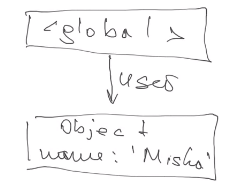
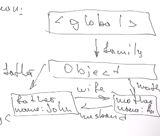
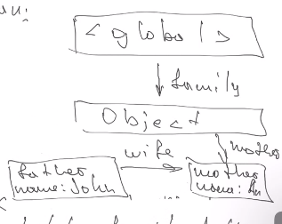
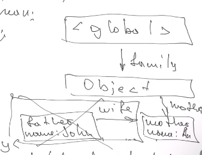
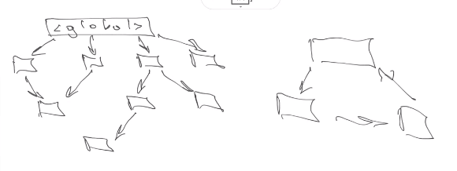

# Collections, colector, garbaje colector

## Garbaje collector

In JS works different that in other lenguajes, as JS have only
one big gobal object.

The main critreria for garbaje collector is **reachability**, if we can reach the value, we should not delete the variable.

This values will always be safe, are not going to follow the rules we are explaing next.

- running func, their variables
- other funcs in chain and their vars
- global vars

**Reachability**

```js
let user = {
  name: "Micha",
};
```



As it is linked to global object, it will not be deleted.

```js
user = null;

// In this case, it will be deleted, as there is no link to global object.
```

```js
function marry(man, woman) {
  woman.husband = man;
  man.wife = woman;
  return {
    father: man,
    mother: woman,
  };
}

let family = marry(
  {
    name: "John",
  },
  {
    name: "Anna",
  }
);
```

As there is a family object, there is a link to global object.



Now if we
delete family.father. father
delete family.mother.husband

Now we have this conections



Garbage collector will delete the father



## How it works

We have some objects and some not linked objects to global


Describe how the collector mark all things that are not going to be deleted.

# Optimizations of garbage colecction

## Generational collection

If some objects live longer, the probability that gets unreachable is very low.

## Incremental collection

We can break the global object in chunks, and in every time a different chunk is checked.

## Idle-time collection

Ver si no hay otras optimizaciones mas y completer

# More

Garbaje collector dont work good as another lenguajes, becaouse there are different engines and it have to work good in all of them. Look more about this

# Collections

- Map
- Set

## Map

It suppors chain of sets

map.set(obj, value).set(obj1, value)

let obj = Object.fromEntries(map)

When we cycle throw the map, we have the same order as they where inserted in the map.

### Methods

- new Map([iterable])
- set(key, value)
- get (key)
- has(key)
- delete(key)
- clear()
- size

## Set

Is a array that doesn't include same value more than one time. It check by its values, not reference.

It can be initialized with an array.

### Methods

- has(value) O(log n)
- new Set ([iterable])
- add(value)
- delete(value)
- clear
- size

# Example

```js
let john = { name: "John" };
let map = new Map();
map.set(john, "value");
john = null;
```


john is still rechable after the null, javascript can still reach the object, but we cannot becouse we lost the reference.

in this case, object will not be deleted from memory. If we want it to be deleted, we must use WeakMap

## Weak Map

It is not iterable.
It is usefull when whe store for example users as keys. If the sesion is experied, the user will be deleted from the weak map.

### Methods

- get(key)
- set(key)
- has(key)
- delete(key)

# JSON

JavaScript Object Notation

It was created to have some wave to send and recibe data.
It only use double quotes and keys also use double quotes.

```json
{
  "name": "John",
  "age": 26,
  "education": null,
  "address": {
    "city": "Gdansk"
  },
  "source value": [1, "value", true, null]
}
```

## Types of data for JSON

- JSON-objects
- arrays
- string
- number
- literals (true, false, null)
- DO NOT HAVE UNDEFINED
- DO NOT HAVE date

## Methods

### JSON.stringify

It skeeps all functions symbos and undefined, iterates in all object very deep and support all types of data.

JSON.stringify(value, [replacer, space])
Replacer can be for string, array of string or functions.

- ver bien lo de replacer y space

- we cant set a property toJSON in our object, so stringify calls this method instead of stringify

### JSON.parse(str, [reviewer])

reviewer take a pair key value, in case we want to convert some value.