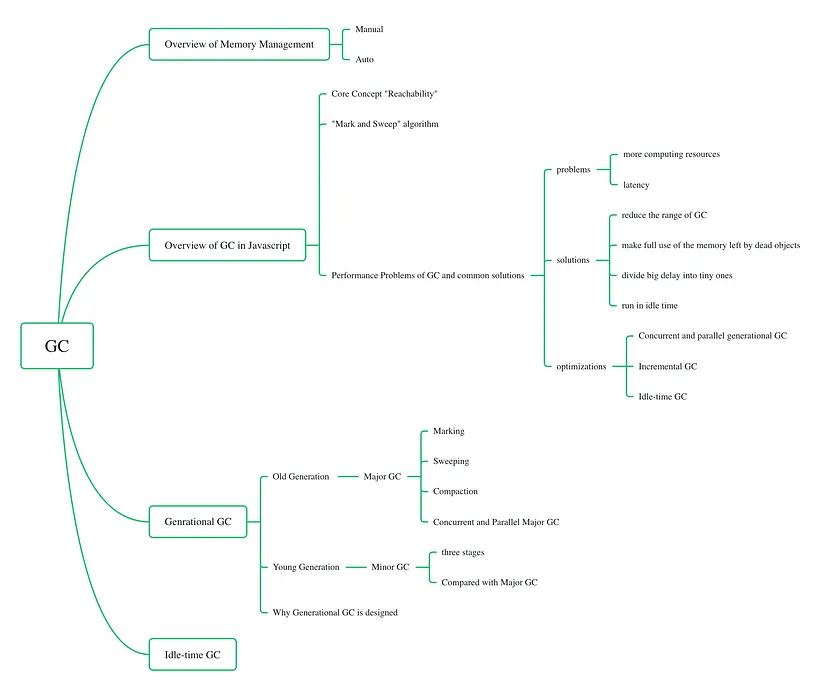
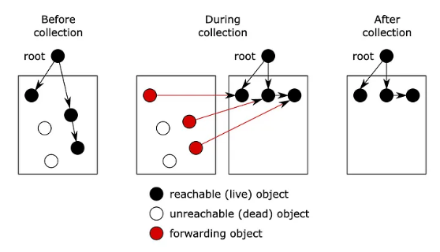
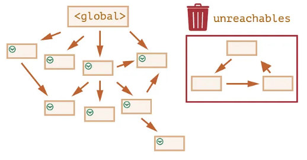
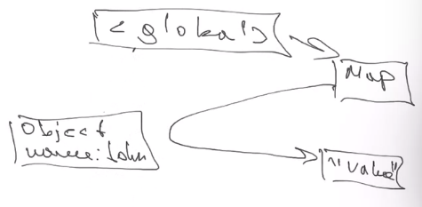

# Collections, colector, garbaje colector

## Garbaje collector

[Read compelte article, all GC information is here.](https://betterprogramming.pub/deep-dive-into-garbage-collection-in-javascript-6881610239a)



**Overview of Memory Management**

Typically, there are two ways of memory management: automatic or manual.

- Automatic memory management: GC is a form of automatic memory management. When the memory is no longer referenced, it will be reclaimed by the garbage collector, e.g., JavaScript, Go, Java, Python

- Manual memory management: programmers have to manage the memory manually, e.g., C/C++.



**Disadvantages of GC**

- First, it consumes extra computing resources to track and decide which could be freed up.

- Second, GC would result in unpredictable stalls. Unlike manual memory management, memory deallocation works implicitly, and it is out of the programmers’ control. Especially in real-time environments, such as transaction processing or interactive programs, “stop-the-world” GC or scattered stalls are unacceptable. Although we have come up with incremental and concurrent GC solutions, performance harm can only be minimized but not eliminated.

### The Main Concept “Reachability”

Garbage collectors monitor all objects and remove those that have become unreachable, so we need to understand which objects can be marked as reachable and which are not.

**What are reachable values?**

Simply put,**“reachable”** values are those that are accessible. There are two types of reachable values.

The first type is called “roots,” and it includes the following:

- Global variables
- Currently executing a function, its local variables, and parameters
  The second type is objects on the chain of roots’ references. For example, if a global object A has a property referencing B, then B is marked as reachable too.

### Mark and Sweep” Algorithm

Algorithms for garbage collection are mainly divided into two:

- “Mark and Sweep” algorithm: JavaScript, Go.
- “Reference Counting” algorithm: Objective-C

**JavaScript uses the “Mark and Sweep”** algorithm as its GC algorithm like this:

1. Mark: mark the roots as “reachable”
2. Visit and recursively mark objects directly or indirectly referenced by roots as “reachable”
3. Sweep: unmarked ones are removed

The graph below illustrates the concept of how garbage collection works:



### Performance Problems of GC and Common Solutions

Just like what we mentioned before, GC mainly has two performance problems:

- Needs more computing resources
- Might introduce “stop the world” delays

**Solutions for these two problems are around these basic ideas:**

- Reduce the range of objects that need to track
- Make full use of the memory left by dead objects
- Divide big delays into tiny ones
- Run GC while the CPU is idle

### Garbage collector optimizations

- Concurrent and parallel generational GC
- Incremental GC — Walking and marking the whole object set simultaneously takes time and introduces visible delays. Why not split the whole object into multiple parts? Although it might take some extra work as the unmarked objects might become marked in later parts, it shortens the delay.
- Idle-time GC — run GC while the CPU is idle.

## Keyed Collections

[Read full article of keyed collections here.](https://developer.mozilla.org/en-US/docs/Web/JavaScript/Guide/Keyed_collections)

- Map
- WeakMap
- Set
- WeakSet

### Map

It suppors chain of sets

map.set(obj, value).set(obj1, value)

let obj = Object.fromEntries(map)

When we cycle throw the map, we have the same order as they where inserted in the map.

```js
// Example
let john = { name: "John" };
let map = new Map();
map.set(john, "value");
john = null;
```



John is still rechable after the null, javascript can still reach the object, but we cannot becouse we lost the reference.

in this case, object will not be deleted from memory. If we want it to be deleted, we must use WeakMap

#### Methods

- new Map([iterable])
- set(key, value)
- get (key)
- has(key)
- delete(key)
- clear()
- size

### Set

Is a array that doesn't include same value more than one time. It check by its values, not reference.

It can be initialized with an array.

#### Methods

- has(value) O(log n)
- new Set ([iterable])
- add(value)
- delete(value)
- clear
- size


### Weak Map

It is not iterable.
It is usefull when whe store for example users as keys. If the sesion is experied, the user will be deleted from the weak map.

#### Methods

- get(key)
- set(key)
- has(key)
- delete(key)

## JSON

[All information about JSON here](https://developer.mozilla.org/en-US/docs/Web/JavaScript/Reference/Global_Objects/JSON)

JavaScript Object Notation

It was created to have some wave to send and recibe data.
It only use double quotes and keys also use double quotes.

```json
{
  "name": "John",
  "age": 26,
  "education": null,
  "address": {
    "city": "Gdansk"
  },
  "source value": [1, "value", true, null]
}
```

### Types of data for JSON

- JSON-objects
- arrays
- string
- number
- literals (true, false, null)
- DO NOT HAVE UNDEFINED
- DO NOT HAVE date

### Methods

#### JSON.stringify(str, [replacer])

It skeeps all functions symbos and undefined, iterates in all object very deep and support all types of data.

JSON.stringify(value, [replacer])
Replacer can be for string, array of string or functions.

- ver bien lo de replacer y space

- we cant set a property toJSON in our object, so stringify calls this method instead of stringify

#### JSON.parse(str, [reviewer])

reviewer take a pair key value, in case we want to convert some value.
