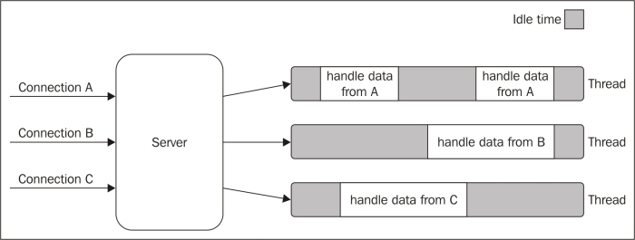
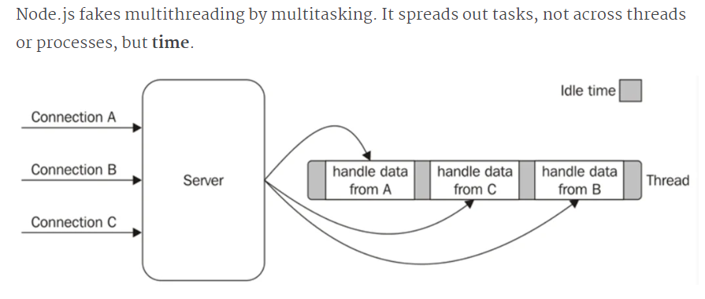
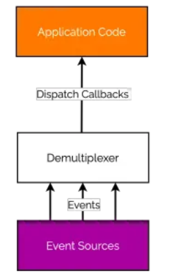
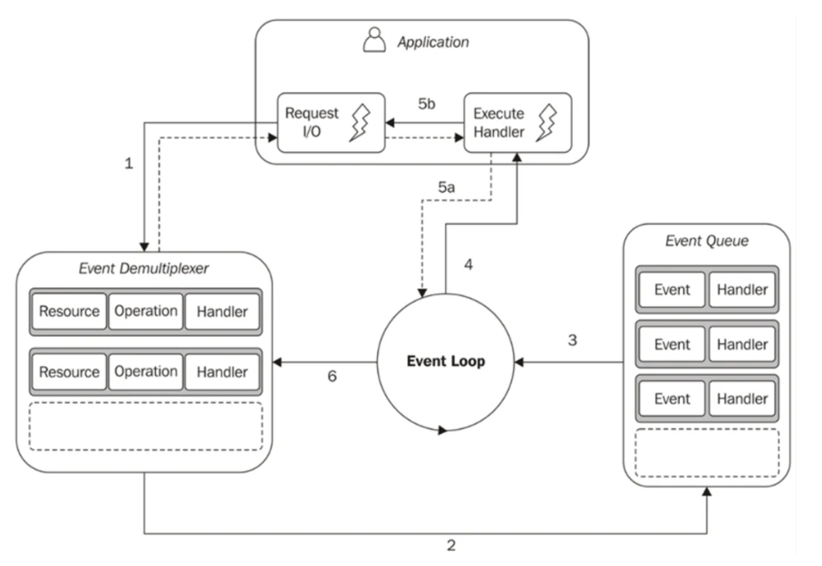
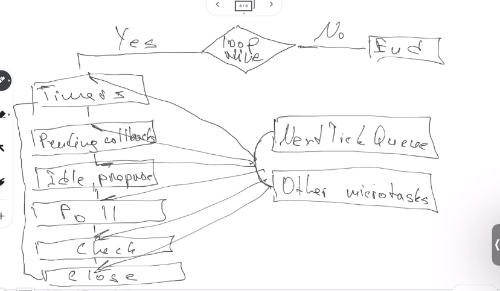
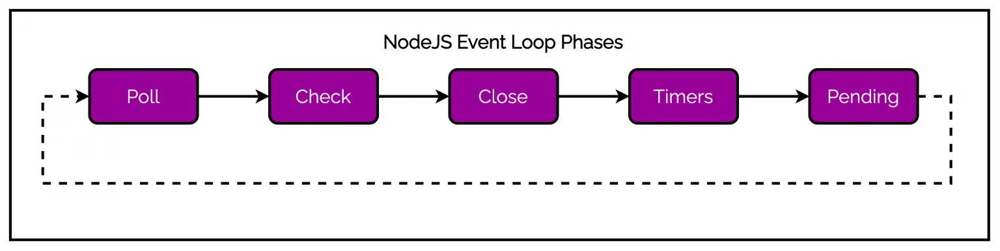
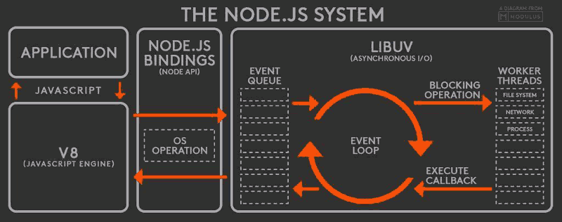
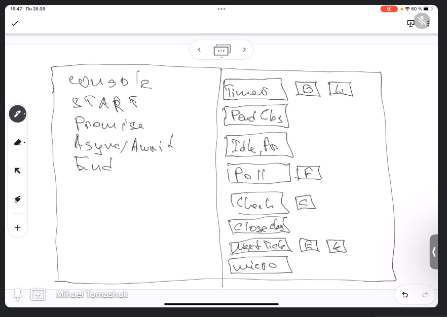

# Event loop

1. https://nodejs.org/ru/docs/guides/event-loop-timers-and-nexttick
2. https://medium.com/@mmoshikoo/event-loop-in-nodejs-visualized-235867255e81

3. https://amplication.com/blog/nodejs-asynchronous-flow-control-and-event-loop


## Client server arquitecture

We have a client and a server.

[See this, a little history of servers and how they work now with node JS.](https://www.bitovi.com/blog/how-node.js-fakes-multithreading#:~:text=The%20synchronous%20event%20demultiplexer%20is,Node%20while%20it's%20in%20progress.)

```js
const response = db.req("SELECT...");
doSomethingWithResponse(response);
doSomethingWithoutResponse();
```

In traditional I/O blocking programming, each concurrent connection is handled by kicking off a new process or a thread in the CPU. So that even if a thread is blocked by some I/O operation. It doesn’t block other connections(threads).



Thread is expensive. The longer a thread lives, the longer the CPU has to perform context switching which wastes CPU time and memory.

### Explain non-blocking I/O architecture.

[Look at this video.](https://www.youtube.com/watch?v=8aGhZQkoFbQ)

```js
// Code interpretation
resources = [socketA, socketB, socketC];
while(resources.length){
  for(i ... resourcers.length){
    let data = resource[i].read();
  }
  if(!data){
    resources.remove(i);
  } else{
    doSomethingWithData(data);
  }
}
```

The main idea is that while we have resources, we go through the cycle and ask, do you have data, if you do not have it, I can not wait or remove it from the resources array.



Using this pattern, Node.js can handle approx. 10,000 HTTP connections at the same time. Instead of creating a thread for each request, Node assigns a callback to each request. A Callback is way too cheap when compared with a Thread.

### Explain sync event demultiplexer.

The synchronous event demultiplexer is a complicated name for a part of Node that just means “in-progress async operations.” When your JS code triggers a request to the file system or network, the synchronous event demultiplexer is where the request lives in Node while it’s in progress. If Node is not actively running JS code, Node will “block” or wait here until one of the async operations finishes.

When an async operation in the demultiplexer finishes, Node moves it to the event queue. When Node is finished running the current bit of JavaScript, it gets the next finished async operation from the queue and runs the callback associated with it.



```js
// Code interpetation
let socketA, socketB;
todoList.add(socketA);
todoList.add(socketB);
while (events in demultiplexer.watch(todoList)) {
  for (ev in events) {
    doSometh(ev);
  }
}
```

## Reactor pattern

The way Node hops around between tasks is explained by the reactor pattern. Node is structured like a reactor, where the flow of control swirls around the event loop, processing tasks as they come in.

Reactor Pattern is used to avoid the blocking of the Input/Output operations. It provides us with a handler that is associated with I/O operations. When the I/O requests are to be generated, they get submitted to a demultiplexer, which handles concurrency in avoiding the blocking of the I/O mode and collects the requests in the form of an event and queues those events.



**This is what happens in an application using the reactor pattern:**

1. The application generates a new I/O operation by submitting a request to the Event Demultiplexer. The application also specifies a handler, which will be invoked when the operation completes. Submitting a new request to the Event Demultiplexer is a non-blocking call and it immediately returns the control to the application.

2. When a set of I/O operations completes, the Event Demultiplexer pushes the new events into the Event Queue.

3. At this point, the Event Loop iterates over the items of the Event Queue.
   For each event, the associated handler is invoked.

4. The handler, which is part of the application code, will give back the control to the Event Loop when its execution completes (5a). However, new asynchronous operations might be requested during the execution of the handler (5b), causing new operations to be inserted in the Event Demultiplexer (1) before the control is given back to the Event Loop.

5. When all the items in the Event Queue are processed, the loop will block again on the Event Demultiplexer which will then trigger another cycle.

The asynchronous behavior is now clear: the application expresses the interest in increasing a resource at one point in time (without blocking) and provides a handler, which will then be invoked at another point in time when the operation completes.

## Event loop phases

When an application runs, it can generate several types of callbacks. Each callback is destined for a specific phase depending on how they are used within the application. So different queues are created.




- NextTickQueue and Other microtask run before each left block.
  - The first microtask queue handles callbacks registered using process.nextTick()
  - The second microtask queue handles promises that reject or resolve

**When the application starts running, the event loop also begins and starts handling the phases one after the other.**

**Timers Phase**

Any callbacks scheduled using setTimeout() and setInterval() are executed in the Timers phase.

**Pending callback Phase**

Executes I/O callbacks deferred to the next loop iteration

**idle, prepare:**

Only used internally.

**Poll Phase**
The poll phase executes I/O-related callbacks. When our application starts running, the event loop is in the poll phase.
Most of the application code that we write is likely to be executed in this particular phase.

**Check Phase**

In this phase, callbacks triggered via setImmediate() are executed.

**Close Phase**

The close phase executes callbacks triggered via the EventEmitter close events. For example socket.on('close', ...) that triggers a callback in the close phase.

## NodeJS I/O Engine – libuv

Today, libuv is the low-level I/O engine of NodeJS. The magic of NodeJS Reactor Pattern is implemented by libuv.

Behind the scenes, Libuv performs several important things:

1. Provides an API for creating event loops
2. Manages event queues
3. Runs async I/O operations
4. Queues other types of tasks

**But what was the need for libuv?**

Each operating system has its interface for the Event Demultiplexer such as epoll on Linux, kqueue on Mac OS and IOCP on Windows

To make matters more complicated, each I/O operation behaves quite differently depending on the type of resource and the operating system. For example, in Unix, regular filesystem files do not support non-blocking operations and it is required to use a separate thread to simulate a non-blocking behavior.



## How  console log works

esto esta incompleto, ya que los pasos se van borrando y aparecen otros. Buscar en internet

