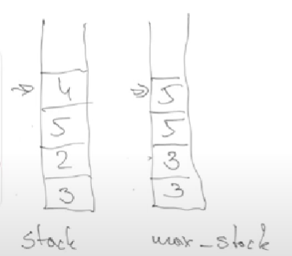
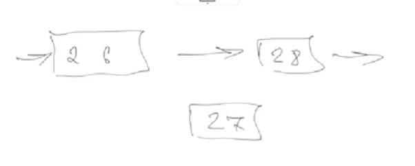
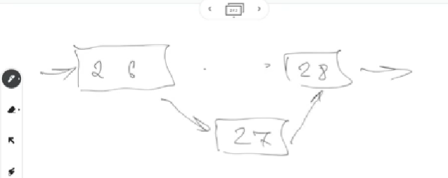
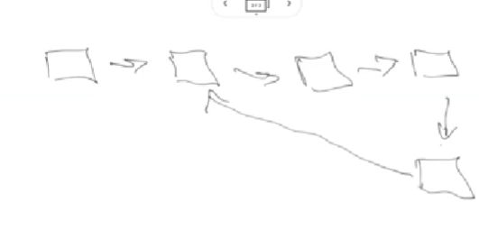
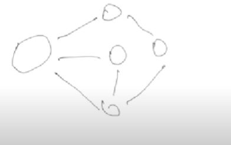
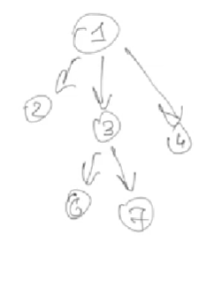
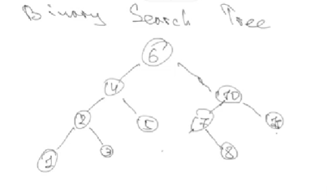

# Data structure

## Arrays

- Is a one field of memory, not separated, not linked.

- All elements are the same size

### It should have next methods all languages

- Get: get a element by index. In js a[i]
- Insert: insert a element by index. In js a[i] =
- Delete: some element by index
- Size: return size of array. In js: a.length

## Stack

- Have a first in last out principle

**To check in O(1) which element is the max.**

We can have to stack, a stack and max_stack

In first item we push the element to both stacks.
With other elements, we add element to stack but only add to max_Stack if element is bigger, if not, we add again the same max element. If the element is bigger, we add it to both stacks.



### It should have next operations

- Push
- Pop
- isEmpty
- Top: link to the link of top element

## Queue

- It follows the principle first in, first out.

### It should next operations

- Enqueue: add item
- Dequeue: removes item
- isEmpty
- Top: get start of the queue

## Linked list

- Like an array, but not sharing the same memory space

Each element have:

- Data
- Pointer to next element

The last element pointer is `null`.

It can be:

- One way: have pointer to next element
- Two way: have pointer to next and previous element

```js
class Node {
  constructor(data, pointer) {
    this.data = data;
    nextPointer = pointer;
  }
}
```

### Goof for

Is good for example, if is used to add some data, in case for example the linked tree is in order. So we split the linked tree and add the value in the middle.





### Problems

The last element point another element and makes a infinite loop.



#### Solve the problem

**Easy but not good method**

Linked list do not have counters.

- Store the pointer of the top
- Store the count of added elements
- When adding elements or doing something, count the times we moved elements, if greater than the total count, we are in problem.

**Better method. Floid method**

- Create two pointers, one that is fast and a slower one. The both start at the beginning.
- Fast pointer moves two elements
- Slow pointer moves ones element
- If the pointers met, it have a loop.

## Graph

Popular data structure.

- Set of vortex and edges
- Connected by them selves
- It can be oriented / not oriented

**Not oriented example**
Because edges do not have arrows, you can move from node to node in both directions.


**Oriented**
They have arrows to define in which way you move.

### Graphs algorithms

Do not use recursion in graph.
Use queue, stack and set.

- Depth first search: go deep till a node do not have a child, the go one step back a start again.
- Breadth first search. go level by level

## Trees

Like a graph but with herarchy.

- Have a root
- Have nodes



It starts by the root. In this case: 1.

- Parent node: a node that have links to other nodes
- Child node: a node hat have parents
- Leaf: a child which is not parent.
- Siblings: children of same parent.

**On this example**

- Root: 1
- Parent: 1 3
- Child: 2 3 4 6 7
- Leaf: 2 4 6 7
- Siblings 1: 2 3 4
- Siblings 2: 6 7

37:12

### Binary search tree

Binary mean that each node can have a maximum of two children.

- Left child is lower
- Right child is higher



Usually used for storing information. If tree is balanced is fast to find elements.

### Balanced search tree

- Every leaf have some depth.
- If the max_leaf_depth - min_leaf_depth <= 2

Is good practice to always balance the tree.

### Black Red Tree

Search more information.

It is used for many databases index.

Tha main idea is that a black red tree balances it self.

It guarantee max_depth / min_depth <=2; and the search is always O( log n)

#### Left Side Turn

## Heap

Read at home

# Homework

## Homework Assignment: Data Structures and Algorithms in JavaScript

### Task

Your task is to demonstrate your knowledge of data structures (stack, queue, tree, graph, linked list) and implement algorithms to solve specific problems related to these data structures in JavaScript.

### Instructions

### Part 1: Data Structure Implementations

1. **Stack**: Implement a class for a stack data structure. Include methods for push, pop, and peek.
2. **Queue**: Implement a class for a queue data structure. Include methods for enqueue, dequeue, and peek.
3. **Binary Tree**: Implement a class for a binary tree data structure. Include methods for inserting nodes, searching for a node, and traversing the tree (e.g., in-order, pre-order, post-order).
4. **Graph**: Implement a class for a graph data structure. Include methods for adding vertices and edges, performing depth-first search (DFS), and breadth-first search (BFS).
5. **Linked List**: Implement a class for a singly linked list data structure. Include methods for inserting nodes, deleting nodes, and searching for a node.

### Part 2: Algorithmic Problems

1. **Min/Max Stack**: Implement a class for a stack that supports finding the minimum and maximum elements in constant time (O(1)). Include methods for push, pop, getMin, and getMax.
2. **Binary Search Tree**: Implement a function to determine if a binary tree is a binary search tree (BST). Provide an efficient algorithm that checks whether the tree satisfies the BST property.
3. **Graph Algorithms**: Implement algorithms to find the shortest path between two vertices in a graph using both Dijkstra's algorithm and Breadth-First Search (BFS).
4. **Linked List Cycle**: Implement a function to detect if a linked list has a cycle. Use Floyd's Cycle Detection Algorithm (Tortoise and Hare algorithm) to solve this problem efficiently.

### Part 3: Demonstration

1. **Usage Demonstration**: Create instances of your data structures and demonstrate their usage with sample data. Show how the algorithms you implemented can solve practical problems using these data structures.

### Part 4: Documentation

1. **Documentation**: Provide clear and concise comments and documentation for your code. Explain the purpose of each data structure, method, and algorithm. Describe how the algorithms work and their time complexity.

### Submission

Submit your JavaScript code along with detailed documentation and comments that explain your data structure implementations and algorithms. Ensure that your code is well-structured and adheres to best practices in data structures and algorithms.

### Example

Here's a simplified example structure to give you an idea of what your code might look like:

```jsx
class Stack {
  // Implement methods for push, pop, peek...
}

class Queue {
  // Implement methods for enqueue, dequeue, peek...
}

class BinaryTree {
  // Implement methods for inserting nodes, searching, traversing...
}

class Graph {
  // Implement methods for adding vertices, edges, DFS, BFS...
}

class LinkedList {
  // Implement methods for inserting, deleting, searching...
}

// Implement Min/Max Stack, Binary Search Tree, Graph Algorithms...
// Demonstrate usage and provide documentation...
```

## Bonus Homework Assignment: Implementing a Red-Black Tree

### Task

As a bonus challenge, you are tasked with implementing a Red-Black Tree data structure in JavaScript. Red-Black Trees are a type of self-balancing binary search tree. This exercise will deepen your understanding of tree structures and balancing algorithms.

### Instructions

1. **Red-Black Tree Implementation**: Create a class for a Red-Black Tree that includes methods for insertion, deletion, and searching. Implement the Red-Black Tree balancing rules to ensure that the tree remains balanced after each operation.
2. **Insertion**: Implement the insertion operation for the Red-Black Tree. Ensure that the tree maintains the Red-Black properties, including colorings and rotations as necessary.
3. **Deletion**: Implement the deletion operation for the Red-Black Tree. Handle cases for both removing nodes with no children, one child, and two children while preserving the Red-Black properties.
4. **Search**: Implement a method to search for a specific value in the Red-Black Tree. Ensure that the search operation is efficient and respects the tree's structure.

### Submission

Submit your JavaScript code for the Red-Black Tree implementation along with detailed comments and documentation explaining your implementation. Provide examples of inserting, deleting, and searching for values in the Red-Black Tree.
