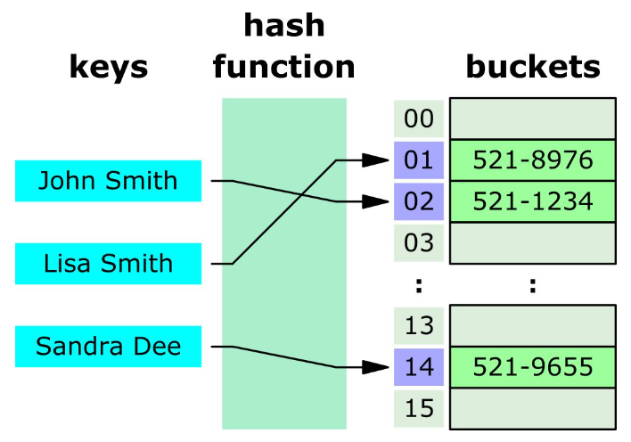
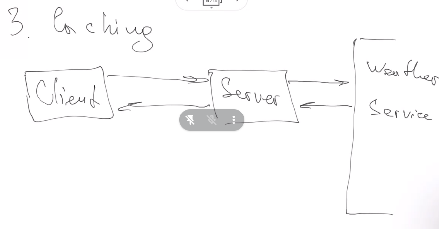
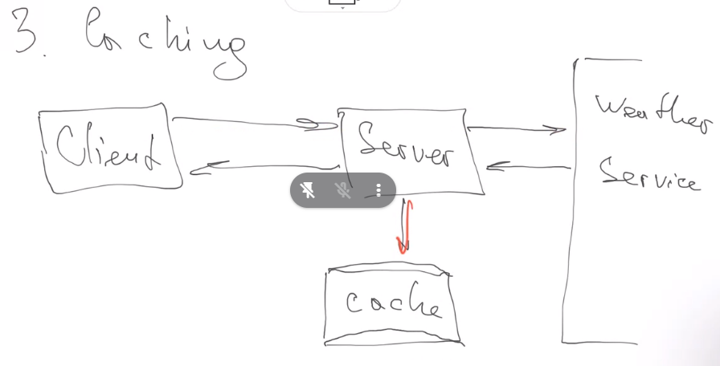
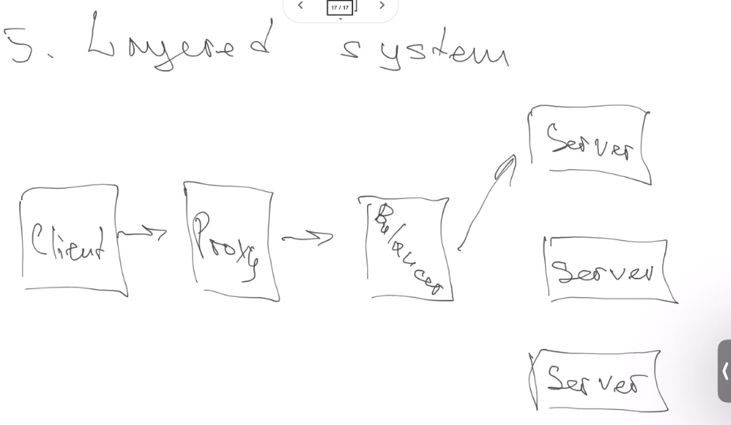
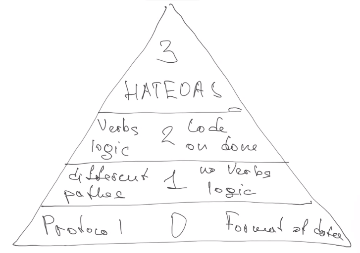

# Class 15 - REST and Hash

## Hash

[Fast approach of hash.](https://www.freecodecamp.org/espanol/news/tabla-hash-en-javascript-hash-de-arreglo-asociativo-en-js/)

[All the info is in this article.](https://samwho.dev/hashing/)

[Load factor and dinamyc hash table size.](https://www.scaler.com/topics/data-structures/load-factor-and-rehashing/)

It is a collection of keys, where each key have a collection of values.



hash(user) => return a key, with this key we store the user information.

The main idea is that is easy to calculate the hash, but with the hash is difficult to get the original data.

### Requirement for a good hash algorithm

- Result must be in a promised range
- Low number of collisions
- Good avalanche effect. A change of 1 bit should change in average the 50% of the hash.
- Good distribution between pockets

### Very used for storing passwords

**passwordJS** is used for password.


### Use hash to compare objects

We can send a big file, both client and user have the hash result, so you can hash the file and both results must be the same.

Some times hash can be hacked, so we can use md5-

### To make it more unpredictable

hash(data, salt) => salta is some parameter make more random hash

### Hash table collisions

Some times, hash(user1) can make the same key for hash(user2)

## Rest architecture

### Format of data presentation

The same dada can be presented in different formats.

- Plain text
- JSON
- XML
- binary

So we need a protocol of how to define the epical rules for how to sent information and a defined the structure of data.

**So we need**

- Protocol
- Transport (how is going to be sent, a cart can be send by plane, boat, etc.). In Rest we use over to define transport.
  - JSON over HTTP
  - XML of QT

### Protocol http

**Hyper Text Transfer Protocol**

It is shown in the uro: http://our.api/stundes/123

**http** is the schema (the transport)
**our.api** is the host, who will receibe the erquest
**/students/123** is the path to resource

### HTTP verbs

It defines what kind of operation to perform

**There are 4 basic HTTP verbs** we use in requests to interact with resources in a REST system:

- GET — retrieve a specific resource (by id) or a collection of resources
- POST — create a new resource
- PUT — update a specific resource (by id)
- DELETE — remove a specific resource by id
- PATCH

## Rest

**Representational State Transfer**

- Is not a library
- Is not a framework
- Is a set of rules for working for creating a architecture.

### Rules and principles

1. **Client-Server architecture** Means that we separate client from server. - The disadvantage is that if server is down, client canot do nothing.
   

2. **Stateless**. For obtaining a certain data, the parameters are always the same.

   - **Advantages:**

     - Scalability. Easy for horizontal and vertical scalability
     - Time: faster, we do not have to store half data after sending
     - Easy to maintain. Testers have a easier work
     - Caching

   - **Disadvantages:**

     - Makes client more complex, as it need to store more data
     - Network issues, as we sent more information, network have to work more.

   - **In a fullstate**, we can send first the half of the parameters, and after the we can send the last part and the server might understand what we want to obtaing and send the response.

3. **Caching**
   The problem here, is that every time a user wants a certain weather, we must ask to the weather service.



We can use caching for storing the data so we do not call always with the same data to weather service.



4. **Hypermedia as Engine of application state** (HATEOAS)

GET /account/123

if we do not use HATEOAS, we will receive the next:

```
{
    account_number: 123,
    balance: 100,
}
```

if we use HATEOAS principle, we will get the data and actions we can do with this data

```
GET /account/123
{
    account_number: 123,
    balance: 100,
    links[
        "account/123/deposit",
        "account/123/withdraw",
        " account/123/transfer",
        ]

}
```

5. **Layered system**

Serer can have many middleware.



Rest architecture says that a layer must only have information about the layer he sends information and about the one he receives information.

6. **Code on done**

It means that when our client ask for some part of the code, we can send it.

### Common mistakes about rest

1. REST principles is optional. WRONG, if we use REST we must use all principles
2. REST is a protocol of data transfer. WRONG, is architecture
3. REST is always HTTP. WRONG, we can use others.
4. REST is always JSON. WRONG, we can use XML for example

### Levels of rest

We do not always follow all of the principles, so there are different levels of rest to know
wich REST is our app.

- **Level 0**, we send data with some protocol and format of data
- **Level **1, we uses different passes for manipulation the data but no verbs logic
- **Level 2**, We use verbs logic. GET, POST, etc. and we use Code on done
- **Level 4**, we use HATEOAS.



# Homework

### Task

Your task is to explore the concepts of hash functions and hash tables, and to implement a hash table with a custom hash function in JavaScript. This assignment will test your understanding of hash functions, collision resolution, and the practical application of hash tables.

### Instructions

### Part 1: Understanding Hash Functions

1. **Research**: Begin by researching and understanding what hash functions are, how they work, and their applications in computer science and data storage.

### Part 2: Implementing a Custom Hash Function

1. **Custom Hash Function**: Implement a custom hash function in JavaScript. Your hash function should take a string as input and produce a hash code (an integer) as output. Be creative, but ensure that your function distributes values uniformly.
2. **Collision Handling**: Implement a collision resolution strategy. You can choose from methods like separate chaining (using linked lists), open addressing (linear probing, quadratic probing), or any other technique you prefer.

### Part 3: Building a Hash Table

1. **Hash Table Class**: Create a JavaScript class for a hash table that uses your custom hash function. Include methods for inserting key-value pairs, retrieving values by key, and deleting key-value pairs.
2. **Testing**: Create test cases to ensure that your hash table and custom hash function work correctly. Test scenarios should include inserting, retrieving, and deleting values, as well as handling collisions gracefully.

### Part 4: Documentation and Analysis

1. **Documentation**: Provide clear and concise comments and documentation for your code. Explain how your custom hash function and hash table class work.
2. **Analysis**: Write a brief analysis of the performance of your custom hash function and hash table. Discuss the time complexity of key operations (insertion, retrieval, deletion) and any trade-offs you made in your implementation.

### Submission

Submit your JavaScript code for the custom hash function and hash table along with your documentation and analysis. Include test cases that demonstrate the correctness and efficiency of your implementation.

### Example

Here's a simplified example structure to give you an idea of what your code might look like:

```jsx
class CustomHashTable {
  constructor() {
    // Initialize the hash table...
  }

  hash(key) {
    // Implement your custom hash function...
  }

  insert(key, value) {
    // Implement key-value insertion...
  }

  get(key) {
    // Implement key retrieval...
  }

  delete(key) {
    // Implement key deletion...
  }
}

// Create an instance of CustomHashTable and demonstrate its usage...
```

### Bonus Challenge

For an extra challenge, consider implementing additional features for your hash table, such as resizing the table dynamically to maintain an efficient load factor, or implementing a method to iterate through all key-value pairs in the hash table.
