# Project managment

**Focus on how the project is maintain and developd.**

## Project and methodology

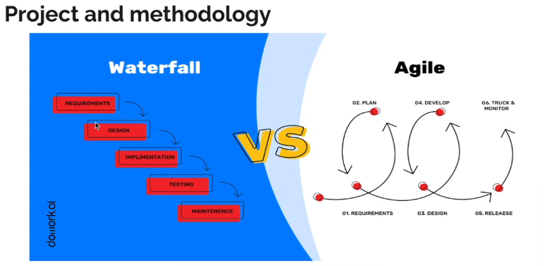

- The waterfall is very formal, we only go to next step if the last one
  is already finished. Fix a bug is very hard and to solicite a request also.

- Agile is about being main flexible. The idea is that the devolope is devidied in short interations. Each iteration is about of 2 to 3 weeks.
  - In each iteration we add changes, new features
  - The client can inspect pieces of software

## Agile framework: Scrum

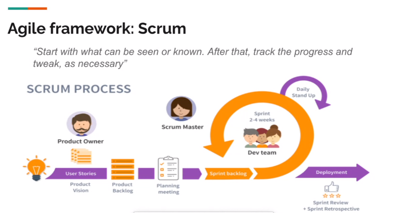

- Producto owener: the one that have the idea and explains it
- User stories: former for describing the requirements
  - Team can also add necesities
- Product backlog: the formal of all the requeriments
- Pkanning meeting: we estimate the stories to be done on the sprints and the dates
- When the sprint is over, we add the changes to the product backlog.
- Scrum Master: techs the team how to work using the scrum method and values.
- Daily stand up: about 15 minits for discuss over all project. If more time is needed, they make another meet.

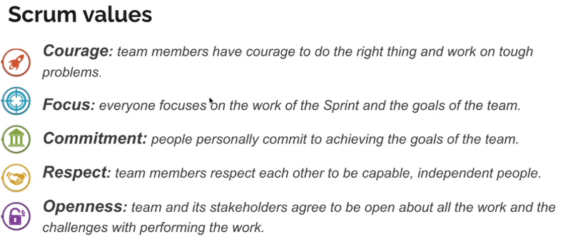

### Kanban for the team

- The number indicates the number of cards that can be in each column
  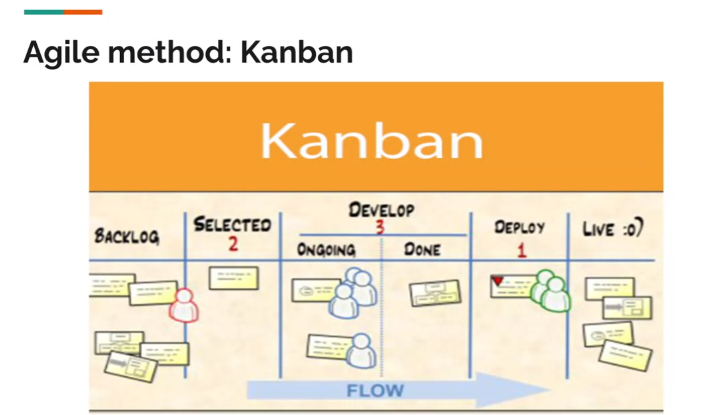

Many people combine scrum and kanban

### Some times we adapt the metodologie

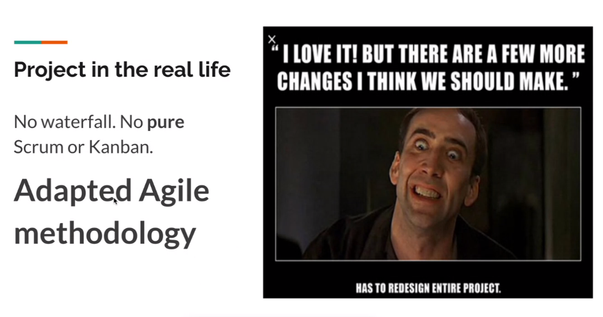

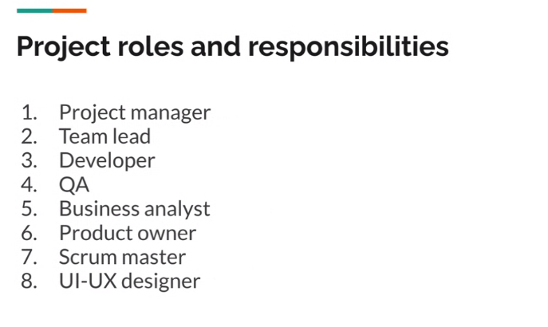

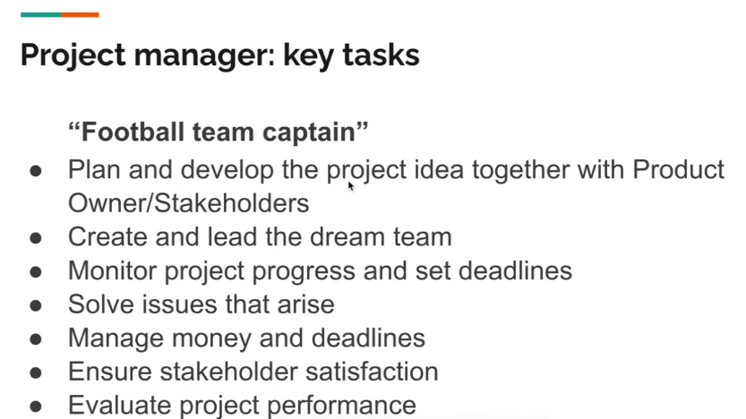

- In agile we do not have business analyst.

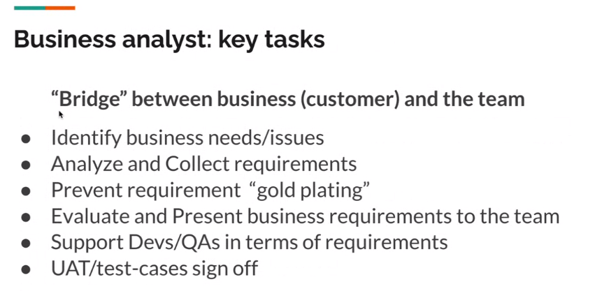

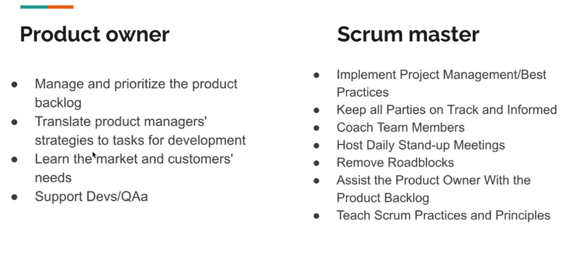

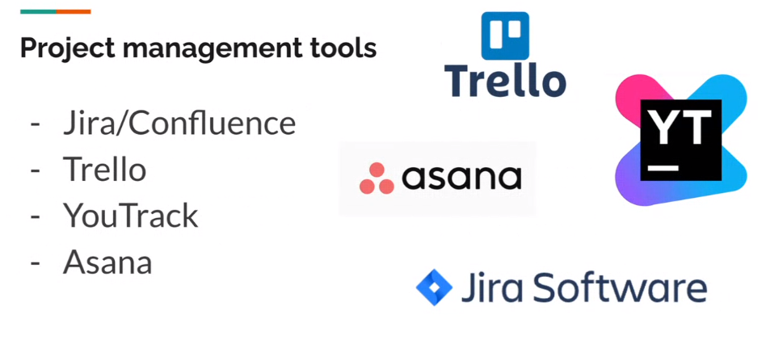

- We use Jira for software development and backlog
- Confluence for documentation?

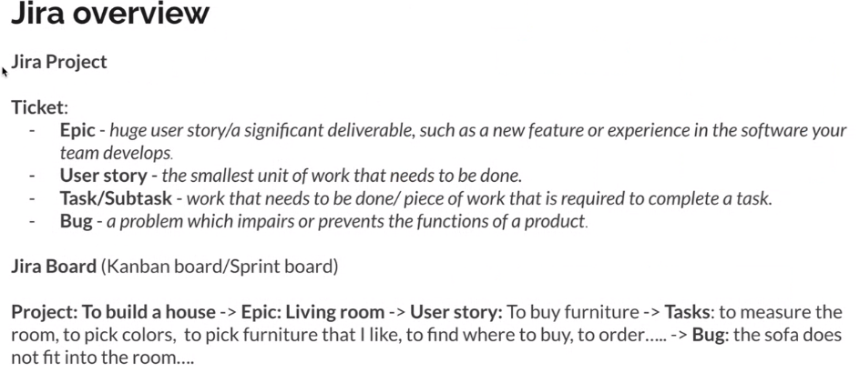

The ticket is the kanban card

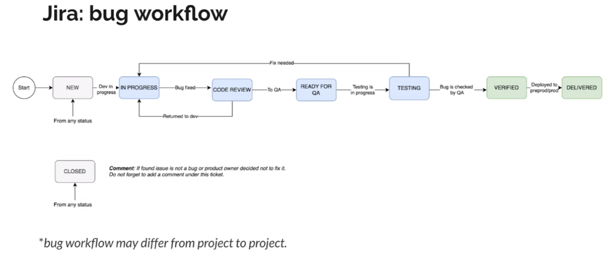

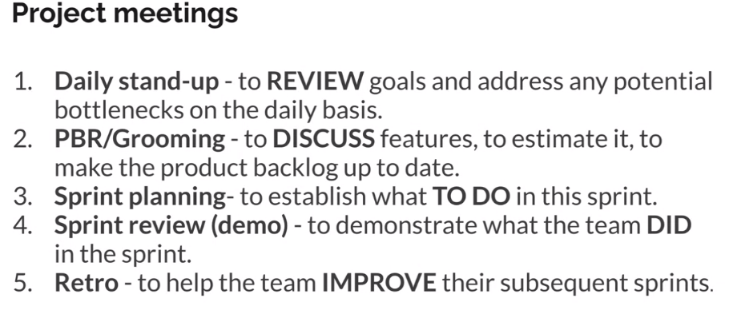

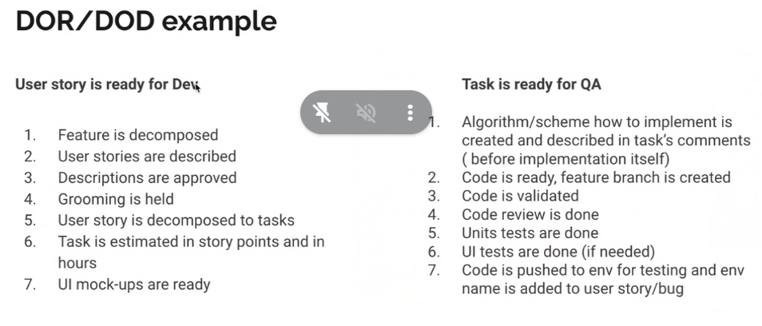

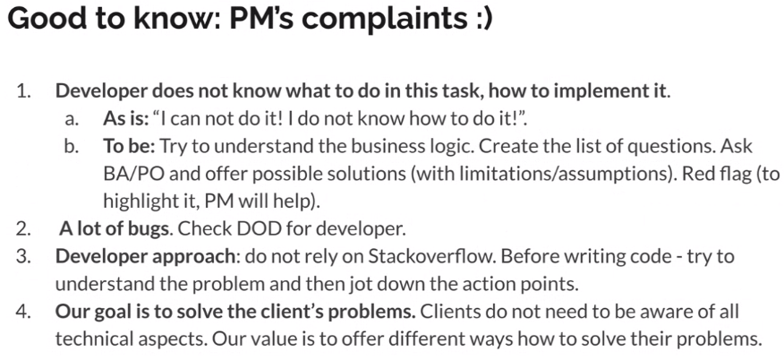

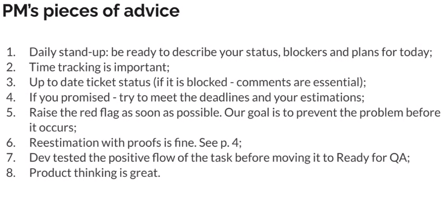