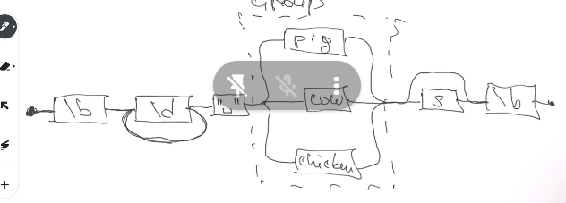
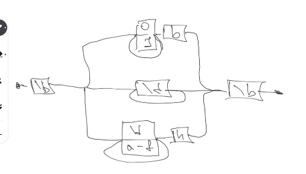

# Class 18 - RegEx

[How regex works](https://javascript.info/regexp-greedy-and-lazy)

For learning regex
https://regexone.com/

## exec() and watch()

```js
r = /\d+/.exec("one two 100");
r.index; // 8 (where the 100 starts)

"100".watch(/\d+/) => // ["100"]
```

## Symbols

/^!/ => searching a string that starts with !
[^ab] => al symbols excepts a and b

/?$/ => looking for ? at the end of the string

\b => looking for border of the board
/cat/.test("concatenate") => true
/\bcat\b/.test("concatenate") => false
/\bcat\b/.test("I have a cat") => true

/\b\d+ (pig|cow|chicken)s?\b/



## Digits

Binary: 1010b
Normal: 2345
Hexadecimal: 5eb6h

Les try to write a regex that extract the digits
Binary, normal, hexadecimal
/\b([01]+b | \d+ | [\da-f]+h)\b/



---

/^.\*x/.test("abcxe");

---

Ver rowl back or roll back , the mechanism of how it works. It is a problem becouse is O(n2) if we have two of them.

/([01]+)+b/ this makes n^2

## replace

```js
"test".replace("t", "o"); // "oest"

"some text".replace(/[st]/, "a"); //aome text"
"some text".replace(/[st]/g, "a"); //aome aexa"
`Hopper, Grace
Cathy, John
Richie, Denais`.replace(/(\w+), (\w+)/g, "$2 $1");
/* "Grace Hopper
John Cathy
Denais Richie,, the $2 and $1 changes the order of the words*/

"the cia and fbi".replace(/\b(fbi | cia)\b/g), (x) => x.toUpperCase); // "the CIA and FBI"

function minusOne(match, amount, unit){
    amount = amount - 1;
    if(amount == 0){
        amount = "no"
    }
    return amount + " " "unit";
}

stock.replace((\d+) (\w+)/g)

```

Create regex for removing block comments /_ comment _/
/\/\*[^]\*\*\//g

## lastIndex

```js
const p = /y/g;
p.lastIndex = 2; // say regext to stop in index 2
p.exec("yxxyx"); // {value:["y"],index:4, lastIndex:4, lastIndex: 5}

//This last index help us to iterate over the regex

while(m r.exec(str)){
    //do smt
}
```

# Homework

## Implementing a Basic JSON Parser with Regular Expressions

### Task

Your task is to implement a simplified version of the `JSON.parse` function in JavaScript using regular expressions. This assignment will test your understanding of JSON syntax and your ability to use regular expressions for pattern matching.

### Instructions

### Part 1: JSON Syntax Understanding

1. **JSON Syntax**: Begin by revisiting the JSON (JavaScript Object Notation) syntax. Make sure you understand the basic structure of JSON objects, arrays, strings, numbers, booleans, and null values.
2. **Parsing Rules**: Familiarize yourself with the rules for parsing JSON, including how to handle nested objects and arrays.

### Part 2: JSON Parser Implementation

1. **Implement JSON.parse**: Create a JavaScript function called `myJSONParse` that takes a JSON-formatted string as input and returns the corresponding JavaScript object. You should use regular expressions to tokenize and parse the input string.
2. **Tokenization**: Implement tokenization by using regular expressions to identify JSON elements (objects, arrays, strings, numbers, booleans, null, etc.) in the input string.
3. **Parsing**: Implement a parsing algorithm that processes the tokens generated in the previous step and constructs the corresponding JavaScript object.
4. **Error Handling**: Ensure your implementation handles common JSON syntax errors gracefully and provides informative error messages when parsing fails.
5. **Testing**: Test your `myJSONParse` function with various JSON strings to ensure it can correctly parse them into JavaScript objects.

### Part 3: Documentation and Reflection

1. **Documentation**: Provide clear comments and documentation in your code to explain how your `myJSONParse` function works and how you used regular expressions.
2. **Reflect**: Write a brief reflection on your experience implementing a JSON parser with regular expressions. Discuss any challenges you encountered and how you addressed them.

### Submission

Submit your JavaScript code for the `myJSONParse` function, along with any test cases you used to validate its correctness. Include the documentation and reflection as well.

### Example

Here's a simplified example structure of what your code might look like:

```jsx
function myJSONParse(jsonString) {
  // Implement JSON parsing with regular expressions...
}

const jsonString = '{"name": "John", "age": 30, "city": "New York"}';
const jsonObject = myJSONParse(jsonString);

console.log(jsonObject); // Should output the parsed JavaScript object.

```

### Bonus Challenge

For an extra challenge, consider extending your `myJSONParse` function to handle additional JSON features, such as Unicode escapes, handling of special characters in strings, and custom revivers similar to the native `JSON.parse` function.