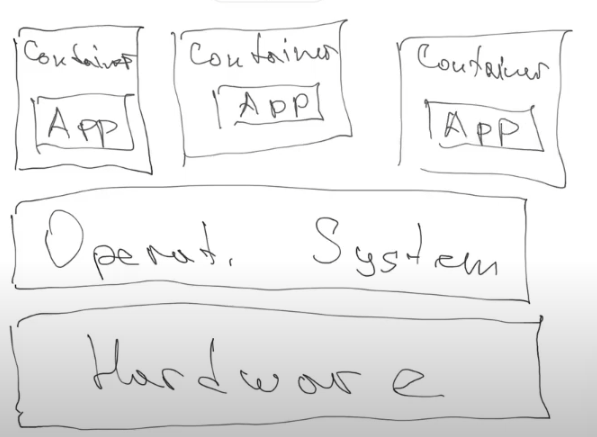
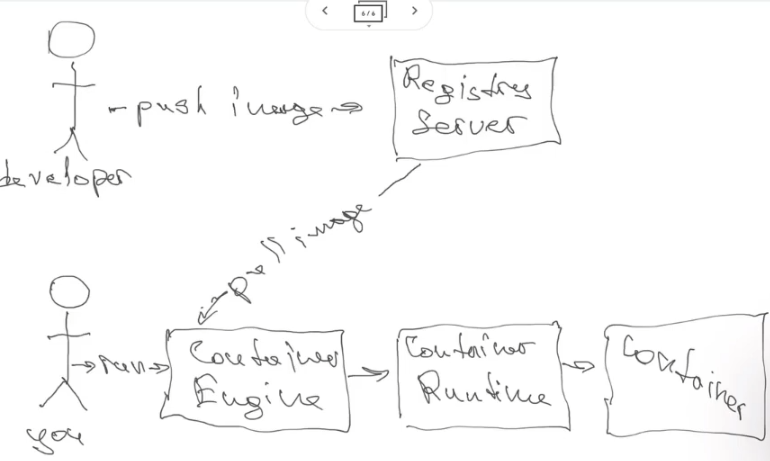
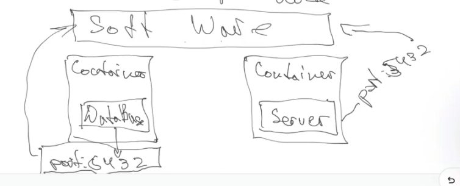

# Class 18 - Docker

## Docker vs virtual machine

Docker is more software and virtual machine is more hardware.

In summary, the choice between Docker and virtual machines depends on your specific use case and requirements. Docker is often preferred for modern, containerized applications, while virtual machines are a better fit for scenarios where stronger isolation and compatibility with various OS environments are necessary. In some cases, both technologies can be used together, with Docker containers running within VMs to combine their benefits.

1. Isolation:

- Docker: Docker uses containerization, which allows applications to run in isolated environments called containers. Containers share the host OS kernel but have their own user space, making them lightweight and efficient. However, they provide less isolation compared to VMs.
- Virtual Machines: VMs, on the other hand, emulate complete virtual hardware and run full guest OSes. This provides stronger isolation but comes at the cost of higher resource overhead.

2. Resource Efficiency:

- Docker: Docker containers are more resource-efficient because they share the host OS kernel. This means that you can run multiple containers on a single host without significant overhead.
- Virtual Machines: VMs consume more resources as they include a full OS stack. Running multiple VMs on a single host can be resource-intensive.

3. Performance:

- Docker: Docker containers generally offer better performance because they have lower overhead due to their lightweight nature.
- Virtual Machines: VMs have a higher overhead, which can lead to slightly reduced performance compared to running applications directly on the host OS.

4. Portability:

- Docker: Docker containers are highly portable because they package the application and its dependencies into a single container image. This image can be run on any system that supports Docker, ensuring consistency across different environments.
- Virtual Machines: VMs are less portable since they include the entire guest OS, which may not be compatible with different hypervisors without modification.

5. Startup Time:

- Docker: Containers start quickly because they share the host OS kernel and do not require a full OS boot.
- Virtual Machines: VMs typically take longer to start because they need to boot a complete OS.

6. Use Cases:

- Docker: Docker is well-suited for microservices architecture, application containerization, and DevOps practices. It's ideal for packaging and deploying applications with their dependencies.
- Virtual Machines: VMs are better for scenarios where strong isolation is required, such as running legacy applications, hosting multiple different OS environments on a single server, or ensuring security boundaries between workloads.

7. Management:

- Docker: Docker containers are easier to manage due to their lightweight nature and the availability of container orchestration tools like Docker Compose and Kubernetes.
- Virtual Machines: VMs require more management effort, including patching and maintaining the guest OS.

## Control groups

Allows you to control how many resource can a container have.

## Docker schema



## How are they isolated

They have different namespaces, this allows to isolate container from OS and other containers.

## Docker namespaces

The namespaces guarantee rules for a container to be isolated.

- File system
  - mount: show container where it will work
- UNIX Time Sharing: isolates; 
    - host name
    - domain name
- process identifier (pid)
- network
- ipc
- user identifiers

## Container Image
Is a file where the application and all the environments are set up. 
It could be a ubuntu, with some node js, code, postgress,  etc.

## Registry Server
Is a repo where there is a lot of container images for managing versioning, names (is like npm).
- Most popular: docker hub
- Other: RedHat

## Container
Is a instance of a container that is already isolated.

## Container Engine

Engine that runs the container, there are many different.
- Most popular: Docker, Podman

## How it works




## Popular commands

```
docker-help
docker search node@alpine
docker pull ubuntu
docker images
docker rmi <image name> // delete container
docker ps // running containers
docker ps -a // stop containers
docker start <app> // start a container
docker stop <app> // stop container
docker rm 
```

## Bridges
To connect different containers using different ports.

Software layer acts as a proxy so the containers can communicate.


## What to use
Node dock