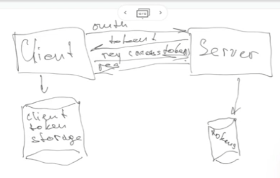
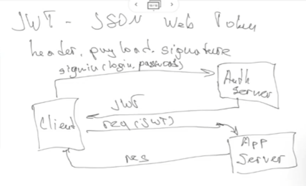

Leer sobre nest Js
nextjs for small projects
swelty

## simple middleware

It get 3 parameters

```js
function (req,res,next){
    ....
    // If there we do not pass a validation
    // for example, we can
    next(new ValidationError(...)); // It will send this error
    // to the nearest error handling middleware, it will pass the other middlewares
}
```

## error handling middleware

It get 4 parameters

```js
function(error, req, rest, next){
switch(...0){
error 1:
error 2:
....
}

    if(error instanceOf ValidationError){
        ....
    }

    if(error instanceOf TypeError){
        ....
    }

}

```

## Middleware levels

- route level: work for only rout of its height

  ```js
  App.get("/", (req,res)=>{
      res.json(....)
  })
  ```

- router level: proceed only for certain requests

```js
const r = express.router();
r.get("/user", handler);
r.post("/user", handler);

app.use(r);
```

## Application level

npm install bodyparser

app.use(bodyParserMiddleware)

```js
app.get("user", authHandler, handler);
```

How express works in the inside

- create application
- router.route
- app.get

## Authentication

If only one developer, do not add authentication.

If many developer, we need auth so each developer can make see different part of the app.

## Basic authorization

Very easy, do not use it.

## OAuth 2.0

it uses auth token: when client log in, we sent him a token, and next operations he authenticate with the token. We use the token becouse the token have a life time, so if the token is stolen of something, after certain time the acces will be lost. We store the tokens in a db. The name of the token is access_token (can be used many time but have a short life, 4 o 5 minitues), and we also have the refresh_token(have more life time but it can be used only one time for refreshing the tokens).

The client works with the access_token, if the client gets response 401, he sends the refresh_token to a certain path, and we will receibe a new pair of tokens so he can continue using the app.



### JWT (JSON Web Token)

Is a string with next parameters:

- header.payload.signature

1. Client sign in in Auth server with login, password and client gets a JWT.
2. Client use the JWT to talk with server.



It looks easy than OAuth, but it only uses one token, so it must be more secure.

```js
// jwt token

header
{
    alg: "HS256",
    type: "JWT"
}
payload
{
    user_id: 1,
}
.iss(issuer) // who is it
.sub(subject)
.exp(expiration)
```

```js
const SECRET_KEY
const unsigned_token = base64(header)+"."+base64(payload)
const signature = sha256(unsigned_token, SECRET_KEY);
const jwt = `${base64(header)}.${base64(payload)}.${base64(signature)}`
```

Client have a public token encrypting, but auth and app server have the private token for decrypting.

## REDIS

Use REDIS for storing tokens in our project in a different docker container
Use OAuth 2 o JWT with out libraries. We can use libraries for encrypting for example.

Use dotenv ? read this