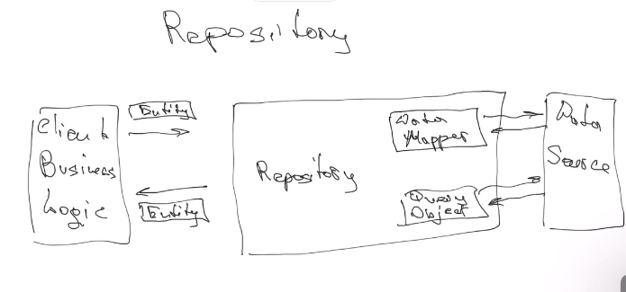
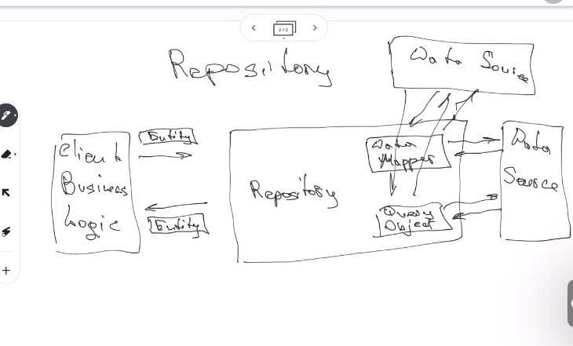

# Class 23 - Solid principles

Mock test for authentication test

# Solid Principles
[Read this.](https://www.freecodecamp.org/news/solid-principles-for-programming-and-software-design/)
- We will be asked in interviews

- Single responsibility principle: each class have only one resposability
- Open close principle: open for extend, losed for modification
- Code substitution principle: parent class ONLY store cocommon methods
- Interface segmentation's: not good for javascript.
    - We can used with Object.assign(xxx.protoype, other class, other class)
- Dependency inversion: higher order clasess should not depends on lower level classes

# Architecture pattern MVC
[Read this.](https://www.freecodecamp.org/news/the-model-view-controller-pattern-mvc-architecture-and-frameworks-explained/)
Most popular and easy, we should use it.

- Model: implement logic of data and representation
    - sometimes it is algo the database it self
- Viewer: shows something to user
- Controller: used to proceed client actions

Its kind of a recursive architecture, each part can have also it own MVC

## Repository

For example, if we use another API, we can use a repository that reads data from the API and prepare it mapping to our project. so if the api changes, we only modify the repository.

We need some data, so the repository get the data from external API and prepare it to our business logic.

So we can have many sources of external data sources and our project do not know.

### tasks

If we have acceptance for asistents, we can proceed.