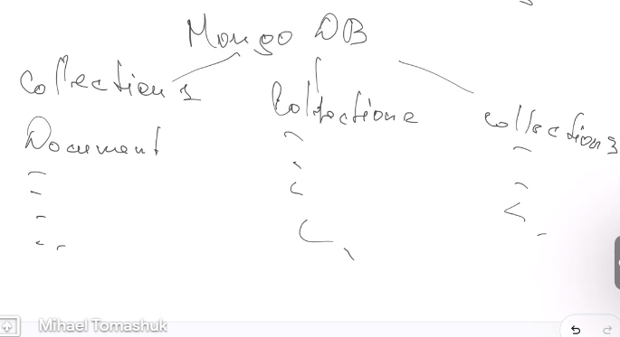
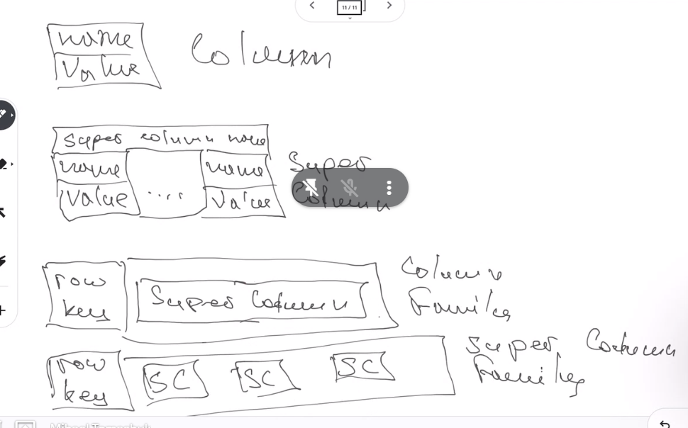
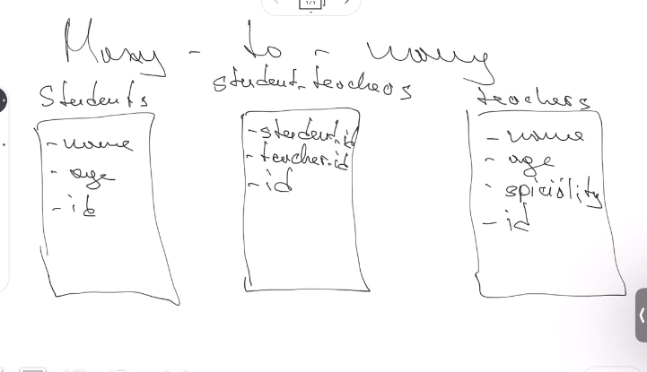
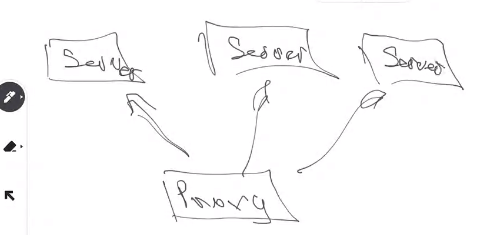

# Class 24 - Data Bases

## Most pupular

- Relational
- Documental
- Key values

## Relational DBs

- Data stored into tables
- Tables have relations with other tables
- Can be -row-directional (MySql)
- Can be -column-directional (ClickHouse)
- PostgresSQL is the most famous

## Key-value DBs

- Good for cache, authorization
- Redis
- Amazon DynamicDB
- Azure CosmosDB

## Document-oriented DBs

- Good if we herarchical data structure to store and it is not necessary to make a complex data tables structure
- MongoDB is most popular

- DynamoDB is second most popular. Is a multi modal DB, it means that can be key-value or documental depending of how data is stored

## Time-series DBs

- For data with time-stamps and the time-stamp is the most popular key
- It is easy to search by time or periods of time
- InfluxDB
- Prometheus
- Graphite

## Graph DBs

- Data is stored in graphs
- Neo4j
- CosmosDB
- OrientDB

## Search Engine DBs

- Good for searching through huge amount of data
- ElasticSearch is the most popular
- SplanK is the second most popular

## Object-oriented DBs

- Store objects connected with each others
- Is not very popular
- Db4o is the most popular

## RDF (Resource Description Framework)

- Most confusing DB
- Data is stored as sentences
- Apache Jeera RDF is the most popular

## Wide Column Stores

- Data is stored in flexible columns
- The idea is that DB is perfect for horizontal scaled
- Cassandra is the most popular
- HBase

## Native XML

- Stores data like relational DB but in XML

## GEO/GIS DBs

- Store information ass coordinates
- Good for if the coordinate cross something, is inside some area, is throw some route, etc
- PostGIS is the most popular
- Aerospike is the second popular
- GEOMeso

## Event Base DBs

- Very similar to Search Engine DBs
- In the middle between Search Engine and time series DB
- It stores lots of information, and also store threads of changes
- EventStoreDB is the most popular
- NEventStore

## Content DBs

- Like a storage
- It allows to get content
- JackRabbit
- ModeShape

## Navigational DBs

- Is not like GIS/GEO DBs, but it have some navigation
- It is about to find perfect routes

## Vector DBs

- For storing coordinates of vectors
- Word2Vec is the most popular

# SQL

There can be 3 time relations between tables

- One-to-one
- One-to-many
- Many-o-many

# Horizontal vs vertical scale

## Vertical scaling

- We make our server more powerful
  - Adding more CPU
  - Adding more RAM
  - etc

## Horizontal scaling

- We add more servers

# Task

Think about which data base to use, what structure should we use.
Start with controllers and middlweares
