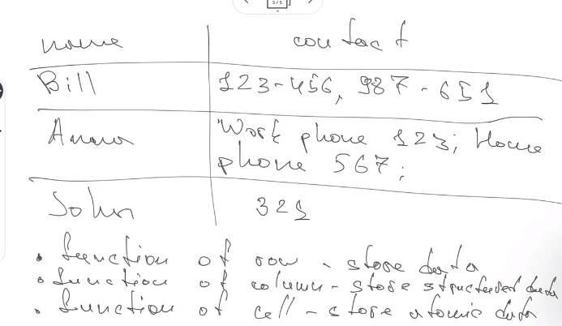
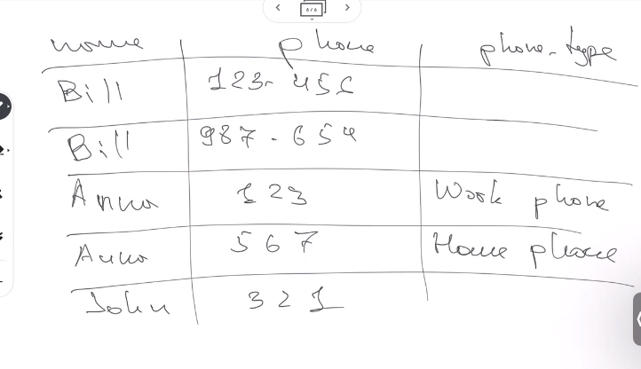
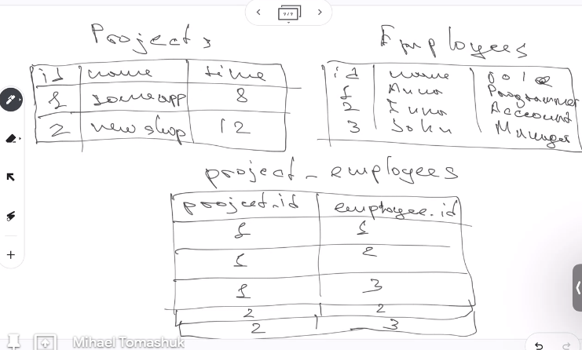
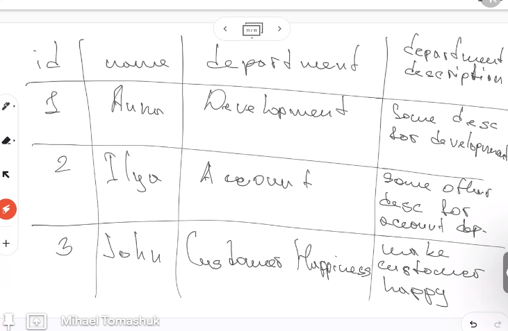
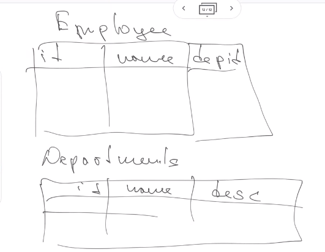
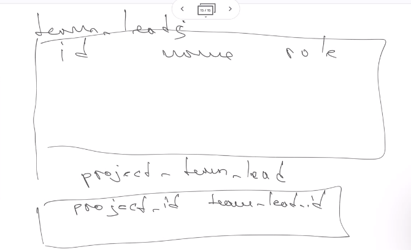

# Class 25 - Relational data bases

# Normalization

Help us to keep the data consistency and avoid data duplication. Also help us to avoid anomalies and helps to store and ge data with more comfort.

It is quite difficult to normalize all data base, so there are different level or stages of normalization.

## Normal forms

These are the ones standards on documentation on educational or academics.

- 1NF
- 2NF
- 3NF
- 4NF
- 5NF

There are 4 more for a better structure.

- 4NF (zero normal form)
- BCNF
- DKNF
- 6NF

If wy put them in stages order, it will be:

- 4NF (zero normal form)
- 1NF
- 2NF
- 3NF
- BCNF
  We stop here. The next ones we can learn if we cant. For our course nad for start the uppers one will be okay.
- 4NF
- 5NF
- DKNF
- 6NF

## Explanations of norms

- YNF (zero normal form):

  - data should not have indexes. We can have ID (unique identifier).
  - columns should be names
  - There is no order. We only new data to the end of the table

- 1NF:
  - data to be in YNF
  - no duplicates
  - in cells - atomic values (no complex information, only one type of data)
  - in a column - data of one type
  - no arrays or lists

Next example is not following 1NF, as contact have different type of data.

This the correct table

- 2NF:
  - data to be in 1NF
  - table should have a key
  - non-key columns should depend on whole key

This table is not in 2NF

For making column should have a key: We can make project and employee the keys. The primary key is the connection of the 2 columns

For solving the non-key should depend on whole key, we can make the table to work with many to many relationships.

This is the correct table

- 3NF
  - data to be in 2NF
  - No transit dependency (when no key columns depends in other key columns)

This is wrong, because department description depends in department and not in ID

We fix this way:

- BCNF
  - data in 3NF
  - Key-columns of complex key must not depend on non-key columns

Table is wrong
  

Correction 
  

## Continue with data base architecture in UML diagram