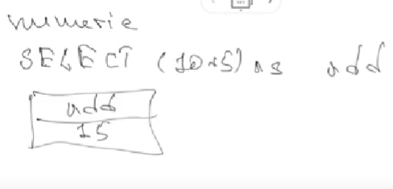

# Class 26 - SQL

SQL is a language for manipulate and extract data from a data base.

**With SQL you can:**

- get access to data in DB
- describe data structure
- define data in DB and handle them
- connect with other language with some library
- create and remove tables
- create stored procedures and functions
- grand and revoke access

We make and command, and SQL compile the command to work.

This processes handles our request.

- Query dispatcher
- Optimization Engine
- Classic Query Engine
- SQL Query Engine

## Commands groups

- DDL: Data Definition Language
  - CREATE
  - ALTER
  - DROP
- DML: Data Manipulation Language
  - SELECT
  - INSERT
  - UPDATE
  - DELETE
  - there are many more...
- DCL: Data Control Language
  - REVOKE
  - GRANT
- TCL: Transaction Control Language

  - COMMIT
  - CREATE TRANSACTION

## Constrains

- NOT NULL
- DEFAULT: it will set some default value
- UNIQUE
- PRIMARY KEY
- FOREIGN KEY
- CHECK: flexible constrain where we add some condition
- INDEX

For removing a constrain: ALTER TABLE DROP CONSTRAINT

## Data Integrity

Is some constrain for data that SQL will follow.

- Entity Integrity: there should be no duplicates on the table
- Domain Integrity: we can filter all data by value, by type, by format, etc.
- Referential integrity: if we delete a post for example, all comments stored in another table of this post must also be deleted.
- User Defined Integrity, some integrity created by the user.

## Data Types

- Integer

  - int
  - bigint
  - tinyint
  - smallint
  - numeric
  - decimal
  - bit
  - smallmoney
  - money

- Float

  - float
  - real

- Date and Time

  - datetime
  - smalldatetime
  - date
  - time

- String
  n version store data in unicode

  - char / nchar <= 8000 symbols
  - varchar / nvarchar <= 8000
  - text / ntext <= 2x10e10

- Binary

  - binary <= 8000 bytes
  - varbinary <= 8000 bytes variable length
  - image

- Mixed

  - timestamp (updates automatically ?)
  - unique identifier

- Relations type
  - one to one
  - one to many
  - many to many

## Arithmetical operations

- -
- -
- -
- %

## Comparator operations

- =
- !=
- <>
- <=
- > =
- > = not less
- <= not greater

## Logic operators

- ALL
- AND
- ANY: compare two values con check if one is true
- BETWEEN
- EXISTS
- IN
- LIKE: like regex but with only to symbols
  - %
  - \_
- NOT: like ! in js
- OR
- IS NULL
- UNIQUE

## Expressions

```sql
SELECT *
FROM table
WHERE [conditional expression]
```

- logic
- numeric

  - AVG
  - SUM
  - MIN
  - MAX
  - COUNT
  - ROUND
  - TRUNCATE
  - CEILING
  - FLOOR
  - POWER
  - SQRT
  - RANDOM

- String

  - CONCAT
  - LENGTH
  - TRIM
  - SUBSTRING
  - REPLACE
  - LOWER
  - UPPER

- Date
  - DAY OF MONTH
  - DAY OF WEEK
  - DAY OF YEAR
  - MONTH
  - YEAR
  - LAST_DAY
  - HOUR
  - MINUTE
  - SECOND
  - DATE_ADD
  - DATE_SUB
  - DATEDIFF
  - TIME_TO_SECOND



## Create a DB

```sql
-- Create db
CREATE DATABASE IF NOT EXISTS <db>;

-- Show DBs
SHOW DATABASES;

-- Delete DB
DROP DATABASE IF EXISTS <db>;

-- Select db to use
USE <db>;
```

## Create a table

```sql
CREATE TABLE <tableName>(
    name varchar(50) NOT NULL,
    age INT,
    status VARCHAR(10),
    PRIMARY KEY (id)
)

-- Returns table description
DESC <tableName>;

-- Delete table
DROP table <tableName>
```

## Insert values into table

```sql
INSERT INTO <tableName>(
    col1, col2, col3,
    VALUES(val1, val2, val3)
);

-- Migrating table from another
INSERT INTO <tableName> [columnList]
SELECT [col1, col2, colN]
FROM <anotherTable>
WHERE condition
```

## Syntax of select

```sql
SELECT col1, col2, colN
FROM tableName

SELECT *
FROM tableName

SELECT col1, col2, colN
FROM tableName
WHERE condition
```

## Update a field

```sql
UPDATE tableName
SET col1 = val1, col2 = val2 ...
WHERE condition
```

## Delete records

```sql
DELETE FROM tableName
WHERE condition
```

## -

Sometimes we do not to take all values, maybe only some of them,

- TOP: allows to get the top elements (first created) from the table

  - SELECT TOP 3 \* FROM USERS;

- LIMIT:

  - SELECT \* FROM users LIMIT 15, 0 (gets first 15 rows)

  - SELECT \* FROM users LIMIT 15, 15 (gets 15 rows from the 15th row)

- ORDERBY: sort the results

  - SELECT col1, coln FROM tableName WHERE condition ORDERBY col1, col2 [asc | desc ]

- INNER JOIN
- OUTER JOIN
- LEFT JOIN
- RIGHT JOIN
- CROSS JOIN
