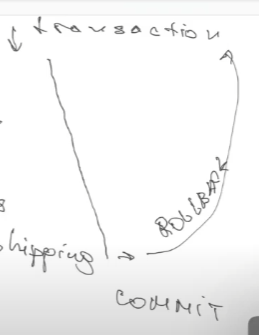

# Class 27 More SQL

### Distinct

Select al unique values.

```sql
SELECT DISTINCT city FROM users;
```

### Union

Combine two selects. Have conditions:

1. The same set of columns
2. The same number of expressions
3. The same same type of data on the columns
4. The same order of columns

```sql
SELECT userId, amount, date
FROM users
LEFT JOIN orders
ON user.userId = orders.userId
UNION
SELECT userId, amount, date
FROM users
RIGHT JOIN orders
ON user.userId = orders.userId
```

### Aliases

We are going to use it a lot in complex queries.

```sql
SELECT col1...colN
FROM tableName AS aliasName
[WHERE condition]

SELECT column AS aliasName
FROM tableName

-- Example
SELECT U.userId, O.amount, U.name
FROM users AS U, orders AS O
WHERE U.userId = O.userId
```

### Index

```sql
CREATE INDEX indexName ON
tableName, colName

-- Delete index
DRP INDEX indexName;
```

**Do not use indexes**

- In small tables
- In tables that insert and update often
- in columns with a lot of values
- in columns which update a lot

### Alter

```sql
ALTER TABLE tableName
ADD colName dataType;

ALTER TABLE tableName
DROP COLUMN colName;

ALTER TABLE tableName
MODIFY COLUMN colName dataType NOT NULL;

ALTER TABLE tableName
ADD CONSTRAINT constrName
UNIQUE(col1, col2, colN);

ALTER TABLE tableName
DROP CONSTRAINT constrName;
```

### Truncate

Do not delete table, but delete all data.

```sql
TRUNCATE TABLE tableName;
```

## Transactions

Very important topic.

If there are lot of operations to perform in data base.

- Crete Order -> Receive payment -> Send Order

- **Example**
  - update user cart
  - update order status
  - proceed payment
  - update user bonuses
  - update order about shipping

Imagine at last stage we receive an error that we cannot ship to this address, so we have to comeback and undone al previous steps.

So we need to know in which step was the error, so we can go back. But we also need to know the previous status, so we can recover it.

- The idea es we create a transaction and set a rollback point.

- COMMIT means we push the changes, if there is a error, we can come back to the previous point.

  

- **Standards**
  - atomicity: all operations must be successful. If one fails, we rollback
  - consistency: state of DB should change with all transactions operations. We cannot make a transaction that changes DB schema.
  - isolation: we can write many transactions in same time and they cannot depend en each other. Each transaction depends on its own.
  - durability: if we commit a transaction, and DB have a problem, the transaction should be saved.

```sql
-- Different DB have different command
BEGIN|START TRANSACTION

COMMIT;

ROLLBACK;

SAVEPOINT;
```

## Temporary table

Example, we can migrate a table but with some previous steps. We can use temporal tables for this.

This tables are deleted when we end the section.

```sql
CREATE TEMPORARY TABLE
```

## Stored procedures

For storing procedures that we make very often.

```sql
-- Creating procedure
CREATE PROCEDURE get_employee
    @employee_id INT
AS
BEGIN
    SELECT * FROM employees
    WHERE employee_id = @employee_id
END

-- Executing procedure
EXECUTE get_employee @employee_id = 123;

-- Modify procedure
ALTER PROCEDURE get.employees
    @employee_id INT
    @employee_count INT
AS
BEGIN
    SELECT * FROM employees
    WHERE employee_id = @employee_id
    SET @employee_count = @@ROWCOLUMN
END;
```
