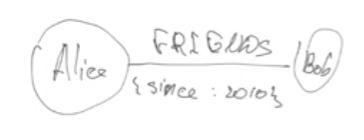

# Class 8 - NO-SQL DBs

## MongoDB

- Stores data in a JSON document
- Data is stored into collections
- Is dynamic (advantage)
- Do not have complex connections
- Not suitable for complex DBs

## Internals

1. **Data storage:** Store data in a special formate called **BSON** (binary representation of JSON)
2. **Memory management:** It not use file system, only use memory feature that helps to be faster
3. **Indexes:**
4. **Sharding:** have built in functions for horizontal scaling
5. **Replication:** easy to replicate and make copy of the DB.
6. **Query execution:** a disadvantage is that it do not have JOIN, so you cannot connect collections.

## Commands

```js
use myDb // for using a created DB

// Creating a collection
db.createCollection("users");   // with out validation
db.createCollection("users", {  // with validation
    validator: {
        ....
    }
}
);

// Insert documents into schema
db.users.insertOne({
    name: "Anna",
    age: 30,
})

db.users.insertMany({
    {
        name: "John", age: 32
    },
    {
        name: "Alla", age: 23
    }
})

// Update documents into schema
updateOne(
    {
    name: "John"
    },
    {
    $set: {age:32}
    }
);

updateMany(
    ... // we can set increment by one all ages > 30
)

// Delete operations
deleteOne();
deleteMany();

// Some commands
createIndex();
aggregate();
count();
distinct();
findAndModify();
findOneAndDelete();
replaceOne();
```

## Advantages and disadvantages of MongoDB

### Advantages

1. Flexible data modeling
2. Scalability: as there is no connection between documents, is very scalable
3. Performance
4. Developer friendly (have a lot of commands for complex operations)

### Disadvantages

1. Limited transactions support
2. Bad analytics
3. No support joins
4. Memory and storage requirement

## Popular library: Mongoose

Allows to create a schema of the collection

```js
const userSchema = new mongoose.Schema({
  name: {
    type: String,
    required: true,
  },
  age: {
    type: Number,
    required: true,
  },
});

model.exports = mongoose.model('user', userSchema);
```

All of these schemas will pass throw Mongo validator

Encrypting password. Document oriented middleware.

Middleware work in next operations:

- Init
- Validate
- Remove
- Update

```js
user.Schema.pre('save', function (next) {
  this.password = crypt(this.password);
  next();
});
```

## Example

We delete a user, and we do not want to show all documents related to a deleted user.

```js
userSchema.pre('find', function (next) {
  this.where({ isDeleted: false });
  next();
});
```

## Commands to learn

- count
- find
- findOne
- findOneAndDelete
- findOneAndUpdate
- update
- deleteOne

## Other document DBs

- Couchbase -> Professor favorite
- Raven DB
- Amazon Document DB

# Graph Databases

Neo4j is a popular one.

## Used in

1. Social networking
2. Recommendation engines
3. Fraud detection

## Neo4 example

```js
// Creating 3 nodes
CREATE (:Person{name: 'Alice', age:30});
CREATE (:Person{name: 'Bob', age:35});
CREATE (:Person{name: 'Charlie', age:25});
CREATE (:Movie{title: 'Terminator 2'});

// Creating connections
MATCH (alice: Person {name:'Alice'}); // Make node a variable
MATCH (bob: Person {name:'Alice'});

// Creating connection
CREATE (alice)-[:FRIENDS{since:20/10}]->(bob)
```


```js
MATCH(alice: Person{name: 'alice'}),(terminator: Movie{title: 'Terminator 2'});

CREATE (alice)-[:LIKES]->(terminator);

// Making a query for getting al friends
MATCH(bob: Person {name: 'Bob'})
-[:-FRIENDS]->(friend: Person)
RETURN friend.name
```

# Time-series DBs

- Influx DB

Very used in IOT, in order to store al values sent by the device.

# Column Base databases

- Apache Cassandra