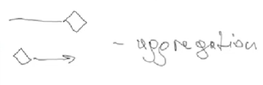
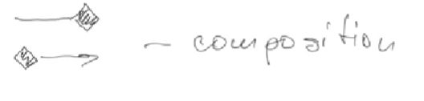

# Class 29 - Design patterns

**Design patterns**: it have 3 groups.

- structural
- creational
- behavioral

**Aggregation**

Is when class is part of another. But one class can exist with out the other.



**Composition**

Composition is a special case of aggregation. In a more specific manner, a restricted aggregation is called composition. When an object contains the other object, if the contained object cannot exist without the existence of container object, then it is called composition.



**Dependency**

Change in structure or behaviour of a class affects the other related class, then there is a dependency between those two classes. It need not be the same vice-versa. When one class contains the other class it this happens.


**Generalization**

Inheritance or some interface.


## Creational design patterns

https://refactoring.guru/es/design-patterns/factory-method

Are pattern that help us to create objects.

### Simple factory

Use to create a object when it have some complex logic and we do not want to repeat the logic.

```ts
// Example 1
interface Door {
  getWidth: number;
  getHeight: number;
}

class WoodenDoor implements Door {
  private width: number;
  private height: number;

  constructor(width: number, height: number) {
    this.width = width;
    this.height = height;
  }

  getWidth(): number {
    return this.width;
  }

  getHeight(): number {
    return this.height;
  }
}

class DoorFactory {
  public static makeDoor(width: number, height: number): Door {
    return new WoodenDoor(width, height);
  }
}
```

```ts
// Example 2
interface Interviewer {
  askQuestions(): void;
}

class Developer implements Interviewer {
  askQuestions(): void {
    console.log('asking about design patterns');
  }
}

class CommunityExecutive implements Interviewer {
  askQuestions(): void {
    console.log('Asking about community building');
  }
}

interface HiringManager {
  makeInterviewer(): Interviewer;
  takeInterview(): void;
}

class DeveloperManager implements HiringManager {
  makeInterviewer(): Interviewer {
    return new Developer();
  }

  takeInterview(): void {
    this.makeInterviewer().askQuestions();
  }
}

class CommunityExecutiveManager implements HiringManager {
  makeInterviewer(): Interviewer {
    return new CommunityExecutive();
  }

  takeInterview(): void {
    this.makeInterviewer().askQuestions();
  }
}

// Using it
// As we can see, I do not care about the questions, the principal class have the correct question stored.
new DeveloperManager().takeInterview();
```

### Abstract factory

Is like a factory of factories.

We have a set of factories, and they decide what to do.

https://refactoring.guru/es/design-patterns/abstract-factory

```ts
interface Door {
  getDescription(): void;
}

class WoodenDoor implements Door {
  getDescription(): void {
    console.log("I'm a wooden door");
  }
}

class IronDoor implements Door {
  getDescription(): void {
    console.log("I'm a iron door");
  }
}

interface DoorFittingExpert {
  getDescription(): void;
}

class Carpenter implements DoorFittingExpert {
  getDescription(): void {
    console.log('I only fit wooden doors');
  }
}

class Welder implements DoorFittingExpert {
  getDescription(): void {
    console.log('I only fit iron doors');
  }
}

interface DoorFactory {
  makeDoor(): Door;
  takeFittingExpert(): DoorFittingExpert;
}

class WoodenDoorFactory implements DoorFactory {
  makeDoor(): Door {
    return new WoodenDoor();
  }
  takeFittingExpert(): DoorFittingExpert {
    return new Carpenter();
  }
}

class IronDoorFactory implements DoorFactory {
  makeDoor(): Door {
    return new IronDoor();
  }
  takeFittingExpert(): DoorFittingExpert {
    return new Welder();
  }
}

// Using everything
let factory: DoorFactory = new WoodenDoorFactory();
let door = factory.makeDoor();
let expert = factory.takeFittingExpert();
```

### Builder

It help us to create something partially or with complex structure and then use it.

https://refactoring.guru/es/design-patterns/builder

```ts
class Burger {
  private size: number;
  private cheese: boolean;
  private lettuce: boolean;
  private bacon: boolean;
  private tomato: boolean;

  constructor(BurgerBuilder: BurgerBuilder) {
    this.size = BurgerBuilder.size;
    this.cheese = BurgerBuilder.cheese;
    this.lettuce = BurgerBuilder.lettuce;
    this.bacon = BurgerBuilder.bacon;
    this.tomato = BurgerBuilder.tomato;
  }
}

class BurgerBuilder {
  public size;
  public cheese = false;
  public lettuce = false;
  public bacon = false;
  public tomato = false;

  constructor(size: number) {
    this.size = size;
  }

  addCheese() {
    this.cheese = true;
    return this;
  }

  addLettuce() {
    this.lettuce = true;
    return this;
  }

  addBacon() {
    this.bacon = true;
    return this;
  }

  addTomato() {
    this.tomato = true;
    return this;
  }

  build(): Burger {
    return new Burger(this);
  }
}

// Using it
let burgerBuilder = new BurgerBuilder(20);
burgerBuilder.addBacon().addChese();

let burger = burgerBuilder.build();

let burger2 = new BurgerBuilder(20).addLettuce().addCheese().build();
```

## Structural Patterns

### Adaptor

https://refactoring.guru/es/design-patterns/adapter

Help us to cover or interact one object with another.

```ts
interface Lion {
  roar: () void;

}

class AfricanLion implements Lion {
  roar() {};
}

class AsianLion implements Lion {
  roar: () {};
}

class Hunter {
  hunt(lion: Lion){

  }
}

class WildDog{
  bark(){

  }
}

// We cannot hunt a dog because it does not have WildDog interface

class WildDogAdapter implements Lion {
  public dog;

  constructor(dog: WildDog){
    this.dog = dog;
  }

  roar: () {
    this.dog.bark();
  }
}

// Using it

const wildDog = new WildDog();
const adaptedWildDog = new WildDogAdapter(wildDog)
const hunter = new Hunter();

hunter.hunt(adaptedWildDog);
```

### Bridge

https://refactoring.guru/es/design-patterns/bridge

```ts
interface WebPage {
  get content:(): void;
}

interface Theme {
  getColor: (): void;
}

class Career implements WebPage {
  private theme: Theme;

  constructor(theme: Theme) {
    this.theme = theme;
  }

  getContent(){
    console.log('Carrer in' + this.theme.getColor());
  }
}

class About implements WebPage {
  private theme: Theme;

  constructor(theme: Theme) {
    this.theme = theme;
  }

  getContent(){
    console.log('About in' + this.theme.getColor());
  }
}

class Project implements WebPage {
  private theme: Theme;

  constructor(theme: Theme) {
    this.theme = theme;
  }

  getContent(){
    console.log('Project in' + this.theme.getColor());
  }
}

class DarkTheme implements Theme {
  getColor(){
    return 'dark';
  }
}

class AquaTheme implements Theme {
  getColor(){
    return 'aqua';
  }
}

class LightTheme implements Theme {
  getColor(){
    return 'light';
  }
}

// Usign it

const page = new About(new DarkTheme());
```

### Composite

https://refactoring.guru/es/design-patterns/composite
Put various object in one common function

```ts
interface Employee {
  getName: () string;
  getSalary:(): number;
  setSalary:(number): void;
  getRoles: () => string[];
}

class Developer implements Employee {
  private name: string;
  private salary: number;

  constructor(name: string, salary: number){
    this.name = name;
    this.salary = salary;
  }

  getName(){
    return this.name;
  }

  getSalary() {
    return this.salary;
  }

  setSalary(salary: number) {
    this.salary = salary;
  }

  getRoles() {
    return [
      'node dev',
      'debugging ing'
    ]
  }
}


class Designer implements Employee {
  private name: string;
  private salary: number;

  constructor(name: string, salary: number){
    this.name = name;
    this.salary = salary;
  }

  getName(){
    return this.name;
  }

  getSalary() {
    return this.salary;
  }

  setSalary(salary: number) {
    this.salary = salary;
  }

  getRoles() {
    return [
      'design projects',
      'play with fonts'
    ]
  }
}

// This is the composite class
class Organization {
  private employees: Employee();

  addEmployee(employee: Employee){
    this.employees.push(employee);
  }

  getNetSalaries(): number {
    return this.employees.reduce((nemo, item) => nemo + item.getSalary),0)
  }
}
```

### Decorator

https://refactoring.guru/es/design-patterns/decorator

Helps to change dynamically the component behavior.

```ts
interface Coffee{
  getCost() => number;
  getDescription: () => string;
}

class SimpleCoffee implements Coffee{
  getCost(){
    return 2;
  }

  getDescription(){
    return 'Simple coffee';
  }
}

class MilkCoffee implements Coffee{
  private coffee:

  constructor(coffee: Coffee){
    this.coffee = coffee;
  }

  getCost(){
    return this.coffee.getCost() +1;
  }

  getDescription() {
    return this.coffee.getDescription() + "+ milk";
  }
}

class VainillaCoffee implements Coffee{
  private coffee:

  constructor(coffee: Coffee){
    this.coffee = coffee;
  }

  getCost(){
    return this.coffee.getCost() +3;
  }

  getDescription() {
    return this.coffee.getDescription() + "+ vainilla";
  }
}

class WhiskeyCoffee implements Coffee{
  private coffee:

  constructor(coffee: Coffee){
    this.coffee = coffee;
  }

  getCost(){
    return this.coffee.getCost() + 4;
  }

  getDescription() {
    return this.coffee.getDescription() + "+ whiskey";
  }
}

// Usign it

let coffee = new SimpleCofee();
// In runtime we add some functionality
// and the prices continue increasing and
// the description continue adding
coffee = new MilkCoffee(coffee); //coffee + milk
coffee = new WhiskeyCoffee(coffee); // coffee + milk + whiskey
```

### Facade

https://refactoring.guru/es/design-patterns/facade

Creates a simpler interface for a complex system.

```ts
// Very complex class
class Computer {
  makeSound() {
    console.log('Beep');
  }

  showLoadingScree() {
    console.log('Loading...');
  }

  bam() {
    console.log('Ready to be used');
  }

  closeEverything() {
    console.log('some complex closing operation');
  }

  smooth() {
    console.log('zzzz');
  }

  getElectricShock() {
    console.log('Ouch');
  }
}

class ComputerFacade {
  private computer: Computer;

  constructor(computer: Computer) {
    this.computer = computer;
  }

  turnOn() {
    this.computer.getElectricShock();
    this.computer.makeSound();
    this.computer.showLoadingScreen();
    this.computer.bam();
  }

  turnOff() {
    this.computer.closeEverything();
    this.computer.smooth();
  }
}
```

### Flyweight

Minimize memory and resources by sharing common parts of an object instead of of each object containing all the parts.

```ts
class KarakTea {}

// Here, we do not store a KarakTea if it is already stored.
class TeaMaker {
  private availableTea: object;

  make(preferences: string) {
    if (this.availableTea[preferences]) {
      return this.availableTea[preferences];
    }
    this.availableTea[preferences] = new KarakTea();
    return this.availableTea[preferences];
  }
}

class TeaShop {
  private orders: string[];
  private teaMaker;

  constructor(teaMaker: TeaMaker) {
    this.teaMaker = teaMaker;
  }

  takeOrder(string) {
    this.orders.push(order);
  }

  serve() {
    this.orders.forEach((order) => this.teaMaker.make(order));
  }
}
```

### Proxy

```ts
interface Door {
  open: () => {};
  close: () => {};
}

// The proxy
class Security {
  private door: Door;

  constructor(door: Door) {
    this.door = door;
  }

  authenticate(password: string) {
    return password === 'password';
  }

  open(password: string) {
    if (this.authenticate(password)) {
      return this.door.open();
    }
  }

  close() {
    return this.door.close();
  }
}

class HomeDoor implements Door {
  open() {}
  close() {}
}
```

## Behavioral patterns

### Observer

When we use event emitters.

https://refactoring.guru/design-patterns/observer

### Iterator

https://refactoring.guru/design-patterns/iterator

### Chain of responsibility

The idea is to request from one object to another till we find the correct object to handle the request.

https://refactoring.guru/design-patterns/chain-of-responsibility

```ts
class Account {
  public balance = 0;
  private successor: Account;

  setNext(account: Account) {
    this.successor = account;
  }

  pay(bill: number) {
    if (this.canPay(bill)) {
      this.balance -= bill;
      console.log('success');
    } else if (this.successor) {
      this.successor.pay(bill);
    } else {
      console.log('not enough money.');
    }
  }

  canPay(amount: number) {
    return this.balance >= account;
  }
}

class PayPal extends Account {
  public balance: number = 0;

  constructor(balance: number) {
    super();
    this.balance = balance;
  }
}

class BitCoin extends Account {
  public balance: number = 0;

  constructor(balance: number) {
    super();
    this.balance = balance;
  }
}

class Bank extends Account {
  public balance: number = 0;

  constructor(balance: number) {
    super();
    this.balance = balance;
  }
}

// Using

const bank = new Bank(200);
const paypal = new PayPal(250);
const bitcoin = new BitCoin(100);

bank.setNext(paypal);
paypal.setNext(bitcoint);

bank.pay(200);
```

### Command

https://refactoring.guru/design-patterns/command

The idea is tu capsulate methods into a object.
Is usefull when we do something based in transactions. As makes it easy to come back or redo something.

```ts
const Bulb{
  turnOn(){
    console.log("Light");
  }

  turnOff(){
    console.log("dark");
  }
}

interface Command{
  execute: (): void;
  undo: (): void;
  redo: (): void:
}

class TurnOn implements Command {
  private bulb;

  constructor(bulb: Bulb){
    this.bulb = bulb;
  }

  execute(){
    this.bulb.turnOn();
  }

  redo() {
    this.execute();
  }

  undo(){
    this.bulb.turnOff();
  }
}

class TurnOff implements Command {
  private bulb;

  constructor(bulb: Bulb){
    this.bulb = bulb;
  }

  execute(){
    this.bulb.turnOff();
  }

  redo() {
    this.execute();
  }

  undo(){
    this.bulb.turnOn();
  }
}

class RemoteController {
  submit(command: Command){
    command.execute();
  }
}

let bulb = new Bulb();
let remoteController = new RemoteController();
remoteController.submit(new TurnOff(bulb));
```

### Mediator

https://refactoring.guru/design-patterns/mediator
Help objects to handle each other.

```ts
interface ChatRoomMediator {
  showMessage(user: User, message: string);
}
class ChatRoom implements ChatRoomMediator{
  showMessage(user: User, message:string){
    let time = Date.now().toLocalString();
    let sender = user.getName();

    console.log(`[${sender}] [${time}] [${message}]`)
  }
}
class User{
  private name: string;
  private chatMediator: ChatRoomMediator;

  constructor(name: string, chatMediator: ChatMediator){
    this.name = name;
    this.mediator = mediator;
  }

  getName(): string{
    return this.name;
  }

  sendMessage(message:string){
    this.chatMediator.showMessage(this, message);
  }
}

// Using it

cont mediator = new ChatRoom();
const john = new User("John", mediator);
const anna = new User("Anna", mediator);

john.sendMessage("hi");
```

### Momento

https://refactoring.guru/design-patterns/memento

Help to save some state to come back later.

```ts
class EditorMomento {
  private content: string;
  constructor(context: string) {
    this.content = content;
  }

  getContent() {
    return this.content;
  }
}

class Editor {
  private content: string;

  type(text: string) {
    this.content += text;
  }

  getContent() {
    return this.content;
  }

  save() {
    return new EditorMomento(this.content);
  }

  restore(momento: EditorMomento) {
    this.content = momento.getContent();
  }
}

// Usign it

const editor = new Editor();
editor.type('saved info');
const momento = editor.save();
editor.type('we will remove this');
editor.restore(momento);
```

### Visitor

https://refactoring.guru/design-patterns/visitor
Help us to make prepare everything to add more behavioraviour in the future.

```ts
interface Animal{
  accept(operation: AnimalOperation);
}

interface AnimalOperation{
  visitMonkey(money: Monkey);
  visitLion(lion: Lion);
  visitDolphin(dolphin: Dolphin);
}

class Monkey implements Animal {
  accept(operation: AnimalOperation){
    operation.visitMonkey(this);
    operation.jumpMonkey(this);
  }
}

class Lion implements Animal {
  operation.visitLion(this);
}

class Dolphin implements Animal {
  operation.visitLion(this);
}

// Lets create some operations

class Speak implements AnimalOperation {
  visitMonkey(monkey: Monkey){
    console.log("ooh oo oaoa");
  }
  visitLion(lion: Lion){
    console.log("Roarrr");
  }
  visitDolphin(dolphin: Dolphin){
    console.log("tuu tuu tuu");
  }
}

class Jump implement AnimalOperation {
  jumpMonkey(monkey: Monkey){
    console.log("jumping");
  }
}

// We can create new operations like jump, etc
const monkey = new Monkey();
const lion = new Lion();
const dolphin = new Dolphin();

const speak = new Speak();
const jump = new Jump();

monkey.accept(speak);
monkey.accept(jump);
```

### Strategy

We have some type of behavior and we want to change them dynamically.

https://refactoring.guru/design-patterns/strategy

```ts
interface SortStrategy {
  sort(array: number[]): number[];
}

class BubbleSortStrategy implements SortStrategy {
  sort(array: number[]): number[] {
    // sort array
    return array;
  }
}

class QuickSortStrategy implements SortStrategy {
  sort(array: number[]): number[] {
    // sort array
    return array;
  }
}

class Sorter {
  private sorter: SortStrategy;
  constructor(sorter: SortStrategy) {
    this.sorter = sorter;
  }
  sort(array: number[]) {
    return this.sorter(array);
  }
}
```

### State

https://refactoring.guru/design-patterns/state
Change behavior of the class depending on the current state.

```ts
interface WritingState {
  write(words: string);
}

class UpperCase implements WritingState {
  write(words: string) {
    console.log(words.toLocalUpperCase());
  }
}

class LowerCase implements WritingState {
  write(words: string) {
    console.log(words.toLocalLowerCase());
  }
}

class Default implements WritingState {
  write(words: string) {
    console.log(words);
  }
}

class TextEditor {
  private state: WritingState;

  constructor(state: WritingState) {
    this.state = state;
  }

  type(words: string) {
    this.state.write(words);
  }

  setState(state: WritingState) {
    this.state = state;
  }
}

// Using

let editor = new TextEditor(new Default());

editor1.setState(new UpperCase());
editor1.type('Second Line');
editor1.setState(new LowerCase());
editor1.type('He he');
```

### Template

https://sourcemaking.com/design_patterns/template_method

```ts
class Builder {
  test() {}
  lint() {}
  assemble() {}
  deploy() {}

  build() {
    this.test();
    this.lint();
    this.assemble();
    this.deploy();
  }
}

class AndroidBuilder extends Builder {
  test() {
    console.log('Run android tests');
  }

  lint() {
    console.log('Android styling code');
  }

  assemble() {
    console.log('Run Java assembler');
  }

  deploy() {
    console.log('deploy yto PlayMarket');
  }
}

class IOSdBuilder extends Builder {
  test() {
    console.log('Run ios tests');
  }

  lint() {
    console.log('Ios styling code');
  }

  assemble() {
    console.log('Run objective-c assembler');
  }

  deploy() {
    console.log('deploy yto AppStore');
  }
}
```
