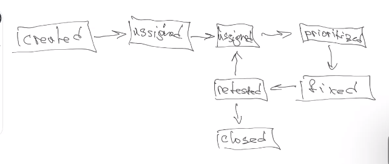

# Class 30 - Common testing and AB Testing

- **Reason for testing:**

  - check that program follow expectations.
  - early defining of problems
  - find unexpected problem cases
  - increase productivity of company

## Testing principles

There are 9 in total

1. Testing shows pressure of defects. If there are good testing, we decrease probability of issues.
2. Exhaustive testing is impossible. We cannot test all possible case scenarios.
3. Early testing. The early we start testing, the easier will be later.
4. Defects clustering. If there are a lot of modules, almost all defects will be in some of them. Most issues will be in some module.
5. Pesticide paradox. As you continue to test a software system, the effectiveness of your tests diminishes over time if you don't update and adapt them.
6. Context depending. Depending in which module we are testing, we should define what is more critical and what should be more tested.
7. Absence of-errors fallacy. If we do not find any issues, it does not mean that our product is ready for release.

## Quality insurance and quality control

Quality control is when we check that our software is ready for release. That all requirements of the project exist and works.

Also try to guess what can be better and what can be improved.

## Verification and validation

- Verification is when we check and accept if the project follows the criteria of it. More about testing
- Validation is to check if it follows the expectative of the user. More about quality insurance

## Bug

Is a difference between actual result and expected.

- Bug report: is some document that store all information about a bug

- Attributes: a bug have some attributes

  1. ID
  2. Summary
  3. Description
  4. Steps to reproduce
  5. Actual result
  6. Expected result
  7. Attachments
  8. Severity
  9. Status (new, reopened, etc)

- Bug lifecycle

  - Created (tester found the bug and report)
  - Assignment (test send it to some manager)
  - Assignment (manager sends it to some manager)
  - Prioritize
  - Fix
  - Retest
  - Closed

  

  ## Severity and priority

  - **Severity** is how harm this bug applies to our project

    - S1: Blocker (highest severity). Testing of some part is impossible
    - S2: Critical. Something very important business logic is not working. Should be fixed now.
    - S3: Major. Some functionality does not work but you should do something annusual for making it. For example making som SQL injection.
    - S4: Minor: some issues that doe not infers into functionality but harm user experience.
    - S5: trivial: something like misspelling of color of button is wrong. We can live with it but is better to fix it.

  - **Priority is how fast the bug should be fix:**
    - P1 High. Is critical and should be fixed as soon as we can.
    - P2 Medium. Is critical and should be fixed in near future.
    - P3 Low. We can be fixed it later.

## Task types

1. Epic: big task we would work for a few sprints. It have a lot of tasks inside.
2. Requirement: for make a new feature or part of a feature.
3. Task: like a atomic task. Only one thing.
4. Sub-task: If task is big we can separate it in smaller tasks.
5. Bug

## Type of testing

There are a lot of them and they are separated in different categories.

- By access: by how does tester have access to our code

  1. Black box: he do not have access
  2. Grey box: he have partial access
  3. White box: he have access

- By detalization:

  1. Module: we test a small separate part
  2. Integrational: we test how to different modules interact with them selves.
  3. System: We check hole system and try to define if follows acceptance.
  4. Acceptance: If it follows al requirements of project

- By optimization:

  1. Manual testing
  2. Automated testing

- By level of functional testing:

  1. smoke testing: Check only critical functions and have minimal requirement. I buy something, I receive the ticket and the email.
  2. Critical path: checking of all possibles movement of a user. I can see a catalog, I can filter it, I can search, compare products.
  3. Extended: check everything, try to crash application, etc.

- By purposes:
  1. Functional: when we check our application works fine checking some input parameters, clicking in some parts, etc.
  2. Non-functional: testing system it self.
     1. performance testing. We try to test how stable the app is in different scenarios
     2. load testing: we try to send lot of request to server and se how he behaves.
     3. Scalability testing: we check how the server will behave when he scales.
     4. Stress testing
     5. installation testing
     6. usability testing
     7. Security testing
     8. Regretiong testing: after testing a feature, we check overall functionality that other things still working.
