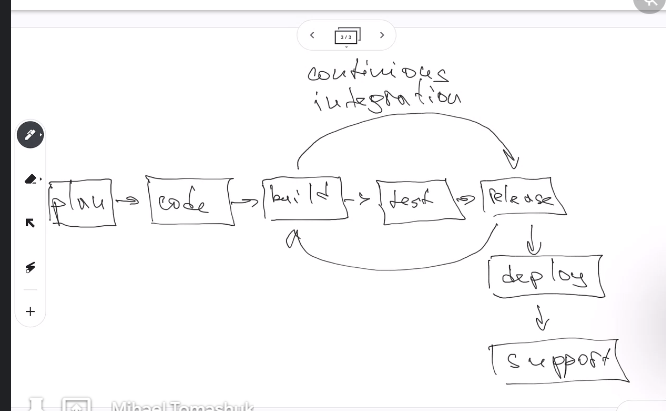
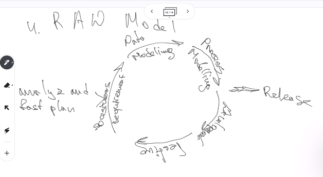

# Class 32

## CI/CD

- CI: continuous integration
  We do not want to just merge the branch, we might want to check that some things are good, like making some tests or anything to do before merging.

- CD: continuos delivery or continuous deployment

### Goals

- Automate testing and delivery for the project
- automate environment (as we use docker, kubernetes, etc)
- allow to deploy project to different environments
- minimize errors (if it check things before merge, we can be sure it will work)

### Stages

1. Plan: how to do he project
2. Code
3. Build
4. Test
5. Release
6. Deploy
7. Support

**Contionuos integration happens here**



**Continuos development happens here**


### Plus of using CI/CD

- Minimize delivery time. If our client want to add some new feature, we can just add new feature, and CI/CD will check the new code, run checks with new nests and deploy app

- Ability to check different variants. We can check different variant of code faster if we have automated deployment, so we can check the changes in production

- Increase quality. We can minimize errors and quality will increase

### Minus of using CI/CD

- Some problems with communication. If for example we want to change node version, and there are lot of yml files, containers, etc, we have to comunicate with devops and plan the strategy, as architecture is very complex
- Experience requirement for good CI/CD setup

### Most popular tool

- Jenkins, usually we do not set up it. We have to know a little about it
- Github Actions

**Learn YAML syntax**

### How to create our GitHub actions

- In root create .github/workflows/my-work-flow.yml

- my-work-flow will look like:

```yml
name: CI
on:
  push: branchs:["master", "vdevelop"]
  pull_request: branchs:["master"]
  commit: branches ...
```

```yml
jobs:
    build_and_test:
        runs-on: ubuntu-intesd
    steps:
        - uses: actions/checkout@v3
        - name: Install modules
        run: npm ci
        - name: linting
        run: npm run lint
```

## Models of development

### Waterfall Model

The project goes stage by stage, with out sprints or iterations. It is not popular, as the plan must be very strick, as we cannot go back and modify something.


**When to use:**

- We know all requirements
- We have enough engineers
- In small project

### V-Model

There are test after every stage

1. Verification
2. Business requirements
3. Functional requirements
   - Functional testing
4. Create architecture
   - Integration testing
5. Realization
   - Unit testing


**When to use**

- We need very deep testing, validation and verification
- in a small project with defined requirements
- enough engineers

### Incremental Model or Multi-Waterfall

Lets say there is a new technology and a lot of different projects as mine, but I want to be the first, we a base functionality so it can grow after that, we have a plan for the future releases.

1. Start planning
2. Planning requirements
3. Estimating developing
4. Testing
5. Realizing


**When to use**

- When we need to some part of the project first to put some functionally on the market ASAP
- When we have few main features and we can release one by one

### RAW Model

We go version by version, the we merge all and there it is.




## Homework

run unit tests and linting in git hub actions for homework. Maybe also run something for test coverage
