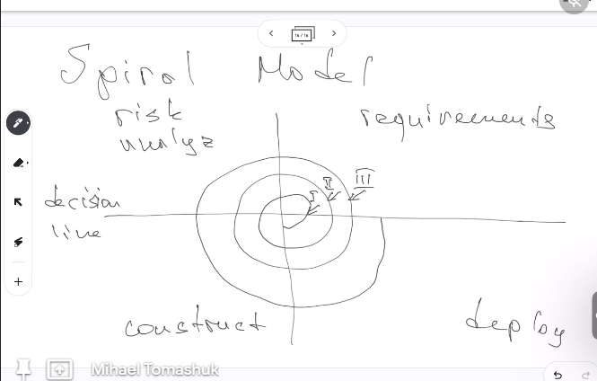
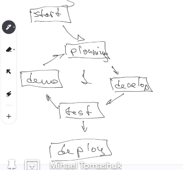
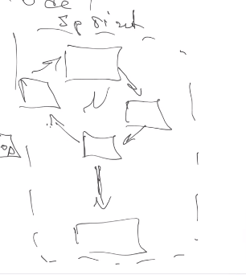
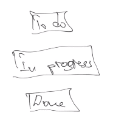
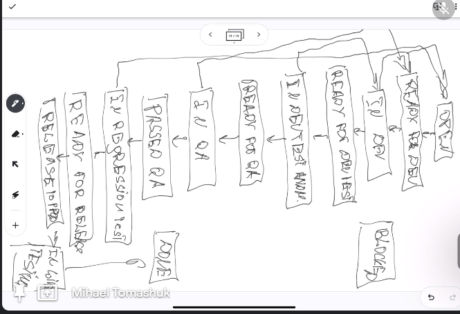

# Development model

## Iterative model

We put all deployment functionalities and then we incorporate new features.

All version have all functionalities, not only a part.

## When to use

1. Known requirements
2. Big projects (if project is small we can finish it without versioning)
3. There is a big task and some details can be provided later

## Spiral model

Before starting creating requirements, we do a risk analysis

Each number is a version.

## Agile model

1. Start
2. Planing => develop => test => demo
3. Deploy (sometimes)

After every iterations there is a demo for the costumer, if everything is ok, we make the deploy.

## Kanban and Scrum

They are methods of handling the project

### Kanban

When we make a a dashboard for showing the tasks. We can see a "kanban board".

A really simple Kanban boards looks like:

.

**Kanban for enterprise project**

Some tools are: Jira, Trello, Notion (Mihael favorite), Miro, Gitlab

1. Open: costumer happiness team open the ticket with maybe bad information, and product owner make more details and make the "Ready for development" ticker for the dev team.
2. Ready for development
3. In development => it might come back to open
4. Ready for dev tests (code review) => it might come van to ready for dev
5. In dev test and merge
6. Ready for QA
7. In QA
8. Passed QA
9. In regression test
10. Ready for release
11. Release product
12. In life testing
13. Done

- Blocked: we cannot go further because we are waiting for something

### Scrum

It have:

1. Backlog
2. Sprint
3. Story point
4. Story-evaluation: it uses Fibonacci numbers
5. Time-evaluation: S, M, L, XL, XXL
6. Scrum meetings
7. Backlog refillment
8. Sprint kickoff
9. Daily scrum meeting
10. Sprint review
11. Sprint retrospective

Alias game

- Server version with out client
- There mas be chat with socket connection
- We must use synonyms but we must not use words with same root. The person who explains the words can not use root words
