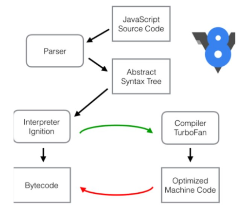
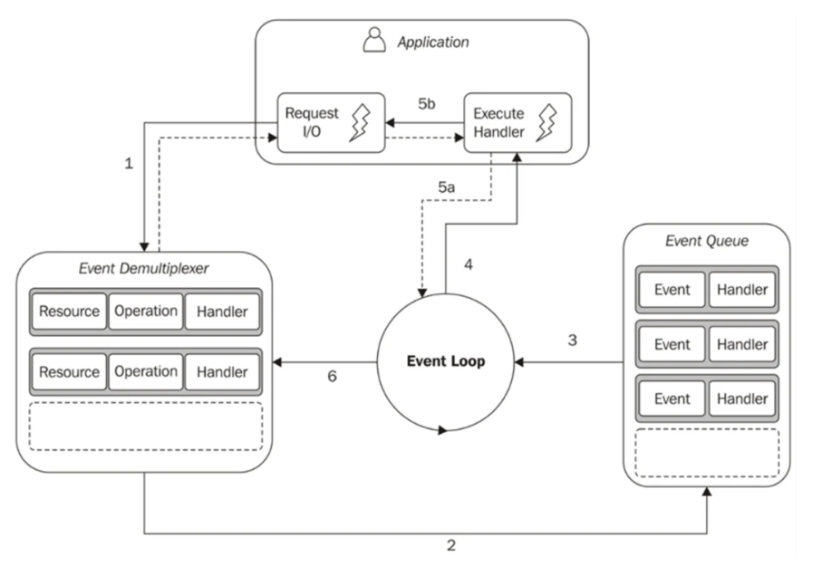
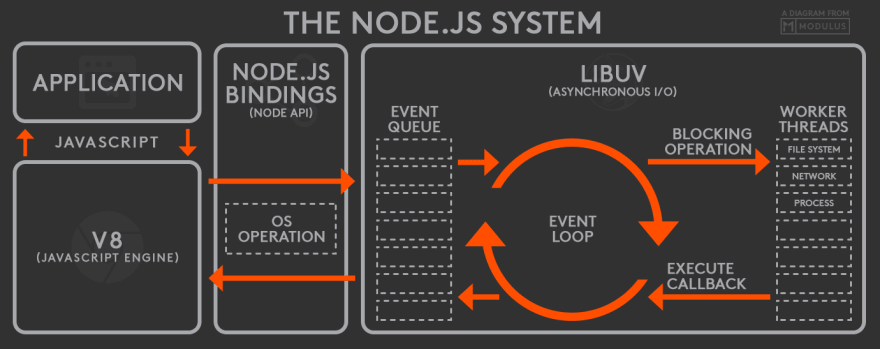

# Interview questions. NodeJS laba.

### Deep dive into Node.js architecture

1. **What is Node.js?**

   Node.js is a open-source server-side JavaScript engine that runs on top of the V8 Engine. It allows developers to run JavaScript server-side outside a web browser.

   - Asynchronous
   - Event-driven
   - Single thread
   - Not blocking I/O
   - Cross platform

2. **What is V8?**

   V8 is a JavaScript engine developed by Google.

   - Written in C
   - High performance
   - JIT (just in time ) compilation
   - Automatic garbage collection
   - Open source
   - Cross platform

3. **What is stream?**

   A stream is a sequence of data that is available over the time. It allows you the read or write in a continuous flow of data.

   - Readable streams
     - Flowing mode
     - Paused mode
   - Writable streams
   - Duplex streams
   - Transform streams

4. **What V8 streams do you know?**

   As I know, V8 do not have streams implemented by it self, but Node.js does and these are:

   - Readable streams
   - Writable streams
   - Duplex streams
   - Transform

5. **What optimization techniques of V8 do you know?**

   - **JIT (just-in-time) compilation:** V8 uses a just-in-time compiler to translate JavaScript code into native machine code at runtime. This allows the engine to generate highly optimized machine based on the running program.
   - **Hidden classes:** mechanism to optimize object property access
   - **Inline caching:** V8 monitors which functions call different objects and properties accessed during execution and generates specialized code for frequently used path and stores the object type.
   - **Escape analysis:** V8 identify objects that do not escape from their creating function and can be allocated on the stack instead of the heap. This can result in more efficient memory usage and faster object allocation.
   - **Optimization:** with inline caching and hidden classes, V8 can identify hot functions, functions repeatedly called with same object type. So V8 optimize this code for not looking every time into the hidden classes, and stores the offsets for directly accessing to the properties.
   - **Deoptimization:** deoptimize previously optimized code if it encounters situations that invalidate the assumptions made during optimization.



6. **What is the main idea of demultiplexer pattern?**

   **In Node.js, the demultiplexer pattern is commonly used to handle events or messages from different sources and route them to appropriate event handlers or processing logic.**

Reactor Pattern is used to avoid the blocking of the Input/Output operations. It provides us with a handler that is associated with I/O operations. When the I/O requests are to be generated, they get submitted to a demultiplexer, which handles concurrency in avoiding the blocking of the I/O mode and collects the requests in the form of an event and queues those events.



      1.  **The application generates a new I/O operation by submitting a request to the Event Demultiplexer. The application also specifies a handler, which will be invoked when the operation completes. Submitting a new request to the Event Demultiplexer is a non-blocking call and it immediately returns the control to the application.**

      2.  **When a set of I/O operations completes, the Event Demultiplexer pushes the new events into the Event Queue.**

      3.  At this point, the Event Loop iterates over the items of the Event Queue. For each event, the associated handler is invoked.

      4.  The handler, which is part of the application code, will give back the control to the Event Loop when its execution completes (5a). However, new asynchronous operations might be requested during the execution of the handler (5b), causing new operations to be inserted in the Event Demultiplexer (1) before the control is given back to the Event Loop.

      5.  When all the items in the Event Queue are processed, the loop will block again on the Event Demultiplexer which will then trigger another cycle.

      6.  The asynchronous behavior is now clear: the application expresses the interest in increasing a resource at one point in time (without blocking) and provides a handler, which will then be invoked at another point in time when the operation completes.

7.  **What is \***\*a \*\***non-blocking I/O architecture and how do non-blocking threads work?**

A non-blocking I/O architecture is a architecture that a allows the program to perform other operations while while waiting for others I/O to be completed.

Non-blocking threads by having the next characteristics:

- Asynchronous operations
- Event-driven model
- Event-loop

8.  **What is libuv?**

Libuv is a multi-platform support library with a focus on asynchronous I/O. It was developed for use by the Node.js runtime but can be used independently of Node.js for building other networking software and applications that require asynchronous I/O operations.


- Cross-Platform Support
- Asynchronous I/O
- Event Loop
- Networking: Libuv includes functionality for networking, including TCP and UDP
- Threading: Libuv provides facilities for handling threads
- Timers and Events
- File System Operations

9. **Name all stages of event loop.**

- **Timers Phase:** Any callbacks scheduled using setTimeout() and setInterval() are executed in the Timers phase.

- **Pending callback Phase:** Executes I/O callbacks deferred to the next loop iteration.

- **idle, prepare:** Only used internally.

- **Poll Phase:** The poll phase executes I/O-related callbacks. When our application starts running, the event loop is in the poll phase. Most of the application code that we write is likely to be executed in this particular phase.

- **Check Phase**: In this phase, callbacks triggered via setImmediate() are executed.

- **Close Phase:** The close phase executes callbacks triggered via the EventEmitter close events. For example socket.on('close', ...) that triggers a callback in the close phase.

- **NextTickQueue and Other microtask:** run before each left block.
  - The first microtask queue handles callbacks registered using process.nextTick()
  - The second microtask queue handles promises that reject or resolve

10. **Is Node.js single-threaded or multi-threaded?**

Node.js is generally considered single-threaded. It follows an event-driven, asynchronous programming model, and its concurrency is achieved through the event loop. The event loop enables Node.js to handle many simultaneous connections and I/O operations without the need for threads.

However, it's important to note that certain tasks, such as those involving native modules or heavy computations, may be implemented using worker threads or other mechanisms to take advantage of multi-core processors.

### JavaScript Fundamentals

1. **What’s difference between CommonJS and ES module systems?**

   1. **Syntax:**

   - CommonJS:
     - Uses `require()` to import modules.
     - Uses `module.exports` to export values from a module.
   - ES Modules:
     - Uses `import` and `export` statements for importing and exporting modules.

   2. **Dynamic vs. Static:**

   - CommonJS:
     - Modules are loaded at runtime, which means the entire module is evaluated when it is required. This can be useful for dynamic scenarios.
   - ES Modules:
     - Modules are statically analyzed during the parsing phase. This allows for more optimizations by tools and better tree-shaking capabilities.

   3. **Top-level Scope:**

   - CommonJS:
     - Modules have their own scope, and each module is evaluated only once.
   - ES Modules:
     - Each module has its own scope, and the top-level variables (those not explicitly exported) are not visible outside the module.

   4. **Default Exports:**

   - CommonJS:
     - Supports default exports using `module.exports`.
   - ES Modules:
     - Supports default exports using `export default`.

   5. **Browser Support:**

   - CommonJS:
     - Originally designed for server-side environments (Node.js), but tools like Browserify or webpack can be used to enable CommonJS in the browser.
   - ES Modules:
     - Designed with both server-side and client-side in mind, and browsers natively support ES Modules.

   6. **Circular Dependencies:**

   - CommonJS:
     - Handles circular dependencies by allowing modules to be partially resolved. The module's exports are filled in as the module is executed.
   - ES Modules:
     - Throws an error when a circular dependency is detected during static analysis.

   7. **Asynchronous vs. Synchronous:**

   - CommonJS:
     - Primarily designed for synchronous loading of modules.
   - ES Modules:
     - Supports both synchronous and asynchronous loading. The `import()` function allows dynamic, asynchronous module loading.

   8. **Use Cases:**

   - CommonJS:
     - Well-suited for server-side development, especially in Node.js.
   - ES Modules:
     - Becoming the standard for both server-side and client-side development due to its static nature and native support in modern browsers.

2. **What’s difference between `var`, `let` and `const`?**

- **Scope:**

  - `var`: function-scoped, if declared outside a function is globally scoped.
  - `let` and `const`: block-scoped

- **Hoisting:**

  - `var`: hoist variable declaration to the top, not initialization. Accessing the variable before initialization will throw "undefined"
  - `let` and `const`: variable are also hoisted, but accessing the variable before it initialization wil throw "ReferenceError"

- **Reassigment**:

  - `var`: can be reassigned and redeclared.
  - `let`: can be reassigned but not redeclared.
  - `const`: can not be reassigned or redeclared

- **Global Object Property:**
  - `var`: become property of the global object ('windows') on browsers
  - `let` and `const`: not become property of global object

3. **Name all JS data types.**

- Number
- String
- Symbol
- BigInt
- Null
- Undefined
- Object
- Boolean

4. **What’s difference between `null` and `undefined`?**

- `undefined`: typically indicates an unintentional absence of a value, often due to the absence of an assignment or a default value.

- `null`: is used to represent an intentional absence of a value or to explicitly clear a variable or property.

5. **What happens when you compare data of different types?**

When you compare data of different types in JavaScript, the interpreter will attempt to perform a type coercion to make the comparison meaningful. Type coercion is the process of converting one type of value to another. This can lead to unexpected behavior if not used carefully.

There are two types of equality operators in JavaScript: strict equality (===) and loose equality (==).

- `strict equality ===`: check for same type and value, no type coercion occurs
- `loose equality ==`: type coercion occurs

6. **What are "truthy" and "falsy" values in JavaScript?**

Values are categorized as "truthy" or "falsy" when they are used in a boolean context as in a 'if' statement.

- Falsy values are:

  - NaN
  - null
  - undefined
  - ""
  - 0
  - false

- Truthy values can be:
  - 'some value'
  - numbers different than 0
  - any non falsy value

7. **What is an object?**

A object is a composite data type that allows to store data using key-value pairs.

8. **What’s the difference between objects and primitive types?**

- Objects:

  - Complex data type with key-value paris and methods
  - Keys are strings or symbols
  - Mutable: properties and methods can be modified, added or removed.
  - Changes of the object affect the object it self
  - Is passed by reference
  - It can have methods

- Primitives:
  - Simple values
  - Immutable: cannot be changed after creation (a operation that seems to modify the value creates a new one)
  - Is passed by value, not reference
  - It does not have methods

9. **What’s the difference between strict and non-strict (or loose) comparison?**

- `strict equality ===`: check for same type and value, no type coercion occurs
- `loose equality ==`: type coercion occurs

10. **What’s the difference between explicit and implicit type conversion?**

- `Implicit type conversion`: also called coercion, occurs automatically when JavaScript converts a value from one data type to another without the developer explicitly requesting the conversion.

- `Explicit type conversion`: also known as type casting, occurs when a developer intentionally converts a value from one data type to another using explicit functions or operators. Like using: Number(), String(), parseInt(), parseFloat()

11. **How does ternary operator work?**

The ternary operator, also known as the conditional operator, is a concise way to write an if...else statement in JavaScript. It is a shorthand way of expressing a conditional statement in a single line

condition ? expression_if_true : expression_if_false;

- The part before the ? is the condition that evaluates to either true or false.

- The expressions on both sides of the : are the values or expressions to be returned based on the evaluation of the condition

12. **Why do we need switch/case operator and how does it work?**

We switch statement in JavaScript because provides a way to perform multiple conditional branches based on the value of an expression. It is an alternative to using multiple if...else if...else

```js
// It works by having a expression, several cases, breaks and a defauñt
switch (expression) {
  case value1:
    // Code to be executed if expression === value1
    break;

  case value2:
    // Code to be executed if expression === value2
    break;

  // Additional cases as needed

  default:
  // Code to be executed if none of the cases match
}
```

It improves:

- Readability
- Efficiency

13. **What’s the difference between loop `for` and loop `while`?**

- `The for loop` is typically used when the number of iterations is known or can be easily determined.

It have three parts:

- Initialization (executes onces before start)
- Condition: checked before each iteration, if true, continues
- Updated: executed after each iteration

- `The while loop` is used when the number of iterations is not known in advance and is determined by a condition.

It have one part:

- Condition: checked before each iteration

14. **How do logic operators work?**

- `Logical AND &&`: The && operator returns true if both operands are true; otherwise, it returns false.

- `Logical OR ||`: The || operator returns true if at least one of the operands is true. It returns false only if both operands are false.

- `Logical NOT !`:The ! operator negates the boolean value of its operand. If the operand is true, ! returns false; if the operand is false, ! returns true.

15. **What is nullish coalescing operator (`??`) ?**

The nullish provides a concise way to handle default values for cases where a variable might be null or undefined. The nullish coalescing operator is represented by ??.

`const result = someValue ?? defaultValue;`

The difference with the ||, is that ?? only set the default if the value is 'undefined' or 'null', while the || works with any falsy value.

16. **What is strict mode and what features does it have?**

Strict mode is a tool for developers to catch common programming mistakes, write more reliable code, and avoid potentially error-prone language features. It is especially useful when working on large code bases or when transitioning from older JavaScript versions with different behaviors.

1.  Variable Declaration:

    - Feature: Variables must be declared with `var`, `let`, or `const` before being used.
    - Effect: Attempting to assign a value to an undeclared variable results in a `ReferenceError`.

2.  Global Object:

    - Feature: In strict mode, the global object (`this`) is `undefined` inside functions.
    - Effect: Helps avoid unintentional modifications of the global object.

3.  Assignment to Read-Only Properties:

    - Feature: Attempting to assign a value to a read-only property, like `undefined` or `NaN`, results in a `TypeError`.
    - Effect: Prevents unintentional modification of built-in properties.

4.  Octal Literal Syntax:

    - Feature: Octal literals (e.g., `0123`) are not allowed in strict mode.
    - Effect: Avoids confusion and potential errors related to octal literals.

5.  Deleting Variables:

    - Feature: Deleting variables, functions, or function arguments is not allowed in strict mode.
    - Effect: Promotes more robust code by preventing accidental deletions.

6.  Duplicate Parameters:

    - Feature: Function parameters with duplicate names are not allowed.
    - Effect: Enforces clarity and avoids potential confusion caused by duplicate parameter names.

7.  `with` Statement:

    - Feature: The use of the `with` statement is not allowed.
    - Effect: Avoids potential scope-related issues and improves code clarity.

8.  `eval` and `arguments`:

    - Feature: Assigning values to `eval` and `arguments` is not allowed.
    - Effect: Enhances security and prevents potential issues with these objects.

9.  Reserved Words:

    - Feature: Use of some previously reserved words (e.g., `implements`, `interface`, `package`, etc.) as variable names is not allowed.
    - Effect: Future-proofs code and avoids conflicts with potential future language features.

10. `this` in Functions:

    - Feature: In non-method functions (functions not defined as methods of an object), `this` is `undefined`.
    - Effect: Helps avoid unintentional reliance on the global object when calling functions.

11. Secure Syntax:

    - Feature: Certain syntactic constructs are treated as syntax errors (e.g., `with`, `arguments.callee`, `arguments.caller`).
    - Effect: Promotes more secure and less error-prone code.

12. Strict Mode in Modules:

    - Feature: ES6 modules are in strict mode by default; there is no need to include `"use strict"`.

### Functions

1. **What are the ways to declare functions? What is the difference between them?**

- **Function declaration**

```js
function add(a, b) {
  return a + b;
}
```

- Hoisted: Yes (Can be called before the declaration).
- Can be used as a constructor.

- **Anonymous function expression**

```js
const getRectArea = function (width, height) {
  return width * height;
};
```

- Hoisted: No (Cannot be called before the declaration).
- Cannot be used as a constructor.

- **Named function expression**

```js
const calcArea = function calcArea(x, y) {
  return x * y;
};
```

- Hoisted: No (Cannot be called before the declaration).
- Cannot be used as a constructor.
- Helps for debugging, as the function will left traces.

- **Arrow function expression**

```js
const add = (a, b) => a + b;
```

- Hoisted: No (Cannot be called before the declaration).
- Lexical this: Binds this to the surrounding context (lexical scoping).
- Should not be used as method
- Cannot use yield or be used as generator function

2. **What is hoisting and how does it work?**
3. **What is pure function?**

A pure function always returns the same value given the same arguments and produces no side effects.

4. **What is high ordered function?**

Have two criteria, if follow one of both of them is high order function.

- Takes a function as an argument
- Return function as a result

5. **What is generator function?**

A generator function in JavaScript is a special type of function that allows you to pause its execution while maintaining its own state. This allows you to create an iterator that can be controlled explicitly.

```js
function* countToThree() {
  yield 1;
  yield 2;
  yield 3;
}

const generator = countToThree();

console.log(generator.next()); // { value: 1, done: false }
console.log(generator.next()); // { value: 2, done: false }
console.log(generator.next()); // { value: 3, done: false }
console.log(generator.next()); // { value: undefined, done: true }
```

6. **What is lazy function?**

A lazy function is a concept in programming where the execution of a function or the evaluation of its result is delayed until the result is actually needed.

Lazy evaluation is particularly beneficial in scenarios where not all results are needed, or where the cost of computation is high. It allows for more efficient use of resources by computing only what is necessary when it is necessary.

- Example of a Lazy Function using Memoization:

```js
function createExpensiveFunction() {
  const cache = new Map();

  return function (x) {
    if (cache.has(x)) {
      console.log('Result retrieved from cache');
      return cache.get(x);
    } else {
      console.log('Computing result');
      const result = x * x;
      cache.set(x, result);
      return result;
    }
  };
}

const lazySquare = createExpensiveFunction();

console.log(lazySquare(3)); // Computes result
console.log(lazySquare(3)); // Retrieves result from cache
console.log(lazySquare(4)); // Computes result
```

7. **What is carrying?**

It is a technique in functional programming, that transforms the function of multiple arguments into several functions of a single argument in sequence.

- It allows to solve a function partially till you have all parameters available
- It helps us to create a higher-order function
- It reduces the chances of error in our function by dividing it into multiple smaller functions that can handle one responsibility.
- It is very useful in building modular and reusable code
- It helps us to avoid passing the same variable multiple times
- It makes the code more readable

```js
//Example 1

function sum(a) {
  return (b) => {
    return (c) => {
      return a + b + c;
    };
  };
}
console.log(sum(1)(2)(3)); // 6

// You can call the function partially
const sum1 = sum(1);
const sum2 = sum1(2);
const result = sum2(3);
console.log(result); // 6

// Example 2 with arrow functions

const sum = (a) => (b) => (c) => a * b * c;
console.log(sum(1)(2)(3)); // 6
```

8. **What is function composition?**

Function composition is another powerful technique in functional programming, which involves combining two or more functions to create a new function. The output of one function becomes the input to the next function in the chain. This allows you to build complex transformations or computations by composing smaller, reusable functions together.

```js
// Example functions to be composed
const add = (x) => x + 1;
const square = (x) => x * x;
const subtractTen = (x) => x - 10;

// Manual function composition
const composedFunction = (x) => subtractTen(square(add(x)));

// Usage
const result = composedFunction(5);

console.log(result);
```

### Objects

1. **Name ways of creating an object.**

- Object literal

```js
const person = {
  name: 'John',
  age: 30,
  job: 'Developer',
};
```

- Constructor function

```js
function Person(name, age, job) {
  this.name = name;
  this.age = age;
  this.job = job;
}

var person = new Person('John', 30, 'Developer');
```

- Object.create()

```js
const personPrototype = {
  age: 30,
  city: 'New York',
  isEmployed: true,
};

const person = Object.create(personPrototype);
person.name = 'John';

person.age; // => 30
```

- ES6 classes

```js
class Person {
  constructor(name, age) {
    this.name = name;
    this.age = age;
  }

  sayHello() {
    console.log(
      `Hello, my name is ${this.name} and I am ${this.age} years old.`
    );
  }
}
```

2. **Why do we need constructor?**

A constructor is a special function that creates and initializes an object instance of a class. In JavaScript, a constructor gets called when an object is created using the new keyword.

The purpose of a constructor is to create a new object and set values for any existing object properties.

- **Object Initialization:** Constructors allow you to initialize object properties with default values or values passed as arguments when creating an instance. This helps ensure that objects start with a predefined state.

- **Encapsulation:** Constructors help in encapsulating the initialization logic within a function. This makes it easier to manage and modify the initialization process without affecting the rest of the code.

- **Code Reusability:** Constructors enable code reuse by allowing you to create multiple instances of objects with similar properties and methods. This is especially useful in scenarios where you need to create many objects with the same structure.

- **Prototypal Inheritance:** Constructors are essential when working with prototypal inheritance. They help set up the prototype chain and allow objects to inherit properties and methods from a common prototype.

- **Avoiding Global Scope Pollution:** By using constructors, you can avoid polluting the global scope with numerous variables. The properties and methods of an object are contained within the instance rather than being defined globally.

3. **Name ways of accessing an object property.**

   - Dot notation
   - Bracket notation

4. **What are property descriptors and what types of descriptors are available?**

A property descriptor is an object that defines the attributes of a property. It define how the property will behave.

- Value
- Writable
- Enumerable
- Configurable

5. **Explain prototypal inheritance.**

Each object in JavaScript has an internal reference to its prototype. When you access a property or method on an object, if it's not found directly on the object, JavaScript follows the prototype chain and looks for the property or method in the object's prototype. If it's not found there, the search continues up the chain until the property or method is found, or until the end of the prototype chain is reached, which is Object.prototype.

6. **What is context?**

The context is the value of `this` keyword, which stores the reference to the object that owns the actually running code.

7. **Name object methods that you know.**

- Object.keys(obj)
- Object.values(obj)
- Object.assign(target, source)
- Object.getOwenPropertyDescriptors(obj)
- Object.getOwnPropertyNames(obj)
- Object.hasOwn(obj, "propName")
- Object.defineProperty(obj, "propName", {value: ..., configurable:...})
- Object.preventExtensions(obj)
- Object.seal(obj)
- Object.freeze(obj)

8. **Name ways of copying an object.**

- Shallow Copy using Object.assign()
- Shallow Copy using the Spread Operator (ES6+):
- Deep Copy using JSON.parse() and JSON.stringify()
- Deep Copy using External Libraries:

9. **How to compare two object for equality?**

There is no method in JavaScript for comparing objects, as the properties may be changed in position, or when you copy the objects, some information may be lost, as in the case of Deep Copy where you lost the functions.

One simple way is using external libraries, like lodash.

10. **Name ways to protect an object.**

- Object.preventExtension(obj): prevents extension of object
- Object.seal(obj): prevents extension, deletion and set object as non configurable, but allows modification of properties values.
- Object.freeze(obj): prevents extension, seal object and makes properties non-writable.

### Arrays

1. **What is an array?**

An array is a type of object that stores a collection of values in a specific order and provides methods for accessing, manipulating, and iterating over the elements in the collection.

2. **Name array methods that you know.**

- Array.of("foo", 2, "bar", true)
- Array(6).fill(1); => [1,1,1,1,1,1]
- declaredArray.length()
- declaredArray.every(callback)
- declaredArray.some(callback)
- declaredArray.map(callback)
- declaredArray.filter(callback)
- declaredArray.forEach(callback)
- declaredArray.reduce(callback, initialValue)
- declaredArray.splice(start, deleteCount, ...elsToInsert);
- declaredArray.slice(start, end)
- declaredArray.push(el)
- declaredArray.pop()
- declaredArray.shift()
- declaredArray.unshift(el)
- declaredArray1.concat(declaredArray2)
- declaredArray.indexOf(el)
- declaredArray.lastIndexOf(el)
- declaredArray.find(callback)
- declaredArray.includes(el)
- declaredArray.toString()
- declaredArray.join(separator)

3. **Name ways to iterate over an array.**

- forEach
- for, for of, for in
- while
- do while
- Array symbol iterator

### Error Handling

1. **How errors are handled in JS?**

Errors are handled in JS using try...catch statement

2. **What is the purpose of the `finally` block in a try-catch statement?**

The purpose is to have a piece of code that will always execute after the try-catch statement.

### Big O Notation

1. **What is a Big O Notation?**

Big O notation is the language we use for talking about how long an algorithm takes to run (time complexity) or how much memory is used by an algorithm (space complexity). Big O notation can express the best, worst, and average-case running time of an algorithm.

2. **How would you describe the Big O complexity of common sorting algorithms like QuickSort, MergeSort, and BubbleSort?**

- **When to use the bubble sort method;**
  - If we expect the majority of arrays will be sorted.
  - If we expect the majority of arrays will be in the worst scenario and the array lengths are less than 142 +- 5.
  - If we expect the majority of arrays will be random and the array lengths to be less than 177.
- **When to use the merge sort method;**
  - If we are sure the majority of arrays will be in the worst scenario and the array lengths are less than 2202 +- 200.
  - If we expect the majority of arrays will be random and the array lengths to be less than 97 +- 5.
- **When to use the quick sort method;**
  - If we are sure the majority of arrays will be in the worst scenario and the array lengths are more than 2202 +- 200.
  - If we expect the majority of arrays will be random and the array lengths to be more than 97 +- 5.

3. **Which other notations do you know?**

- Big Oh notation: indicates complexity is equal or less

- Little Oh notation: indicates complexity is less

- Big Theta notation: indicates time complexity is equal

- Big Omega notation: indicates time complexity es equal or higher

- Little Omega notation: indicates time complexity is bigger

### Memory Management and Collections

1. **How does garbage collection work in JavaScript?**

It works by using the `Mark and Sweep Algorithm`, that have two phases

- **Mark Phase**
  - The garbage collector starts with the root objects. In JavaScript, the root objects are typically global variables and objects referenced from them.
  - The collector traverses the object graph, marking all objects that are directly or indirectly referenced by the root objects.
- **Sweep Phase:**

  - Once the marking is complete, the garbage collector sweeps through the memory, identifying and deallocating (or reclaiming) memory occupied by objects that were not marked during the mark phase.
  - The memory occupied by unmarked objects is considered as no longer in use, and it is released for future use.

- **Compact Phase (optional):**

  - Some garbage collectors include a compacting step after the sweep phase. This step involves rearranging the memory to reduce fragmentation.

- **Some optimizations**

  - Generational GC: it assumes that younger objects dies faster, so younger objects are more frequently visited than the older ones.

  - Incremental GC: instead of performing GC at once and introducing a delay, divided the whole objects in different parts and make the GC one by one on different times

  - Idle-time GC: run GC when CPU is idle

2. **What is the 'heap' in the context of memory management?**

The heap refers to the region of a computer's memory that is used for dynamic memory allocation used during the program execution.

3. **What are the differences between stack and heap memory?**

   1. Purpose:

      - Stack: Primarily used for function call execution and local variable management, following a Last In, First Out (LIFO) structure.
      - Heap: Used for dynamic memory allocation, accommodating data of varying sizes that needs to persist beyond function scopes.

   2. Management:

      - Stack: Managed automatically by the compiler, with memory allocated and deallocated in a predictable order as functions are called and return.
      - Heap: Managed manually (in languages like C/C++) or automatically by a garbage collector (in languages like Java, JavaScript, Python), allowing for more flexible memory allocation.

   3. Allocation/Deallocation:

      - Stack: Memory is allocated and deallocated as functions are called and return, with automatic reclamation of memory upon function exit.
      - Heap: Memory is allocated and deallocated dynamically during program execution, not confined by function scopes.

   4. Size:

      - Stack: Limited in size, determined at compile time, used for local variables and function call information.
      - Heap: Larger and dynamic in size, suitable for storing objects of varying sizes.

   5. Access Speed:

      - Stack: Faster access due to simple pointer manipulation.
      - Heap: Slower access due to more complex memory management operations.

   6. Data Persistence:

      - Stack: Limited lifespan; data is automatically deallocated when a function exits.
      - Heap: Data can persist throughout the program's execution, suitable for long-term storage.

4. **What are Map and Set?**

Map and Set are both data structures in JavaScript that provide collections for storing and managing data.

They both provide function for inserting unique elements, for detecting effectively the presence of a key or a value, and for iterating over them.

5. **What is the difference between Map/Set and WeakMap/WeakSet?**

The differences is that the weak ones holds weak reference to the values.

    1.  Key Types:

        - Keys in a `Weak` must be objects.

    2.  Memory Management:

        - Unlike `Map`, a `WeakMap` holds weak references to its keys. This means that if there are no other references to a key, it can be garbage collected, and the corresponding entry in the `Weak` will be automatically removed.

    3.  Iteration:

        - Due to the weak reference nature, `WeakMap` does not support direct iteration over its keys, values, or entries. This is because the collection may be in a state of flux with keys being garbage collected.

    4.  Use Cases:

        - Use `Weak` when you want to associate data with specific objects, and you don't want to prevent those objects from being garbage collected when they are no longer used elsewhere in your program

### JSON

1. **What is JSON and why do we need it?**

JSON (JavaScript Object Notation) is a lightweight data interchange format that is easy for humans to read and write, and easy for machines to parse and generate. It is a text-based format that represents structured data using a syntax that is similar to JavaScript object literal notation.

- JSON facilitates interoperability between different systems and languages, allowing them to exchange and understand data seamlessly.

- It is widely used for transmitting data between a server and a client in web development. Many web APIs return data in JSON format.

- JSON's human-readable format makes it easy for developers to work with, write, and understand.

- JSON's lightweight nature and simplicity make it efficient for both data representation and parsing, making it suitable for use in resource-constrained environments.

2. **What data types can be in JSON?**

- null
- boolean
- string
- object (json object)
- array

### Promises

1. **What is a promise?**

A Promise is a proxy for a value not necessarily known when the promise is created. It allows you to associate handlers with an asynchronous action's eventual success value or failure reason.

2. What states can have promises?

- Pending: initial state, neither fulfilled nor rejected.
- Fulfilled: meaning that the operation was completed successfully.
- Rejected: meaning that the operation failed.

**A promise is said to be settled** if it is either fulfilled or rejected, but not pending.

3. **Name promise methods.**

#### Promise.all()

Fulfills when all of the promises fulfill; rejects when any of the promises rejects.

#### [](https://github.com/JoseSzycho/nodejs_development_course/tree/main/12_class-Promises#promiseallsettled)Promise.allSettled()

Fulfills when all promises settle.

#### [](https://github.com/JoseSzycho/nodejs_development_course/tree/main/12_class-Promises#promiseany)Promise.any()

Fulfills when any of the promises fulfills; rejects when all of the promises reject.

#### [](https://github.com/JoseSzycho/nodejs_development_course/tree/main/12_class-Promises#promiserace)Promise.race()

Settles when any of the promises settles. In other words, fulfills when any of the promises fulfills; rejects when any of the promises rejects.

#### [](https://github.com/JoseSzycho/nodejs_development_course/tree/main/12_class-Promises#promisereject)Promise.reject()

Returns a new Promise object that is rejected with the given reason.

#### [](https://github.com/JoseSzycho/nodejs_development_course/tree/main/12_class-Promises#promiseresolve)Promise.resolve()

Returns a Promise object that is resolved with the given value. If the value is a thenable (i.e. has a then method), the returned promise will "follow" that thenable, adopting its eventual state; otherwise, the returned promise will be fulfilled with the value.

4. **Will try/catch work for promises?**

Yes, you can, but be aware that try/catch is designed for synchronous code, in order to work you should use a async/await function.

### OOP and Classes

1. **Name and explain basic principals of OOP.**

   1. **Abstraction:** is a way of hiding the implementation details and showing only the functionality to the users.

   2. **Inheritance:**

   - mechanism that allows a new class (subclass or derived class) to inherit properties and behaviors (attributes and methods) from an existing class (superclass or base class).

   - It promotes code reuse and the creation of a hierarchy of related classes.

   - Subclasses can extend or override the behavior of their parent classes.

   3. **Encapsulation:**

   - Encapsulation is the concept of bundling data (attributes or properties) and the methods (functions or procedures) that operate on that data into a single unit called a class.

   - It hides the internal details of how an object works and provides a well-defined interface for interacting with the object.

   - Access to the object's data is controlled through access modifiers (e.g., public, private, protected) to ensure data integrity and security.

   4. **Polymorphism:**

   - is a concept of object-oriented programming that allows a field, in this case, an object, to be changed from one form to another, is often achieved through method overriding and interfaces or abstract classes.

   - Polymorphism allows objects of different classes to be treated as objects of a common superclass.

   - It enables dynamic method invocation, where the specific method that gets executed is determined at runtime based on the actual type of the object.

2. **How to create a class in JS?**

```js
class Person {
  name;
  age;
  constructor(name, age) {
    this.name = name;
    this.age = age;
  }

  sayHello() {
    console.log(`Hi, I'm ${this.name}`);
  }
}
```

3. **How does class differ from a function?**

A class is a higher-level construct that encapsulates both data and behavior, promoting object-oriented design principles. It is used to create instances (objects) with specific attributes and behaviors. On the other hand, a function is a block of code that performs a specific task, promotes code reusability, and is a fundamental concept in procedural programming. Both classes and functions play important roles in different programming paradigms and are used for distinct purposes.

4. **What is a constructor?**

Is a special method or function that is automatically called when an object is instantiated or created from a class. Its primary purpose is to initialize the object's state, set up initial values, and perform any necessary setup tasks.

5. **Explain the concept of inheritance in JavaScript classes.**

Inheritance is a fundamental concept in object-oriented programming (OOP) that allows a class to inherit properties and methods from another class. In JavaScript, the concept of inheritance is implemented using the prototype chain. A class can serve as a blueprint for creating new classes, and these new classes, known as subclasses or derived classes, can inherit the properties and methods of a parent class, also called a superclass or base class.

6. **Where we can reach private and protected fields?**

We can reach private properties only inside the class.
We can simulate protected fields using set and get, and we can get them using the corresponding methods.

7. **What are static methods and fields?**

These are methods or fields than can be called from the class it self instead of a instance from the class.

8. **What are mixins?**

Mixins are a programming concept that involves combining or mixing together the functionalities of multiple classes or objects to create a new class or object with a combination of behaviors. In other words, mixins allow you to reuse and compose functionalities from multiple sources without using traditional class inheritance.

```js
// Mixin 1
const CanSwim = {
  swim() {
    console.log('Swimming...');
  },
};

// Mixin 2
const CanFly = {
  fly() {
    console.log('Flying...');
  },
};

// Class using mixins
class Bird {
  constructor(name) {
    this.name = name;
  }
}

// Combining mixins with Bird class
Object.assign(Bird.prototype, CanSwim, CanFly);

// Creating an instance
const duck = new Bird('Daffy');

// Using mixed-in functionalities
duck.swim(); // Output: Swimming...
duck.fly(); // Output: Flying...
```

### Data Structures

1. **What is array and what methods does it have?**

An array is a data structure that stores elements of the same type in a contiguous block of memory. It allows random access to elements based on their index.

It have methods:

- pop
- push
- shift
- unshift

2. **What is stack and what methods does it have?**

A stack is a data structure that follows the Last In, First Out (LIFO) principle. It has methods for adding and removing elements.

- push
- pop
- peek
- length
- clear

3. **What is queue and what methods does it have?**

A queue is a data structure that follows the First In, First Out (FIFO) principle. It has methods for adding and removing elements:

- enqueue
- dequeue
- front
- length
- clear

4. **What is linked list?**

A linked list is a linear data structure where elements are stored in nodes, and each node points to the next node in the sequence. Linked lists have methods for manipulating elements:

- insertRear
- insertFront
- insertAfter
- deleteFront
- deleteRear
- deleteNode
- getNode
- searchNode

5. **What is graph?**

A graph is a collection of nodes (vertices) and edges that connect pairs of nodes. Graphs can be directed or undirected. Common graph methods include:

- addVertex: Adds a new vertex to the graph.
- addEdge: Adds an edge between two vertices.
- removeVertex: Removes a vertex from the graph.
- removeEdge: Removes an edge between two vertices.
- dfs (Depth-First Search).
- bfs (Breadth-First Search).

6. **What is hash table?**

A hash table (hash map) is a data structure that maps keys to values. It uses a hash function to compute an index into an array where the desired value can be found or inserted.

### Fundamentals of Web Technologies

1. **What is HTTP and how does it work?**

   HTTP, or Hypertext Transfer Protocol, is the foundation of data communication on the World Wide Web. It is an application-layer protocol that enables the transfer of hypertext, which includes text, images, videos, and other multimedia, between clients and servers. HTTP is the protocol used for transmitting information on the internet and forms the basis of any data exchange on the web.

   Here's a basic overview of how HTTP works:

   1. Client-Server Model:

      - In the HTTP communication model, there are two primary entities: the client and the server.
      - The client is typically a web browser or any other application that requests information, while the server is a computer that hosts the requested resources.

   2. Request-Response Cycle:

      - The communication between the client and the server follows a request-response cycle.
      - The client sends an HTTP request to the server, specifying the resource it wants (e.g., a web page or an image).
      - The server then processes the request and sends back an HTTP response, which contains the requested resource or an error message if the request cannot be fulfilled.

   3. HTTP Methods:

      - HTTP defines several methods or verbs that indicate the desired action to be performed on a resource. Common methods include:
        - GET: Retrieve data from the server.
        - POST: Submit data to be processed to a specified resource.
        - PUT: Update a resource on the server.
        - DELETE: Request the removal of a resource.

   4. URLs (Uniform Resource Locators):

      - Resources on the web are identified by URLs, which specify the location of the resource on the server. For example, "<https://www.example.com/index.html>" is a URL.

   5. Status Codes:

      - HTTP responses include status codes that indicate the outcome of the request. For example, a status code of 200 indicates a successful request, while 404 indicates that the requested resource was not found.

   6. Headers:

      - Both requests and responses include headers, which provide additional information about the message, such as the type of data being sent, the length of the content, and more.

   7. Stateless Protocol:

      - HTTP is a stateless protocol, meaning each request from a client to a server is independent and unrelated to previous requests. This simplifies implementation but requires additional mechanisms (like cookies) for maintaining state across multiple requests.

   8. Secure Version - HTTPS:

      - To enhance security, HTTPS (Hypertext Transfer Protocol Secure) is often used, which encrypts the data exchanged between the client and the server using SSL/TLS protocols.

2. **Name and describe main REST principals.**

- Client-Server architecture: Means that we separate client from server.
- Stateless: For obtaining a certain data, the parameters are always the same.

  - Advantages:

    - Scalability. Easy for horizontal and vertical scalability
    - Time: faster, we do not have to store half data after sending
    - Easy to maintain. Testers have a easier work
    - Caching

  - Disadvantages:

    - Makes client more complex, as it need to store more data
    - Network issues, as we sent more information, network have to work more.

- Caching

- Hypermedia As The Engine Of Application State (HATEOAS)

- Layered system

- Code on done

**Levels of application**

- Level 0, we send data with some protocol and format of data
- Level 1, we uses different passes for manipulation the data but no verbs logic
- Level 2, We use verbs logic. GET, POST, etc. and we use Code on done
- Level 3, we send data with some protocol and format of data
- Level 4, we use HATEOAS.

3. **Name and describe main HTTP methods.**

   1. GET:

      - The GET method is used to retrieve data from the server.
      - It is a safe and idempotent operation, meaning it should not change the state of the server, and multiple identical requests should have the same effect as a single request.
      - GET requests are often used for fetching web pages, images, stylesheets, etc.

   2. POST:

      - The POST method is used to submit data to be processed to a specified resource.
      - It is not idempotent, as multiple identical POST requests may have different effects on the server.
      - POST is commonly used for form submissions, file uploads, and other actions that may cause a change in the server's state.

   3. PUT:

      - The PUT method is used to update a resource on the server or create a new resource if it does not exist.
      - It is idempotent, meaning that making multiple identical PUT requests should have the same effect as a single request.
      - PUT is often used for updating or creating resources in a RESTful API.

   4. DELETE:

      - The DELETE method is used to request the removal of a resource on the server.
      - Like PUT, it is idempotent, and multiple identical DELETE requests should have the same effect as a single request.
      - DELETE is commonly used for deleting resources in a RESTful API.

   5. HEAD:

      - The HEAD method is similar to GET but is used to request the headers of a resource, without the actual data.
      - It is often used to check the validity of a resource or to retrieve metadata without downloading the entire content.

   6. PATCH:

      - The PATCH method is used to apply partial modifications to a resource.
      - It is typically used when you want to apply changes to a resource without having to send the entire representation.
      - Not idempotent

   7. OPTIONS:

      - The OPTIONS method is used to describe the communication options for the target resource.
      - It is often used to request information about the supported methods, headers, or other capabilities of a server.

   8. TRACE:

      - The TRACE method is used to perform a message loop-back test along the path to the target resource.
      - It is primarily used for diagnostic purposes, allowing a client to see what changes or additions have been made by intermediate servers.

   9. CONNECT

4. **What application levels do you know?**
5. **How does JWT auth work?**

   JWT, or JSON Web Token, is a compact, URL-safe means of representing claims between two parties. It's commonly used for authentication and information exchange in web development. Here's a simplified overview of how JWT authentication works:

   1. User Authentication:

   - When a user logs in or authenticates, the server generates a JWT containing information about the user (claims) and signs it using a secret key. Claims typically include user ID, username, roles, and other relevant information.

   2. Token Structure:

   - JWTs consist of three parts separated by dots: `header.payload.signature`.
     - Header: Describes the type of token and the signing algorithm used.
     - Payload: Contains the claims. These are statements about an entity (typically, the user) and additional metadata.
     - Signature: Created by combining the encoded header, encoded payload, and a secret key. This signature ensures that the JWT is not tampered with.

   3. Token Issuance:

   - The server sends the JWT back to the client as part of the authentication response. This token is usually included in the response body or headers.

   4. Token Storage:

   - The client typically stores the JWT, often in the browser's localStorage or a cookie. It can then be included in the headers of subsequent requests to the server.

   5. Token Verification:

   - When the client makes a request to a protected resource, it includes the JWT in the request headers.
   - The server verifies the incoming JWT. It checks the signature using the secret key, ensuring the token hasn't been tampered with.
   - If the signature is valid, the server decodes the base64-encoded payload to access the claims.

   6. Expiration and Refresh:

   - JWTs often have an expiration time (exp claim). If the token is expired, the server rejects it.
   - To avoid repeated logins, some systems implement token refresh mechanisms. A refresh token, if provided during authentication, can be used to obtain a new JWT without requiring the user to log in again.

   7. Claims and Authorization:

   - The claims in the JWT can include information about the user's roles and permissions. The server can use this information to make authorization decisions.

   **Benefits of JWT Authentication:**

   - Stateless: Since JWTs contain all the information needed for verification, servers can be stateless, i.e., they don't need to store user information.
   - Scalable: JWTs can be easily shared across different services or domains.

6. **How does OAuth2 work?**

   1. User Requests Access:

      - The user clicks a "Login with OAuth" button in the client application.
      - The client redirects the user to the authorization server's authorization endpoint.

   2. User Authorizes:

      - The user authenticates with the authorization server and grants permission to the client.
      - The authorization server issues an authorization code and redirects the user back to the client with this code.

   3. Token Request:

      - The client sends a request to the authorization server's token endpoint, including the authorization code.
      - The client also authenticates itself by providing its client ID and secret.

   4. Access Token Response:

      - The authorization server verifies the authorization code and the client credentials and responds with an access token and, optionally, a refresh token.

   5. Accessing Protected Resources:

      - The client uses the access token to make requests to the resource server on behalf of the user.

7. **How to send data to server?**

Sending data to a server typically involves making HTTP requests. The choice of method (GET, POST, PUT, DELETE, etc.) and the format of the data (query parameters, form data, JSON, etc.) depend on the specific requirements of your application.

### Express

1. **What is express?**

Express is a minimal and flexible web application framework for Node.js, designed to make it easier to build web applications and APIs.

It main features are:

- Middlewares
- REST APIS support
- Error handling
- Routes
- Static files

2. **What’s the difference between framework and library?**

- Library:
  A library is a collection of pre-written code that developers can use to perform common tasks or functions.
  It provides specific functionality that developers can call directly within their code.
  Developers retain control over the flow of their application.

- Framework:
  A framework is a more extensive and comprehensive set of tools, conventions, and guidelines that dictate the structure and flow of an application.
  It provides a skeleton where the developer fills in the details.
  The framework controls the overall flow of the application.

3. **How does express middlewares work?**

Express middlewares are functions that have access to the request object (req), the response object (res), and the next middleware function in the application's request-response cycle. These functions can modify the request and response objects, end the request-response cycle, or call the next middleware function in the stack.

4. **How does routing work?**

Routing in Express.js allows you to define how your application responds to different HTTP requests and URL patterns. It enables you to organize your application's logic and handle various endpoints or routes

### Docker

1. **What is Docker and why do we need it?**

Docker is a platform and a set of tools designed to simplify the development, deployment, and operation of applications. It uses containerization technology to package an application and its dependencies into a standardized unit called a container. Containers are lightweight, portable, and consistent across different environments, making them an ideal solution for deploying and running applications in various scenarios.

Why need it because:

- Consistency Across Environments
- Isolation and Dependency Management
- Efficient Resource Utilization
- Streamlined Deployment
- Rapid Development and Testing

2. What’s the difference between virtual machine and docker?

- Virtual Machine (VM):

  - VMs virtualize the entire OS and application stack.
  - Each VM includes a full OS kernel and virtual hardware.
  - Higher resource overhead and longer startup time.
  - Strong isolation with separate OS kernels.
  - Less resource-efficient, suitable for diverse OS requirements.

- Docker Container:

  - Containers virtualize only the application and dependencies.
  - Lightweight with quick startup times.
  - Share the host OS kernel, lower resource overhead.
  - Weaker isolation but suitable for microservices and resource-efficient scenarios.
  - Highly portable across different environments.

3. **What is an image and what is a container?**

- A Docker image is a lightweight, standalone, and executable package that includes everything needed to run an application, including the code, runtime, libraries, and system tools.

- A Docker container is a running instance of a Docker image.
  Containers encapsulate the application and its dependencies, providing isolation from the host system and other containers.

4. **What is a registry center?**

A container registry is a centralized repository that stores and manages container images. It serves as a distribution center for sharing and versioning container images across different systems or environments. Dockerhub

5. What is a docker compose and why do we need it?

### SOLID

1. **Name and describe the SOLID principles.**

- **Single responsibility principle:** it should have only one responsibility
- **Open-closed principle:** classes or functions should be open for extension but closed for modification
- **Liskov substitution principle:** any instance of a derived class should be substitutable for an instance of its base class without affecting the correctness of the program.
- **Interface segregation principe:** instead of creating a large interface that covers all the possible methods, it's better to create smaller, more focused interfaces for specific use cases.
- **Dependency inversion principle:** high-level modules should not depend on low-level modules, but both should depend on abstractions.

### Databases

1. **What types of DBs do you know?**

- Relational databases:
  Data stored into tables, tables can have relations with other tables
- Key-value databases: good for cache, authorization
- Document-oriented dbs: good if we do not need complex data tables structures and information is dynamic
- Time-series dbs: where time stamp is the most important key
- Graph dbs
- Object-oriented databases
- Wide column stores
- Native XML
- GEO/GIS dbs
- Navigational dbs
- Event dbs
- Content dbs
- Vector dbs

2. **What is a relational DB?**

A relational database (RDBMS) is a type of database that organizes and stores data in tables with rows and columns and relationships between tables are established based on common attributes

3. **What is normalization and what normal forms exist?**

Normalization is the process of organizing data in a relational database to reduce redundancy and dependency, aiming to improve data integrity and avoid anomalies during data manipulation.

- ZNF: data should not have indexes, we can have ID and columns should have names
- 1NF: no duplicates, anatomic values, no arrays, a column only holds one data type
- 2NF: each row should have a key, no key-values should depend on a whole key
- 3NF: no transit dependency (when a column depends on other column and not a key)
- BCNF (Boyce-Codd Normal Form): key-columns of complex key must not depend on non-key columns
- 4NF
- 5NF
- DKNF
- 6NF

4. **What is denormalization and why do we need it?**

Denormalization is a database optimization technique in which we add redundant data to one or more tables. This can help us avoid costly joins in a relational database. Note that denormalization does not mean ‘reversing normalization’ or ‘not to normalize’. It is an optimization technique that is applied after normalization.

5. **How are SQL commands classified?**

- Data definition language: used for defining the structure of the db

  - CREATE TABLE
  - ALTER TABLE
  - DROP TABLE
  - CREATE INDEX

- Data manipulation language: for manipulating stored data in the db

  - SELECT
  - INSERT
  - UPDATE
  - DELETE

- Data control language: for controlling access to the db

  - GRANT
  - REVOKE

- Transaction control language: used for managing transactions
  - COMMIT
  - ROLLBACK
  - SAVEPOINT

6. **Name and describe types of relations between tables.**

- one-to-one relation: each record in the first table is related to one and only one record in the second table, and vice versa.
- one-to-many relation: a record in the first table can be related to multiple records in the second table, but a record in the second table can be related to only one record in the first table.
- many-to-many: multiple records in the first table can be related to multiple records in the second table, and vice versa.

7. **How many-to-many relation can be proceeded?**
8. **Why do we need constrains and which do you know?**

Constraints in a relational database are rules and conditions applied to columns or tables to maintain the accuracy, integrity, and consistency of the data. They ensure that data adheres to specific criteria, preventing the entry of invalid or inconsistent information.

- Primary key constraint
- Unique constraint
- Foreign key constraint
- Check constraint
- Default constraint

9. **What is the difference between `INNER JOIN`, `LEFT JOIN` and `OUTER JOIN`?**

- Inner Join: Returns only the rows where there is a match in both tables based on the specified condition.
- Returns all rows from the left table (the table mentioned before the JOIN keyword) and the matching rows from the right table based on the specified condition.
- Returns all rows when there is a match in either the left or right table.

10. **How does `CROSS JOIN` work?**

A CROSS JOIN in SQL, also known as a Cartesian join, is a type of join that returns the Cartesian product of the two tables involved. In other words, it generates all possible combinations of rows from the two tables

11. **How to combine two selects in SQL query? (what operator is needed for this)**

To combine the results of two SELECT statements in a SQL query, you can use the UNION or UNION ALL set operators.

12. **What are aliases and why do we need them?**

Alias is a temporary name assigned to a table or a column for the duration of a query. Aliases are used to make the SQL queries more readable or to provide a shorter name for a table or column.

13. **What is an index?**

An index in a database is a performance optimization mechanism that enables faster retrieval of data by creating a structure that facilitates efficient searching and access based on specified columns.

14. **What is a document-oriented DB?**

A document-oriented database (often referred to as a document store or document database) is a type of NoSQL database that stores and organizes data in a semi-structured format known as documents. Unlike traditional relational databases, which store data in tables with predefined schemas, document-oriented databases allow more flexibility in the structure of each record.

15. **What are key-value DBs used for?**

- Caching
- IoT
- Messaging system storage
- Session storage
- User profile and preferences

16. **What is ORM?**


### Design Patterns

1. What creational patterns do you know?
2. What structural patterns do you know?
3. What behavioral patterns do you know?

### Models of development

1. How does waterfall model work?
2. How does agile model work?
3. What is the main idea of V-model?
4. What is the difference between incremental model and iterative model?
5. How does SCRUM work?
6. What SCRUM roles do you know and what are they responsible for?
7. How does kanban work?
